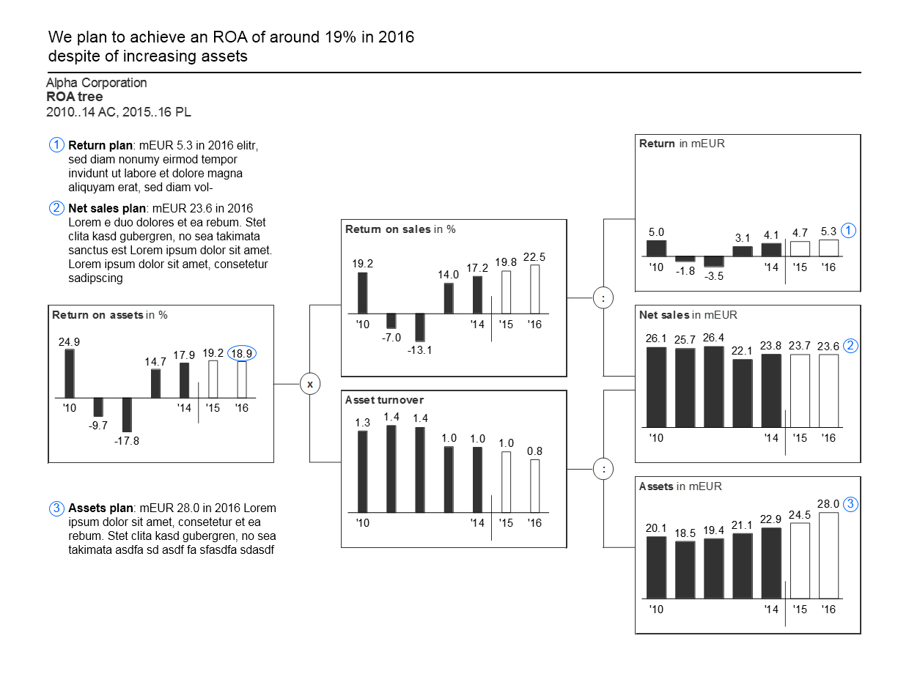

+++
date = 2021-04-10T20:00:00Z
title = "Data Visualization Guide"
description = "CC-licensed design guide for presentations, reports, and dashboards."
image = "/dataviz/cover.png"
slug = "dataviz-guide"
tags = ["data"]
+++

Today I've come across a perfect information graphics / data visualization guide:

-   Based on the works of Edward Tufte and Stephen Few.
-   Comprehensive yet not too wordy (150 pages).
-   Highly practical and with lots of examples (197 figures).

The book provides advice on designing clear, concise, and actionable reports and dashboards:

1. How to articulate the message.
2. How to choose an appropriate chart type.
3. How to design specific chart elements.
4. How to avoid clutter and increase information density.
5. How to make everything clear and consistent.

<figure>
    
</figure>

While the guide itself is great, the authors - IBCS Association - made some questionable choices:

1. They vaguely and somewhat misleadingly called it 'International Business Communication Standards'.
2. They presented it on the [IBCS website](https://www.ibcs.com/standards/) in a way that is barely readable (in my opinion).

Fortunately, IBCS published the guide under the permissive CC BY-SA license. So with some hard work and a bunch of Python I've created a [web version](https://github.com/nalgeon/dataviz), [EPUB](https://github.com/nalgeon/dataviz/releases/download/1.1/data-visualization-guide.epub) and [PDF](https://github.com/nalgeon/dataviz/releases/download/1.1/data-visualization-guide.pdf).

IBCS Association put a lot of thought it the guide, and the result really impressed me. So I encourage you to try it out.
