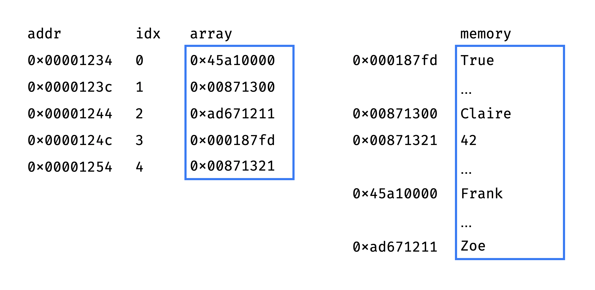
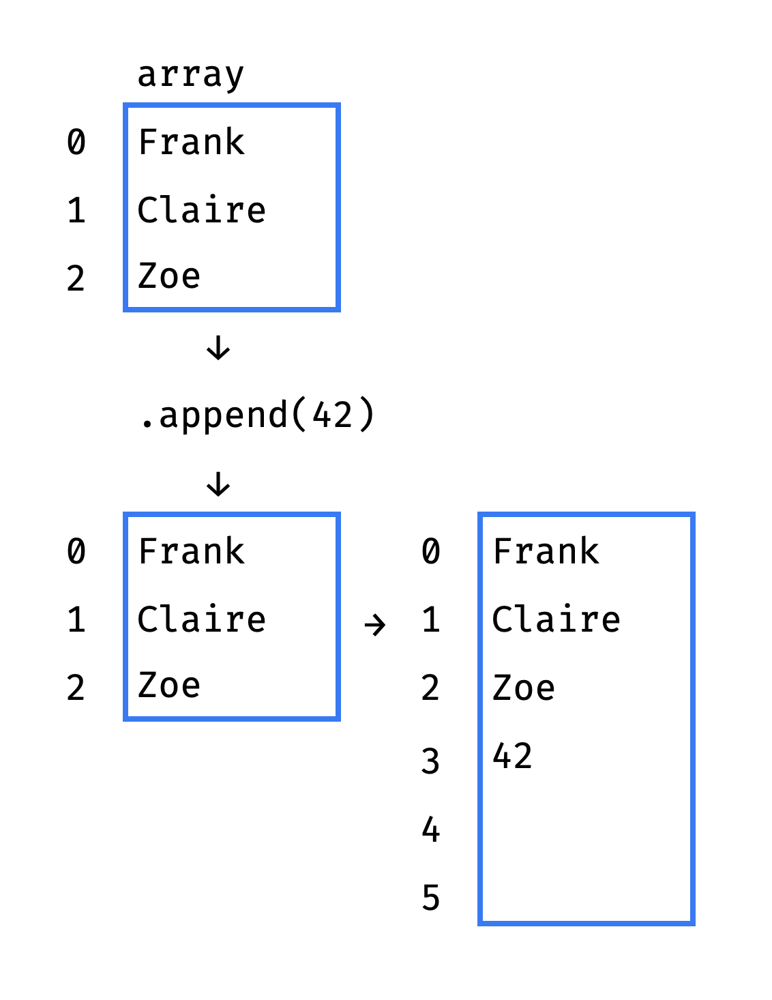

+++
date = 2021-11-12T17:55:00Z
title = "How Python List Works"
description = "And why some methods take constant time while others take linear."
image = "/list-internals/cover.png"
slug = "list-internals"
tags = ["python"]
+++

_This post is largely about the arrays — the #1 data structure in the world. If you are not a data structure guru yet, I guarantee that you will better understand Python lists, their advantages and limitations. If you already know everything — there is no harm in refreshing the key points._

Everybody knows how to work with lists in Python:

```py
>>> guests = ["Frank", "Claire", "Zoe"]
>>> guests[1]
'Claire'
```

Surely you know that selecting an item by index — `guests[idx]` — works instantly even on a million elements list. More precisely, selection by index takes constant time O(1) — that is, it does not depend on the number of items in the list.

Do you know why it works so fast? Let's find out.

## List = Array?

The list is based on an array. An array is a set of elements ① of the same size, ② located in memory one after another, without gaps.

Since elements are the same size and placed contiguously, it is easy to get an array item by index. All we need is the memory address of the very first element (the "head" of the array).

Let's say the head is located at the address `0×00001234`, and each item occupies 8 bytes. Then the element with the `idx` index is located at `0×00001234 + idx*8`:

<div class="row">
<div class="col-xs-12 col-sm-6">
<figure>
  
</figure>
</div>
</div>

Since the "get value by address" memory operation takes constant time, selecting an array item by index also takes O(1).

Roughly speaking, this is how Python list works. It stores a pointer to the head of the array and the number of items in the array. The item count is stored separately so that the `len()` function also performs in O(1) time, and does not have to count the elements each time.

So far so good. But there are a couple of problems:

-   All array elements are the same size, but the list should be able to store items of different sizes (true/false, numbers, strings of different lengths).
-   The array has a fixed length, but the list should be able to store an arbitrary number of items.

We'll tackle them a bit later.

## Naive List

The best way to master a data structure is to implement it from scratch. Unfortunately, Python is not well suited for such low-level structures as arrays, because it doesn't support explicit pointers (addresses in memory).

This is probably as close as we can get:

```py
class OhMyList:
    def __init__(self):
        self.length = 0
        self.capacity = 8
        self.array = (self.capacity * ctypes.py_object)()

    def append(self, item):
        self.array[self.length] = item
        self.length += 1

    def __len__(self):
        return self.length

    def __getitem__(self, idx):
        return self.array[idx]
```

Our custom list has a fixed capacity (`capacity` = 8 items) and stores the elements in the `array` array.

The `ctypes` module gives access to the low-level structures on which the standard library is built. In this case, we use it to create a C-style array of `capacity` elements.

## List = Array of Pointers

The list instantly retrieves an item by index, because it has an array inside. And the array is so fast because all the elements are the same size.

But list items can be of different sizes:

```py
guests = ["Frank", "Claire", "Zoe", True, 42]
```

To solve this problem, someone came up with the idea of storing item _pointers_ instead of item _values_. Each element of the array is a memory address, and if you follow this address — you will get the actual value:

<div class="row">
<div class="col-xs-12 col-sm-10">
<figure>
  
  <figcaption>The array stores pointers adjacently. But the values they refer to can be stored anywhere in memory.</figcaption>
</figure>
</div>
</div>

Since pointers are fixed size (8 bytes on modern 64-bit processors), everything works fine. Instead of one operation (get the value from the array cell), we've now got two:

1. Get the address from the array cell.
2. Get the value at that address.

But it's still constant time O(1).

## List = Dynamic Array

If there are empty spaces left in the array underneath the list, then the `.append(item)` runs in constant time. All it takes is to write a new value to a free cell and increase the element counter by 1:

```py
def append(self, item):
    self.array[self.length] = item
    self.length += 1
```

But what if the array is already full?

Python has to allocate memory for a new, bigger array and copy all the old items to the new one:

<div class="row">
<div class="col-xs-12 col-sm-6">
<figure>
  
  <figcaption>When there is no more space in the old array, it's time to create a new one.</figcaption>
</figure>
</div>
</div>

Here we go:

```py
def append(self, item):
    if self.length == self.capacity:
        self._resize(self.capacity*2)
    self.array[self.length] = item
    self.length += 1

def _resize(self, new_cap):
    new_arr = (new_cap * ctypes.py_object)()
    for idx in range(self.length):
        new_arr[idx] = self.array[idx]
    self.array = new_arr
    self.capacity = new_cap
```

`._resize()` is a costly operation, so the new array should be significantly larger than the old one. In the example above, the new array is twice as large. Python uses a more modest coefficient — about 1.12.

If you remove more than half of the items from the list via `.pop()`, Python will shrink it. It'll allocate a new, smaller array and move the elements into it.

Thus, the list juggles arrays all the time so that we don't have to do it ツ

## Appending an Item to the List

Selecting from the list by index takes O(1) time — we have sorted that out. The `.append(item)` method is also O(1) until Python has to extend the array under the list. But array extension is an O(n) operation. So how long does `.append()` take after all?

It would be wrong to measure a single append — as we found out, sometimes it takes O(1), sometimes O(n). So computer scientists came up with _amortized analysis_. To get an amortized operation time, one estimates the total time that a sequence of K operations will take, then divide it by K.

Without going into details, I will say that the amortized time for `.append(item)` turns out to be constant — O(1). So appending to the list works very fast.

<div class="boxed">
<h3>Why amortized append time is O(1)</h3>
<p>Let's say the list is empty and want to append <code>n</code> items. For simplicity, we'll use the expansion factor of 2. Let's count the number of atomic operations:</p>
<ul>
  <li>1st item: 1 (copy) + 1 (insert)</li>
  <li>another 2: 2 (copy) + 2 (insert)</li>
  <li>another 4: 4 (copy) + 4 (insert)</li>
  <li>another 8: 8 (copy) + 8 (insert)</li>
  <li>...</li>
</ul>
<p>For <code>n</code> items there will be <code>n</code> insertions.</p>
<p>As for copy:</p>
<pre><code>1 + 2 + 4 + ... log(n) = 
= 2**log(n) * 2 - 1 =
= 2n - 1</code></pre>
<p>operations.</p>
<p>So for <code>n</code> items there will be <code>3n - 1</code> atomic operations.</p>
<p><code>O((3n - 1) / n)</code> = <code>O(1)</code></p>
</div>

Summing up, the following operations are guaranteed to be fast:

```py
# O(1)
lst[idx]

# O(1)
len(lst)

# amortized O(1)
lst.append(item)
lst.pop()
```

## List Internals

We've discussed the algorithm. Now let's look at the implementation.

Python core data structures are implemented in C, and the list is no exception. Here is the (massively simplified) list structure from the Python sources (see [listobject.h](https://github.com/python/cpython/blob/main/Include/cpython/listobject.h), [listobject.c](https://github.com/python/cpython/blob/main/Objects/listobject.c)):

```c
// List data structure.
typedef struct {
    // List length
    Py_ssize_t ob_size;

    // Pointers to list items. list[0] is ob_item[0], etc.
    PyObject** ob_item;

    // List capacity
    /* ob_item contains space for 'allocated' elements. The number
     * currently in use is ob_size.
     * Invariants:
     *     0 <= ob_size <= allocated
     *     len(list) == ob_size
     *     ob_item == NULL implies ob_size == allocated == 0
     */
    Py_ssize_t allocated;
} PyListObject;
```

Similar to our naive implementation, the real list structure contains the length (`ob_size`), capacity (`allocated`), and an array of items (`ob_item`).

Here is the list constructor:

```c
// Creates a new list.
PyObject* PyList_New(Py_ssize_t size) {
    PyListObject *op;

    // allocate memory for the list itself (without list items)
    op = PyObject_GC_New(PyListObject, &PyList_Type);

    // allocate memory for list items
    op->ob_item = (PyObject**) PyMem_Calloc(size, sizeof(PyObject *));

    return (PyObject*) op;
}
```

`len()` implementation simply returns the `ob_size` field:

```c
// Returns list length.
static inline Py_ssize_t PyList_GET_SIZE(PyListObject* self) {
    return list->ob_size;
}
```

Getting and setting list items is also trivial:

```c
// Returns list item by index.
static inline PyObject* PyList_GET_ITEM(PyObject* op, Py_ssize_t index) {
    PyListObject* list = _PyList_CAST(op);
    return list->ob_item[index];
}

// Sets list item by index.
static inline void PyList_SET_ITEM(PyObject* op, Py_ssize_t index, PyObject* value) {
    PyListObject* list = _PyList_CAST(op);
    list->ob_item[index] = value;
}
```

Now comes the append:

```c
// Appends an item to the end of the list.
static PyObject* list_append(PyListObject* self, PyObject* object) {
    // list length
    Py_ssize_t len = PyList_GET_SIZE(self);

    // list capacity
    Py_ssize_t allocated = self->allocated;

    // if there is space left in the list (length < capacity),
    // append the item without resizing the list
    if (allocated > len) {
        PyList_SET_ITEM(self, len, newitem);
        Py_SET_SIZE(self, len + 1);
        return 0;
    }

    // otherwise, resize the list
    list_resize(self, len + 1);
    // then append the item
    PyList_SET_ITEM(self, len, newitem);
    return 0;
}
```

As we've discussed, sometimes appending new item results in a list resize:

```c
// Resizes the list, thus increasing its capacity.
static int list_resize(PyListObject* self, Py_ssize_t newsize) {
    // list capacity
    Py_ssize_t allocated = self->allocated;

    /* This over-allocates proportional to the list size, making room
     * for additional growth. The over-allocation is mild, but is
     * enough to give linear-time amortized behavior over a long
     * sequence of appends() in the presence of a poorly-performing
     * system realloc().
     * Add padding to make the allocated size multiple of 4.
     * The growth pattern is:  0, 4, 8, 16, 24, 32, 40, 52, 64, 76, ...
     */
    // calculate new list capacity
    size_t new_allocated = ((size_t)newsize + (newsize >> 3) + 6) & ~(size_t)3;

    // allocate memory for the new capacity
    // and copy list items to the new memory block is necessary
    size_t num_allocated_bytes = new_allocated * sizeof(PyObject*);
    PyObject** items = (PyObject**)PyMem_Realloc(self->ob_item, num_allocated_bytes);
    self->ob_item = items;

    // set new list length and capacity
    Py_SET_SIZE(self, newsize);
    self->allocated = new_allocated;
    return 0;
}
```

And that's basically it!

## Summary

As we found out, these operations are O(1):

-   select an item by index `lst[idx]`
-   count items `len(lst)`
-   add an item to the end of the list `.append(item)`
-   remove an item from the end of the list `.pop()`

Other operations are "slow":

-   Insert or delete an item by index. `.insert(idx, item)` and `.pop(idx)` take linear time O(n) because they shift all the elements after the target one.
-   Search or delete an item by value. `item in lst`, `.index(item)` and `.remove(item)` take linear time O(n) because they iterate over all the elements.
-   Select a slice of `k` elements. `lst[from:to]` takes O(k).

Does this mean that you should not use "slow" operations? Of course not. If you have a list of 1000 items, the difference between O(1) and O(n) for a single operation is insignificant.

On the other hand, if you perform a "slow" operation on a list of 1000 items a million times — this is quite significant. The same goes if you invoke a single "slow" operation on a list of a million items.

Therefore, it is useful to know which list methods take constant time and which take linear time — to make a conscious decision in a specific situation.

I hope you'll see Python lists in a new way after this article. Thanks for reading!
