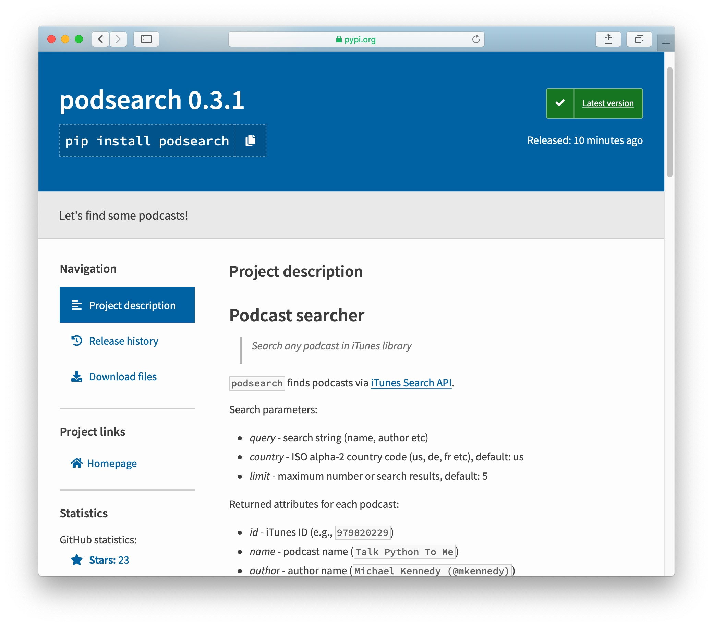
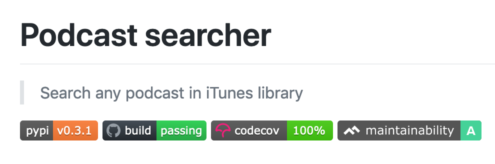

+++
date = "2021-04-06 20:30:00 +0300"
title = "How to make an awesome Python package"
description = "The one to be proud of."
image = "/python-packaging/cover.png"
slug = "python-packaging"
tags = ["python"]
+++

If you are like me, every once in a while you write a useful python utility and want to share it with your colleagues. The best way to do this is to make a package: it easy to install and saves from copy-pasting.

If you are like me, you might be thinking that creating packages is a real headache. Well, that's not the case anymore. And I am going to prove it with this step-by-step guide. Just three main steps (and a bunch of optional ones) accompanied by few GitHub links. See for yourself:

## 1. Stub

We will create `podsearch` - a utility that searches for podcasts in iTunes. Let's create a directory and a virtual environment:

```
$ mkdir podsearch
$ cd podsearch
$ python3 -m venv env
$ . env/bin/activate
```

Define a minimal package structure:

```
.
├── .gitignore
└── podsearch
    └── __init__.py
```

```python
"""Let's find some podcasts!"""

 __version__ = "0.1.0"


 def search(name, count=5):
     """Search podcast by name."""
     raise NotImplementedError()
```

## 2. Test package

Creating a package in Python used to be a troublesome task. Fortunately, nowadays there is a great little [flit](https://flit.readthedocs.io/en/latest/) utility which simplifies everything. Let's install it:

```
pip install flit
```

And create package description:

```
$ flit init
Module name [podsearch]:
Author [Anton Zhiyanov]:
Author email [m@antonz.org]:
Home page [https://github.com/nalgeon/podsearch-py]:
Choose a license (see http://choosealicense.com/ for more info)
1. MIT - simple and permissive
2. Apache - explicitly grants patent rights
3. GPL - ensures that code based on this is shared with the same terms
4. Skip - choose a license later
Enter 1-4 [1]: 1

Written pyproject.toml; edit that file to add optional extra info.
```

[pyproject.toml](https://github.com/nalgeon/podsearch-py/blob/main/pyproject.toml)

Flit has created `pyproject.toml` - the project metadata file. It already has everything you need to publish the package to the public repository - PyPI.

Sign up for [TestPyPi](https://test.pypi.org/) (test repository) and [PyPI](http://pypi.org/) (the main one). They are completely independent, so you will need two accounts.

Setup access to repositories in the `~/.pypirc`:

```
[distutils]
index-servers =
  pypi
  pypitest

[pypi]
username: nalgeon  # replace with your PyPI username

[pypitest]
repository: https://test.pypi.org/legacy/
username: nalgeon  # replace with your TestPyPI username
```

And publish the package to the test repository:

```
$ flit publish --repository pypitest
Found 4 files tracked in git
...
Package is at https://test.pypi.org/project/podsearch/
```

Done! The package is available on [TestPyPi](https://test.pypi.org/project/podsearch/).

## 3. Public package

Let's improve the code so that it actually searches for podcasts:

```python
# ...

SEARCH_URL = "https://itunes.apple.com/search"

@dataclass
class Podcast:
    """Podcast metadata."""

    id: str
    name: str
    author: str
    url: str
    feed: Optional[str] = None
    category: Optional[str] = None
    image: Optional[str] = None


def search(name: str, limit: int = 5) -> List[Podcast]:
    """Search podcast by name."""
    params = {"term": name, "limit": limit, "media": "podcast"}
    response = _get(url=SEARCH_URL, params=params)
    return _parse(response)
```

And publish to the main repository - PyPI. Perform this step only after your package has working code that does something useful. Do not publish non-working packages and stubs.

```
flit publish
```

Done! Time to [share it with colleagues](https://pypi.org/project/podsearch/).

To make the package a pleasure to use, I recommend that you follow a few more steps.

## A. Readme and changelog

No one likes to write documentation. But without docs, it is unlikely that people will want to install your package, so let's add `README.md` and `CHANGELOG.md`.

-   [README.md](https://github.com/nalgeon/podsearch-py/blob/main/README.md)
-   [CHANGELOG.md](https://github.com/nalgeon/podsearch-py/blob/main/CHANGELOG.md)

Add readme to the `pyproject.toml`, so that PyPI shows it on the package page:

```
description-file = "README.md"
```

Also specify the minimal supported Python version:

```
requires-python = ">=3.7"
```

Update the version in `__init__.py` and publish the package via `flit publish`:



Mmm, nice.

## B. Linters and tests

Let's take care of formatting (`black`), test coverage (`coverage`), code quality (`flake8`, `pylint`, `mccabe`), and static analysis (`mypy`). We will run everything through `tox`.

```
$ pip install black coverage flake8 mccabe mypy pylint pytest tox
```

Create `tox` configuration in `tox.ini`:

```
[tox]
isolated_build = True
envlist = py37,py38,py39

[testenv]
deps =
    black
    coverage
    flake8
    mccabe
    mypy
    pylint
    pytest
commands =
    black podsearch
    flake8 podsearch
    pylint podsearch
    mypy podsearch
    coverage erase
    coverage run --include=podsearch/* -m pytest -ra
    coverage report -m
```

[tox.ini](https://github.com/nalgeon/podsearch-py/blob/main/tox.ini)

And run all the checks:

```
$ tox -e py39
...
py39 run-test: commands[0] | black podsearch
All done! ✨ 🍰 ✨
...
py39 run-test: commands[2] | pylint podsearch
Your code has been rated at 10.00/10 (previous run: 10.00/10, +0.00)
...
py39 run-test: commands[6] | coverage report -m
TOTAL 100%
...
py39: commands succeeded
congratulations :)
```

Lovely! The linters are happy, the tests passed, the coverage is 100%.

## C. Cloud build

Every solid open-source project runs cloud tests after each commit, so we will too. A nice side effect is having beautiful badges in the readme ツ

Let's build the project with [GitHub Actions](https://github.com/features/actions), check test coverage with [Codecov](https://about.codecov.io/) and code quality with [Code Climate](https://codeclimate.com/).

You will have to sign up for Codecov and Code Climate (both support GitHub login) and enable package repository in the settings.

After that, add the GitHub Actions build config to `.github/workflows/build.yml`:

```yaml
# ...
jobs:
    build:
        runs-on: ubuntu-latest
        strategy:
            matrix:
                python-version: [3.7, 3.8, 3.9]

        env:
            USING_COVERAGE: "3.9"

        steps:
            - name: Checkout sources
              uses: actions/checkout@v2

            - name: Set up Python
              uses: actions/setup-python@v2
              with:
                  python-version: ${{ matrix.python-version }}

            - name: Install dependencies
              run: |
                  python -m pip install --upgrade pip
                  python -m pip install black coverage flake8 flit mccabe mypy pylint pytest tox tox-gh-actions

            - name: Run tox
              run: |
                  python -m tox

            - name: Upload coverage to Codecov
              uses: codecov/codecov-action@v1
              if: contains(env.USING_COVERAGE, matrix.python-version)
              with:
                  fail_ci_if_error: true
```

[build.yml](https://github.com/nalgeon/podsearch-py/blob/main/.github/workflows/build.yml)

GitHub runs tests via `tox` - just as we did. `tox-gh-actions` package and `USING_COVERAGE` settings ensure that `tox` uses the same Python version as GitHub Actions themself, as required by `strategy.matrix` (I learned this clever trick from [Hynek Schlawak](https://hynek.me/articles/python-github-actions/)).

The last step sends test coverage to Codecov. Code Climate does not need a separate step - it spots repository changes automatically.

Now commit, push, and enjoy the result in a minute. And let everyone enjoy as well - add badges to `README.md`:

```markdown
[![PyPI Version][pypi-image]][pypi-url]
[![Build Status][build-image]][build-url]
[![Code Coverage][coverage-image]][coverage-url]
[![Code Quality][quality-image]][quality-url]

...

<!-- Badges -->

[pypi-image]: https://img.shields.io/pypi/v/podsearch
[pypi-url]: https://pypi.org/project/podsearch/
[build-image]: https://github.com/nalgeon/podsearch-py/actions/workflows/build.yml/badge.svg
[build-url]: https://github.com/nalgeon/podsearch-py/actions/workflows/build.yml
[coverage-image]: https://codecov.io/gh/nalgeon/podsearch-py/branch/main/graph/badge.svg
[coverage-url]: https://codecov.io/gh/nalgeon/podsearch-py
[quality-image]: https://api.codeclimate.com/v1/badges/3130fa0ba3b7993fbf0a/maintainability
[quality-url]: https://codeclimate.com/github/nalgeon/podsearch-py
```

Aren't they cute?

<div class="row">
<div class="col-xs-12 col-sm-8">
<figure>
  
</figure>
</div>
</div>

## D. Task automation

`tox` is fine, but not very handy for development. It's faster to run individual commands like `pylint`, `coverage` etc. But they are quite verbose, so we'll automate the boring stuff.

Let's create short aliases for frequent actions with [Makefile](/makefile-automation/):

```Makefile
.DEFAULT_GOAL := help
.PHONY: coverage deps help lint push test

coverage:  ## Run tests with coverage
	coverage erase
	coverage run --include=podsearch/* -m pytest -ra
	coverage report -m

deps:  ## Install dependencies
	pip install black coverage flake8 mccabe mypy pylint pytest tox

lint:  ## Lint and static-check
	flake8 podsearch
	pylint podsearch
	mypy podsearch

push:  ## Push code with tags
	git push && git push --tags

test:  ## Run tests
	pytest -ra
```

[Makefile](https://github.com/nalgeon/podsearch-py/blob/main/Makefile)

Here are our tasks:

```
$ make help
Usage: make [task]

task                 help
------               ----
coverage             Run tests with coverage
deps                 Install dependencies
lint                 Lint and static-check
push                 Push code with tags
test                 Run tests
help                 Show help message
```

To make the code more DRY, replace raw `build.yml` steps with `make` calls:

```yaml
- name: Install dependencies
  run: |
      make deps

- name: Run tox
  run: |
      make tox
```

## E. Cloud publish

GitHub is quite capable of running `flit publish` for us. Let's create a separate workflow:

<!--  -->

```yaml
name: publish

on:
    release:
        types: [created]

jobs:
    publish:
        runs-on: ubuntu-latest
        steps:
            - name: Checkout sources
              uses: actions/checkout@v2

            - name: Set up Python
              uses: actions/setup-python@v2
              with:
                  python-version: "3.9"

            - name: Install dependencies
              run: |
                  make deps

            - name: Publish to PyPi
              env:
                  FLIT_USERNAME: ${{ secrets.PYPI_USERNAME }}
                  FLIT_PASSWORD: ${{ secrets.PYPI_PASSWORD }}
              run: |
                  make publish
```

<!--  -->

[publish.yml](https://github.com/nalgeon/podsearch-py/blob/main/.github/workflows/publish.yml)

`PYPI_USERNAME` and `PYPI_PASSWORD` are set in repository settings (Settings > Secrets > New repository secret). Use your PyPi username and password, or even better - an [API token](https://pypi.org/manage/account/token/).

Now GitHub will automatically publish the package as soon as you create a new release. Sweet!

<p class="align-center">⌘&nbsp;⌘&nbsp;⌘</p>

Your perfect package is ready! It has everything one could dream of: clean code, clear documentation, tests, and cloud builds. Time to tell your colleagues and friends.

These settings will make your package awesome:

-   [pyproject.toml](https://github.com/nalgeon/podsearch-py/blob/main/pyproject.toml)
-   [tox.ini](https://github.com/nalgeon/podsearch-py/blob/main/tox.ini)
-   [Makefile](https://github.com/nalgeon/podsearch-py/blob/main/Makefile)
-   [build.yml](https://github.com/nalgeon/podsearch-py/blob/main/.github/workflows/build.yml)
-   [publish.yml](https://github.com/nalgeon/podsearch-py/blob/main/.github/workflows/publish.yml)

[Comments on Hacker News](https://news.ycombinator.com/item?id=26733423)
