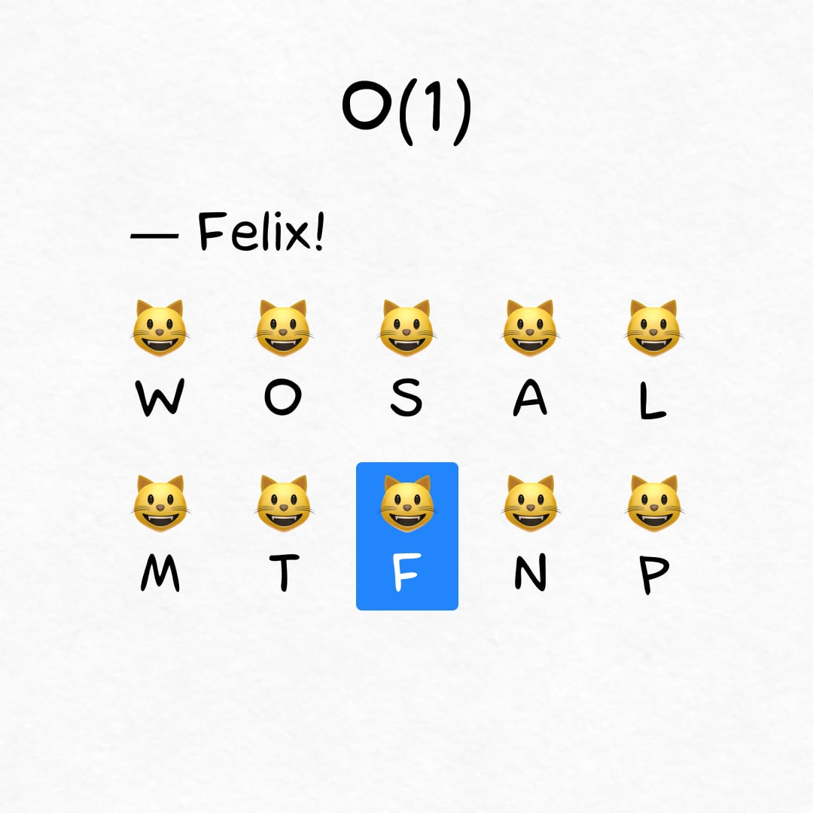
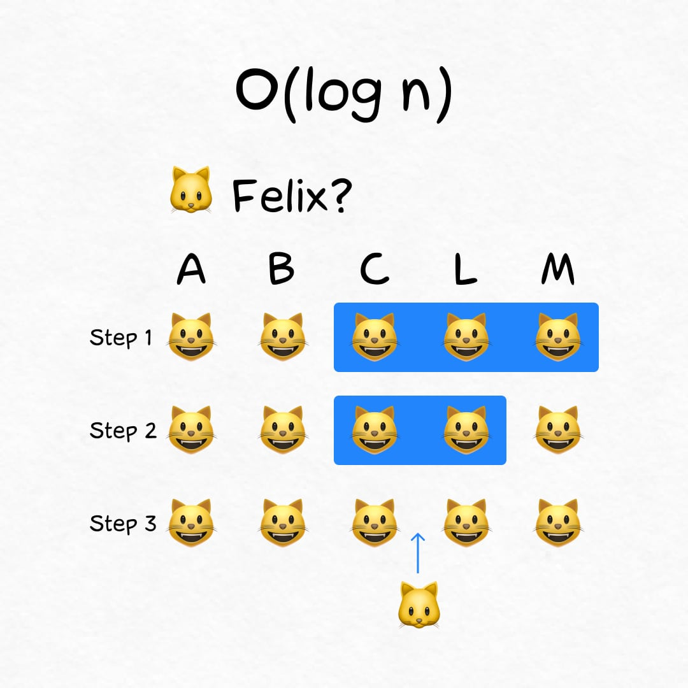
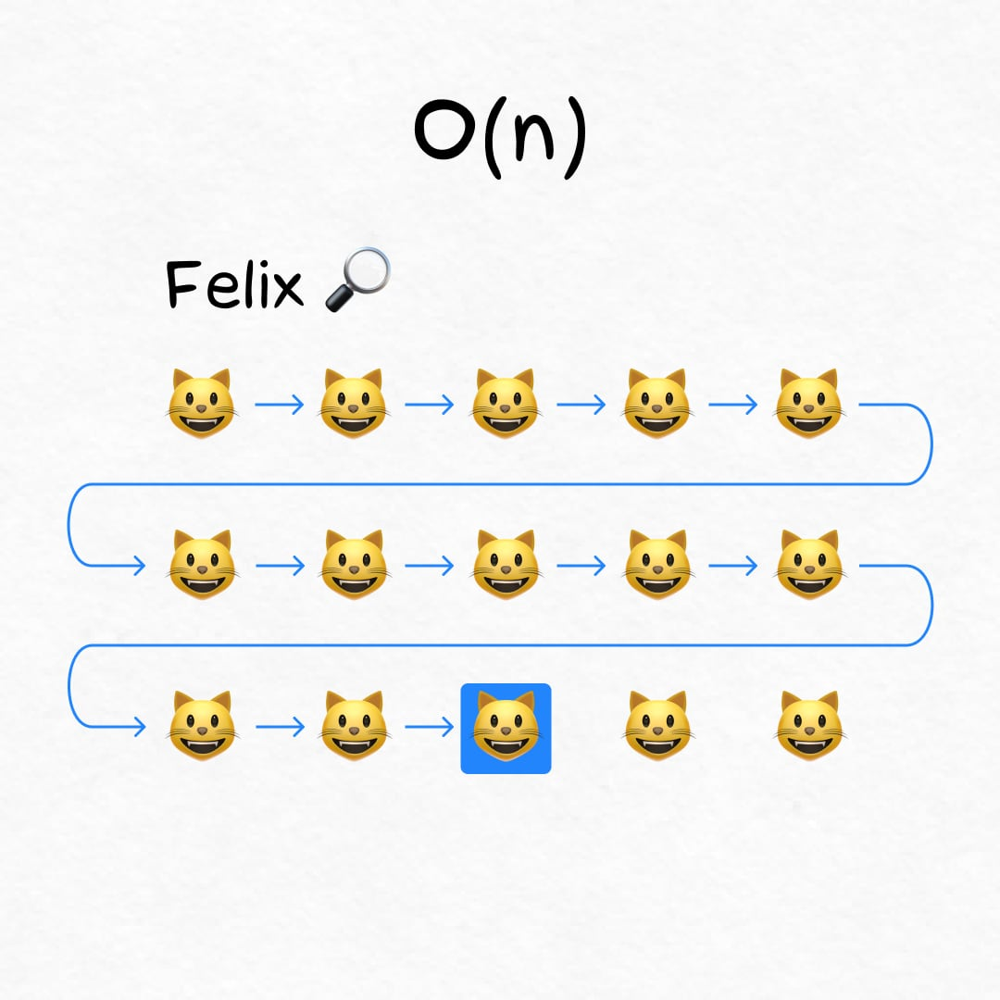
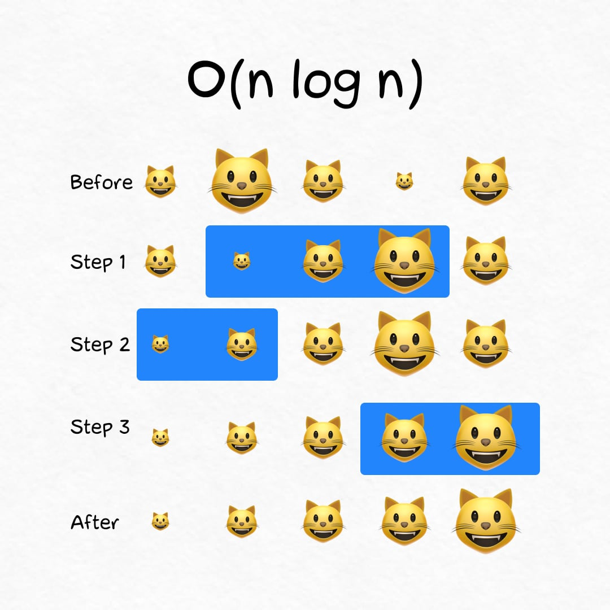
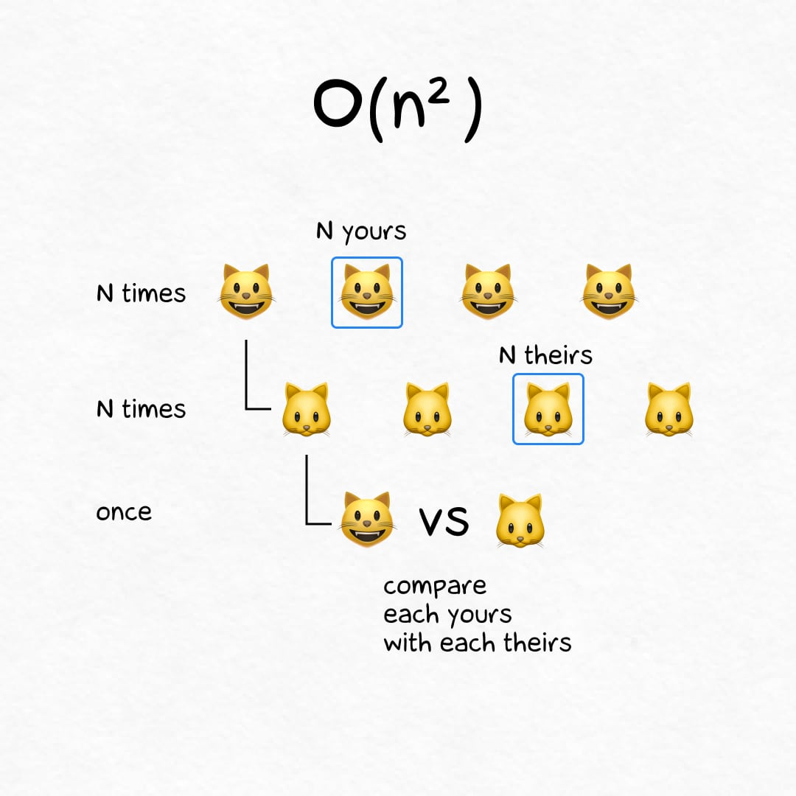
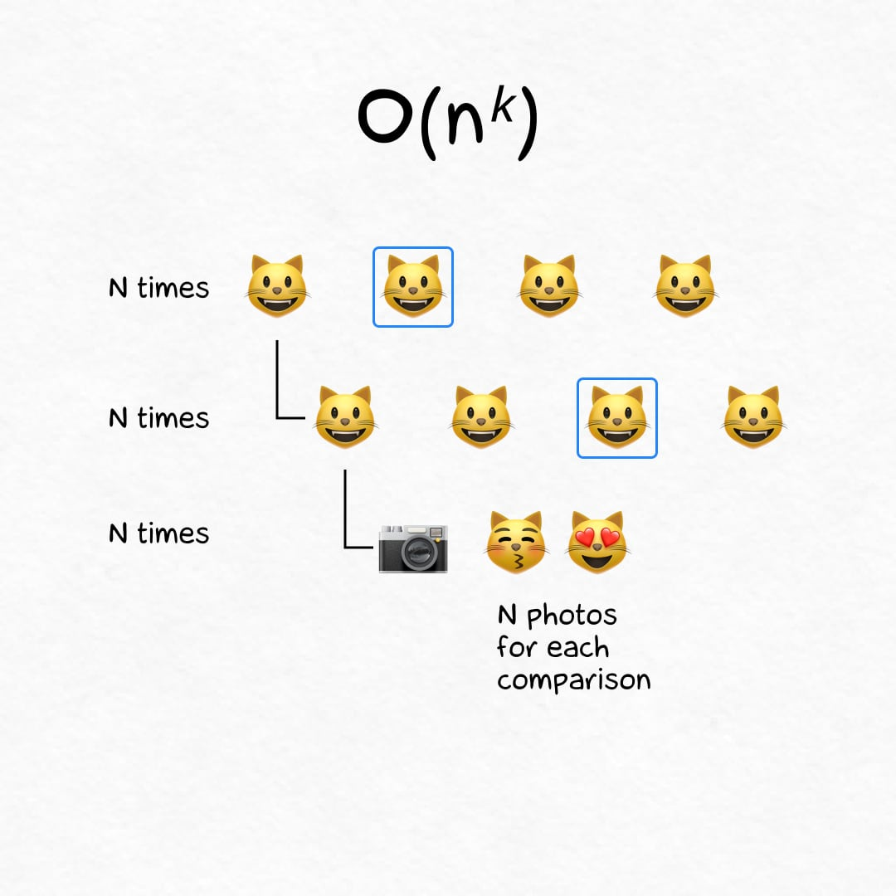
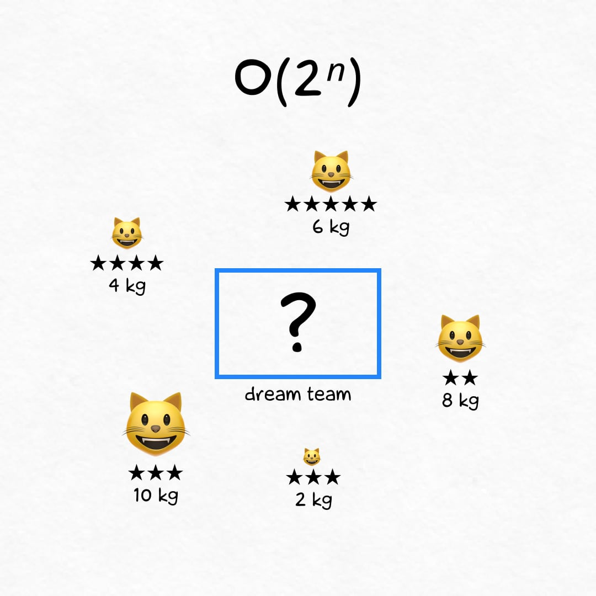
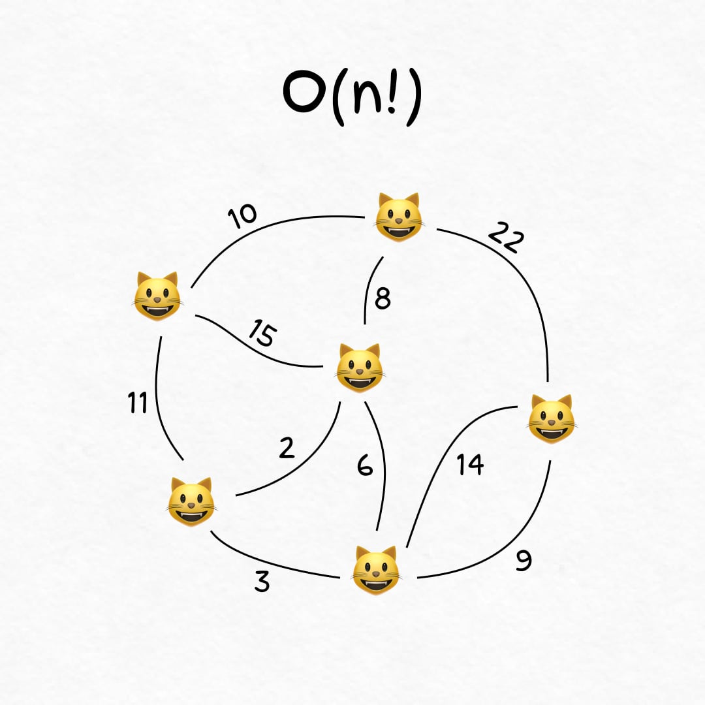

+++
date = 2022-12-21T16:50:00Z
title = "Speed of algorithms (with cats)"
description = "Analyzing fast and slow algorithms with silly cat examples."
image = "/big-o/cover.jpg"
slug = "big-o"
tags = ["software"]
featured = true
subscribe = "ohmypy"
+++

Let's see how programmers evaluate fast and slow algorithms. Since the topic is pretty boring, we'll use silly cat examples.

## Constant time: O(1)

This is your best option. The algorithm speed does not depend on the number of cats.

    
<strong>🐾 Example</strong>

    
You are the lucky owner of <code>N</code> cats. Every kitten knows their name. If you call "Felix!", only one will come running, and the rest of the <code>N-1</code> fluffs don't care.

<figure>
  
</figure>

## Logarithmic time: O(log n)

On `N` cats the algorithm completes in `log(N)` steps. It's fast! 1,000,000 kittens → 20 operations total.

    
<strong>🐾 Example</strong>

    
Cat's bowls are arranged alphabetically. When you adopt a new cat, the place for its bowl can be found in <code>log(N)</code> steps.

<figure>
  
</figure>

## Linear time: O(n)

On `N` cats the algorithm completes in `N` steps. It means that every time you have to traverse all cats. Not great, not terrible.

    
<strong>🐾 Example</strong>

    
Your kittens rebelled and stopped responding to nicknames. Now you have to look through <code>N</code> fluffs to find the right one.

<figure>
  
</figure>

## Log-linear time: O(n log n)

On `N` cats the algorithm completes in `N` × `log(N)` steps. This is slower than in linear time, but not by much (the logarithm of `N` is much smaller than `N`, remember?).

    
<strong>🐾 Example</strong>

    
Waiting for guests, you decided to seat kittens in the order of their size. The quick sort algorithm will handle this in <code>N</code> × <code>log(N)</code> steps.

<figure>
  
</figure>

Next in line, we have lazy polynomial cats and snail-speed superpolynomial ones.

## Quadratic time: O(n²)

On `N` cats the algorithm completes in `N²` steps. So slow.

    
<strong>🐾 Example</strong>

    
Your competitor claims that his <code>N</code> kittens are smoother and happier than yours. A special commission will compare the cats in pairs and make a fair verdict. You will need ~ <code>N²</code> comparisons.

<figure>
  
</figure>

## Polynomial time: O(nᵏ)

On `N` cats the algorithm completes in `N³` steps, `N⁴` steps, `N⁵` steps, or even longer. Ugh. Don't be like that.

    
<strong>🐾 Example</strong>

    
Photoshoot! Each of the <code>N</code> kittens will be photographed in pairs with others, and the photographer takes <code>N</code> pictures for each pair. <code>N</code> × <code>N</code> × <code>N</code> ≃ <code>N³</code> steps.

<figure>
  
</figure>

Polynomial algorithms are not famous for their speed. But compared to superpolynomial ones, they are as fast as a Flash. Sadly, the only "super" part of superpolynomial algorithms is a name. Let me show you.

## Exponential time: O(2ⁿ)

On `N` cats the algorithm completes in `2ⁿ` steps. It's a long time, you're probably not gonna wait.

    
<strong>🐾 Example</strong>

    
Kittens are going to the cat show. Everyone will be weighed and rated in stars. But the cat transport can handle a maximum of X kilograms (or pounds). How to choose the most stellar cast? The answer will require <code>2ⁿ</code> steps.

<figure>
  
</figure>

## Factorial time: O(n!)

On `N` cats the algorithm completes in `N` ×`(N-1)` ×`(N-2)` ×... × `1` steps. This is crazy! With 20 cats it's already a couple of quintillion operations.

    
<strong>🐾 Example</strong>

    
Kittens spread out across the apartment. You want to pet everyone, but you're lazy and don't like walking. What is the shortest route to visit all fluffs? This is ~ <code>N!</code> comparisons.

<figure>
  
</figure>

## Summary

Here are the algorithms we've covered:

-   Constant `O(1)`
-   Logarithmic `O(log n)`
-   Linear `O(n)`
-   Log-Linear `O(n log n)`
-   Quadratic `O(n²)`
-   Polynomial `O(nᵏ)`
-   Exponential `O(2ⁿ)`
-   Factorial `O(n!)`

A constant algorithm is always the best option, and a logarithmic one is almost always. Linear and polynomial ones are more complex — it all depends on the task with them. Sometimes it's a shame to choose `O(n)`, and sometimes `O(n²)` is a huge success.

`O(2ⁿ)` and `O(n!)` are insanely slow. So in practice, people often use suboptimal but fast algorithms.
