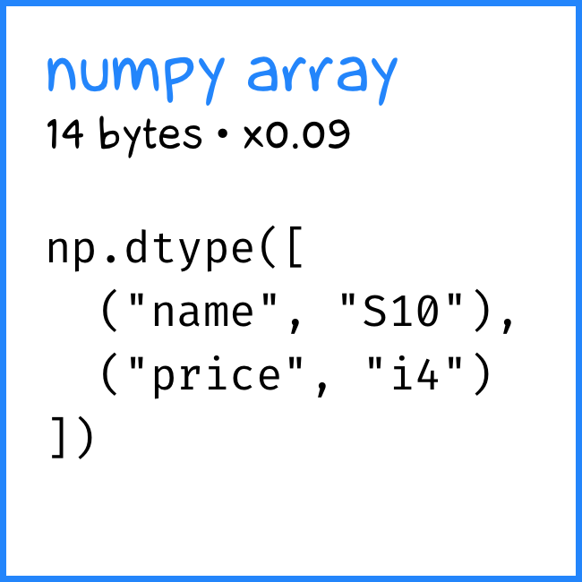

+++
date = 2022-05-13T20:25:00Z
title = "Compact objects in Python"
description = "Tuple vs dataclass, until numpy interferes"
image = "/compact-objects/cover.png"
slug = "compact-objects"
tags = ["python"]
+++

Python is an object language. This is nice and cozy until you are out of memory holding 10 million objects at once. Let's talk about how to reduce appetite.

Imagine you have a simple `Pet` object with the `name` (string) and `price` (integer) attributes. Intuitively, it seems that the most compact representation is a tuple:

```python
("Frank the Pigeon", 50000)
```

Let's measure how much memory this beauty eats:

```python
import random
from pympler.asizeof import asizeof

def fields():
    name_gen = (random.choice(string.ascii_uppercase) for _ in range(10))
    name = "".join(name_gen)
    price = random.randint(10000, 99999)
    return (name, price)

def measure(name, fn, n=10_000):
    pets = [fn() for _ in range(n)]
    size = round(asizeof(pets) / n)
    print(f"Pet size ({name}) = {size} bytes")
    return size

baseline = measure("tuple", fields)
```

```
Pet size (tuple) = 161 bytes
```

161 bytes. Let's use it as a baseline for further comparison.

But who works with tuples these days? You would probably choose a dataclass:

```python
from dataclasses import dataclass

@dataclass
class PetData:
    name: str
    price: int

fn = lambda: PetData(*fields())
measure("dataclass", fn)
```

```
Pet size (dataclass) = 257 bytes
x1.60 to baseline
```

Thing is, it's 1.6 times larger than a tuple.

Let's try a named tuple then:

```python
from typing import NamedTuple

class PetTuple(NamedTuple):
    name: str
    price: int


fn = lambda: PetTuple(*fields())
measure("named tuple", fn)
```

```
Pet size (named tuple) = 161 bytes
x1.00 to baseline
```

Looks like a dataclass, works like a tuple. Perfect.

Or not? Python 3.10 received dataclasses with slots:

```python
@dataclass(slots=True)
class PetData:
    name: str
    price: int


fn = lambda: PetData(*fields())
measure("dataclass w/slots", fn)
```

```
Pet size (dataclass w/slots) = 153 bytes
x0.95 to baseline
```

Wow! Slots magic creates special skinny objects without an underlying dictionary, unlike regular Python objects. Such dataclass is even lighter than a tuple.

What if 3.10 is out of the question yet? Use `NamedTuple`. Or add a slots dunder manually:

```python
@dataclass
class PetData:
    __slots__ = ("name", "price")
    name: str
    price: int
```

Slot objects have their own shortcomings. But they are great for simple cases (without inheritance and other complex stuff).

P.S. The real winner, of course, is the `numpy` array. But there is no fun in competing with it  ツ

```python
import string
import numpy as np

PetNumpy = np.dtype([("name", "S10"), ("price", "i4")])
generator = (fields() for _ in range(n))
pets = np.fromiter(generator, dtype=PetNumpy)
size = round(asizeof(pets) / n)
```

```
Pet size (structured array) = 14 bytes
x0.09 to baseline
```

<div class="row">
<div class="col-xs-12 col-sm-4">
<figure></figure>
</div>
<div class="col-xs-12 col-sm-4">
<figure></figure>
</div>
<div class="col-xs-12 col-sm-4">
<figure></figure>
</div>
</div>

<div class="row">
<div class="col-xs-12 col-sm-4">
<figure></figure>
</div>
<div class="col-xs-12 col-sm-4">
<figure></figure>
</div>
<div class="col-xs-12 col-sm-4">
<figure></figure>
</div>
</div>
