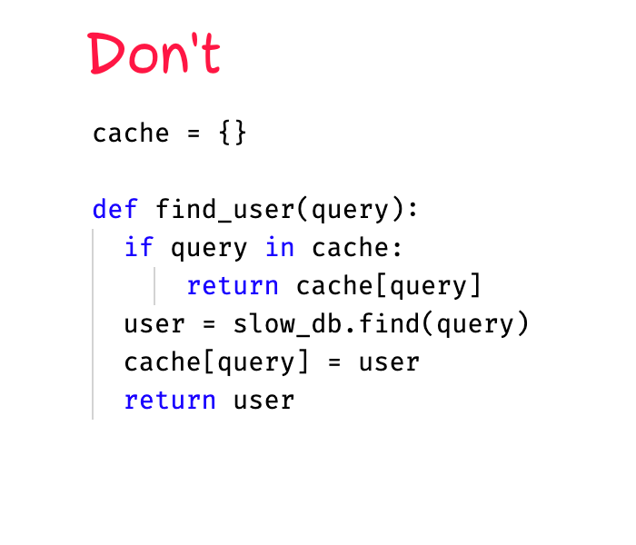

+++
date = 2022-04-23T19:10:00Z
title = "Caching slow functions in Python"
description = "With @lru_cache and @cache from the functools module"
image = "/functools-cache/cover.png"
slug = "functools-cache"
tags = ["python"]
+++

Suppose you wrote a function that returns the user's email:

```python
def get_user_email(user_id):
    user = find_by_id(user_id)
    return user["email"]
```

But there is a problem. `find_by_id()` calls a terribly slow legacy system:

```python
def find_by_id(user_id):
    # simulate a slow network request,
    # returning a user by their id
    time.sleep(1)
    return { "email": "..." }
```

100 calls for `get_user_email(42)` result in 100 slow requests. A single one should be quite enough, so let's attach a simple cache:

```python
cache = {}

def get_user_email(user_id):
    if user_id not in cache:
        user = find_by_id(user_id)
        cache[user_id] = user["email"]
    return cache[user_id]
```

Nothing too complicated (apart from the issue of cache expiration, let's not touch it). But imagine that there are a lot of slow functions, and you have to implement caching for every one of them. Not too inspiring.

Fortunately, there is an `@lru_cache` decorator in the `functools` module. That's what we need. Add one line to the original function, and be done with it:

```python
@functools.lru_cache(maxsize=256)
def get_user_email(user_id):
    user = find_by_id(user_id)
    return user["email"]
```

Now repeated calls to `get_user_email()` with the same `user_id` return the cached result without requesting `find_by_id()`.

<div class="row">
<div class="col-xs-12 col-sm-6 col-md-5">
<figure>
  
  <figcaption>Don't write your own cache...</figcaption>
</figure>
</div>
<div class="col-xs-12 col-sm-6 col-md-5">
<figure>
  
  <figcaption>Use functools @lru_cache instead!</figcaption>
</figure>
</div>
</div>

`@lru_cache` automatically evicts old entries from the cache when there are more than `maxsize` entries. So the cache won't eat up all the memory.

Python 3.9 received another decorator — `@functools.cache`. It's similar to `@lru_cache`, only without the cache entry limit (which makes it work a little faster).

One can manage the cache — view hits/misses stats or clean it:

```python
# cache management

stats = get_user_email.cache_info()
print(stats)
# CacheInfo(hits=2, misses=3, maxsize=256, currsize=3)

get_user_email.cache_clear()
# CacheInfo(hits=0, misses=0, maxsize=256, currsize=0)
```

The cache works in-process and will die with it. So if you need something more scalable, look at Redis or other external cache.

[Documentation](https://devdocs.io/python/library/functools#functools.lru_cache) •
[Playground](https://replit.com/@antonz/functools-cache#main.py)
