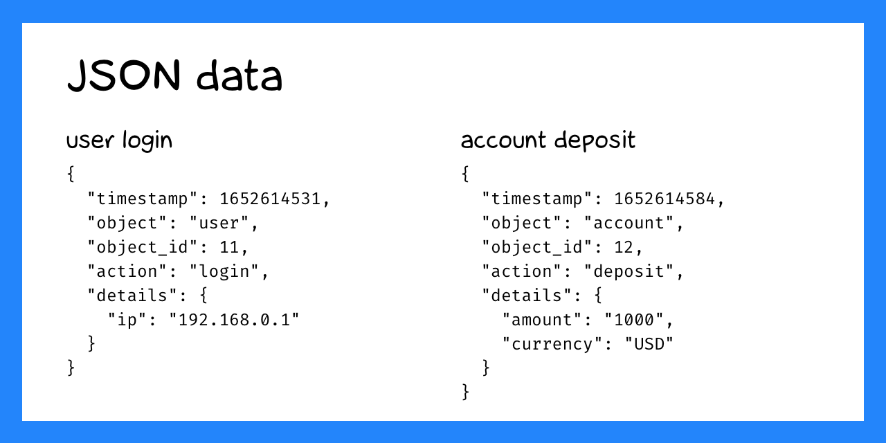
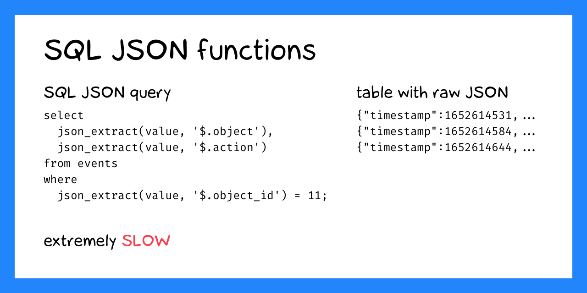
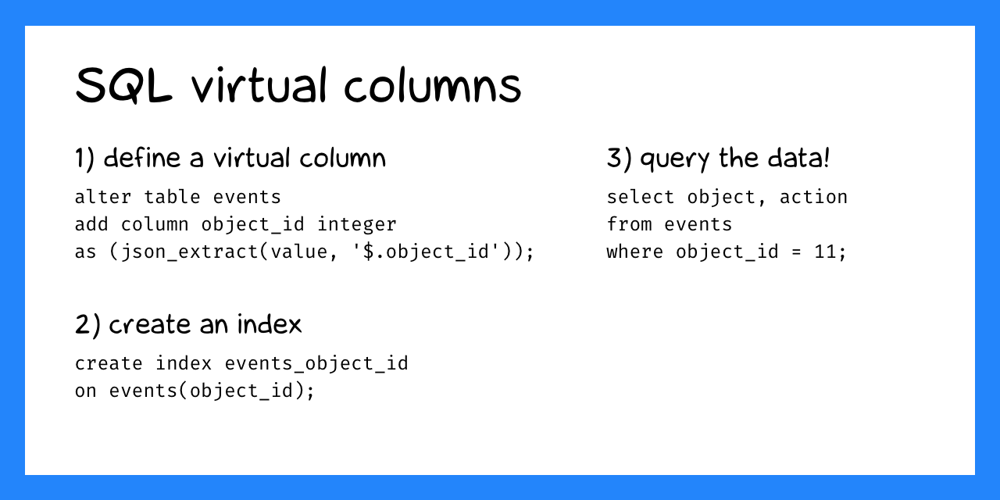

+++
date = 2022-05-15T11:25:00Z
title = "JSON and virtual columns in SQLite"
description = "Faster JSON handling in a relational database."
image = "/json-virtual-columns/cover.png"
slug = "json-virtual-columns"
tags = ["sqlite"]
+++

[Generated columns](/generated-columns/) have another great use case.



Let's say you decide to keep a log of events that occur in the system. There are different types of events, each with its own set of fields. For example, sign-in:

```json
{
    "timestamp": "2022-05-15T09:31:00Z",
    "object": "user",
    "object_id": 11,
    "action": "login",
    "details": {
        "ip": "192.168.0.1"
    }
}
```

Or account deposit:

```json
{
    "timestamp": "2022-05-15T09:32:00Z",
    "object": "account",
    "object_id": 12,
    "action": "deposit",
    "details": {
        "amount": "1000",
        "currency": "USD"
    }
}
```



You decide to store the raw JSON, as normalization is non-trivial. You create an `events` table with a single `value` field:

```sql
select value from events;
```

```
{"timestamp":"2022-05-15T09:31:00Z","object":"user","object_id":11,"action":"login","details":{"ip":"192.168.0.1"}}
{"timestamp":"2022-05-15T09:32:00Z","object":"account","object_id":12,"action":"deposit","details":{"amount":"1000","currency":"USD"}}
{"timestamp":"2022-05-15T09:33:00Z","object":"company","object_id":13,"action":"edit","details":{"fields":["address","phone"]}}
```

And select events for a specific object:

```sql
select
  json_extract(value, '$.object') as object,
  json_extract(value, '$.action') as action
from events
where json_extract(value, '$.object_id') = 11;
```

```
┌────────┬────────┐
│ object │ action │
├────────┼────────┤
│ user   │ login  │
└────────┴────────┘
```

So far, so good. But `json_extract()` parses the text on each call, so for hundreds of thousands of records the query is slow. What should you do?



Define virtual columns:

```sql
alter table events
add column object_id integer
as (json_extract(value, '$.object_id'));

alter table events
add column object text
as (json_extract(value, '$.object'));

alter table events
add column action text
as (json_extract(value, '$.action'));
```

Build an index:

```sql
create index events_object_id on events(object_id);
```

Now the query works instantly:

```sql
select object, action
from events
where object_id = 11;
```

Thanks to virtual columns, we almost have a NoSQL database ツ

[Playground](https://sqlime.org/#gist:c284f7c22684eb74b5dab92d98f7d773)

P.S. Interested in mastering advanced SQL? Check out my book — [SQL Window Functions Explained](/sql-window-functions-book)
