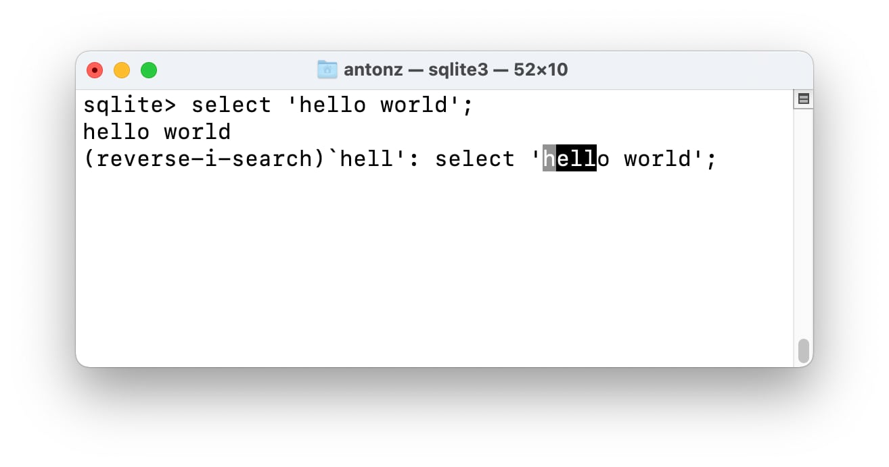

+++
date = 2022-04-17T14:50:00Z
title = "SQLite CLI command history"
description = "Search for the query instead of typing it by hand."
image = "/sqlite-history/cover.png"
slug = "sqlite-history"
tags = ["sqlite"]
+++

SQLite command line tool (`sqlite3` or `sqlite3.exe`) remembers the last 2000 executed commands. To repeat the last command, just press the `↑` key, to search for older ones — use `Ctrl+R` shortcut.

<figure>
  
  <figcaption>It's faster to find a query than to type it again</figcaption>
</figure>

By default, SQLite stores the history file in the user's home directory and names it `.sqlite_history`. It's in plain text, so you can view it in your favorite editor. If you prefer to save it elsewhere, specify the full path in the `SQLITE_HISTORY` environment variable.

<figure>
  
  <figcaption>Sync the history file (via Dropbox etc.) to search for queries on all devices</figcaption>
</figure>

SQLite writes the history to a file when the console exits normally, so in case of the computer or CLI crash the commands executed since the last `sqlite3` launch will be lost.

History recording is not the only feature of the console. SQLite CLI makes it easy to import and export data or work with several databases at the same time. Debugging multi-line queries is quite a challenge, though.

_Follow **[@ohmypy](https://twitter.com/ohmypy)** on Twitter to keep up with new posts 🚀_
