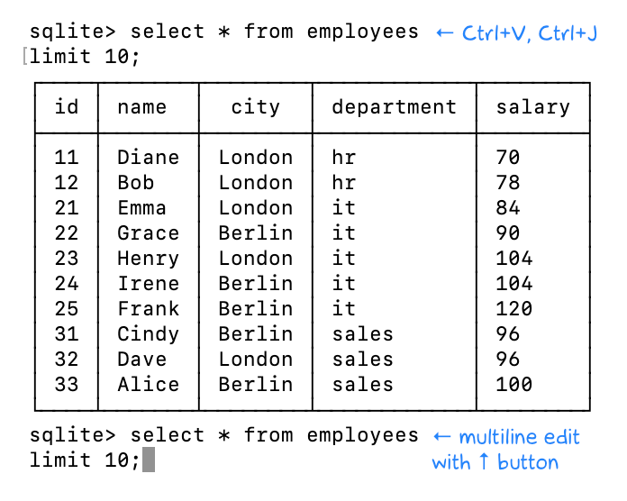

+++
date = 2022-04-24T21:30:00Z
title = "Multi-line queries in SQLite shell"
description = "How to edit a big query without leaving the CLI"
image = "/sqlite-multiline/cover.png"
slug = "sqlite-multiline"
tags = ["sqlite"]
+++

Just after writing that debugging multi-line queries [in SQLite shell](/sqlite-history/) is not easy, I discovered a cool trick on the sqlite forum:

Use `Ctrl+V`, `Ctrl+J` instead of `Enter` for new lines. After that, edit the query with the `↑` button.

<figure>
  
</figure>

And here are some more ways to edit multi-line queries:

-   Use external editor (`.shell <editor> <file>`)
-   Run query from file (`.read <file>`)
-   Consider DBeaver, DataGrip or other UI tool

_Follow **[@ohmypy](https://twitter.com/ohmypy)** on Twitter to keep up with new posts 🚀_
