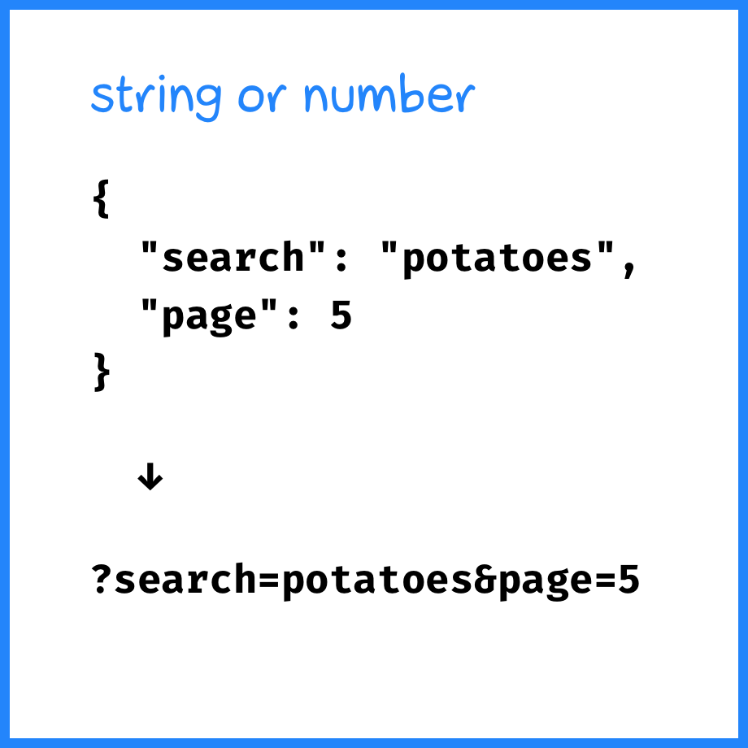
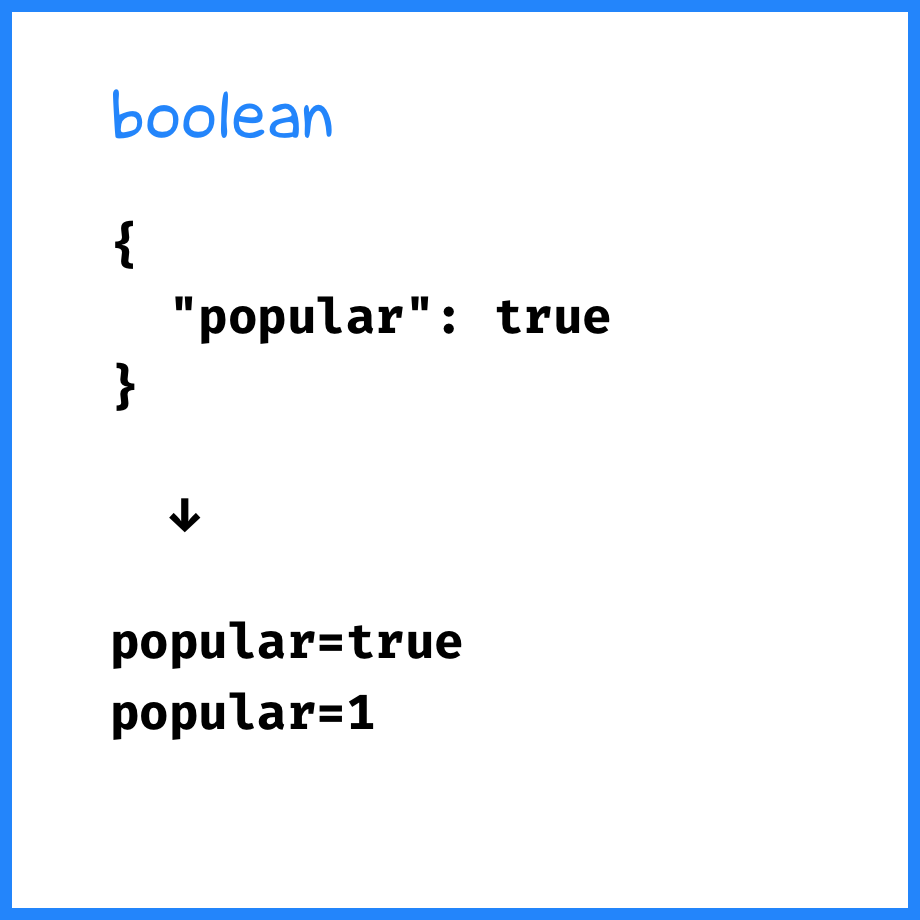
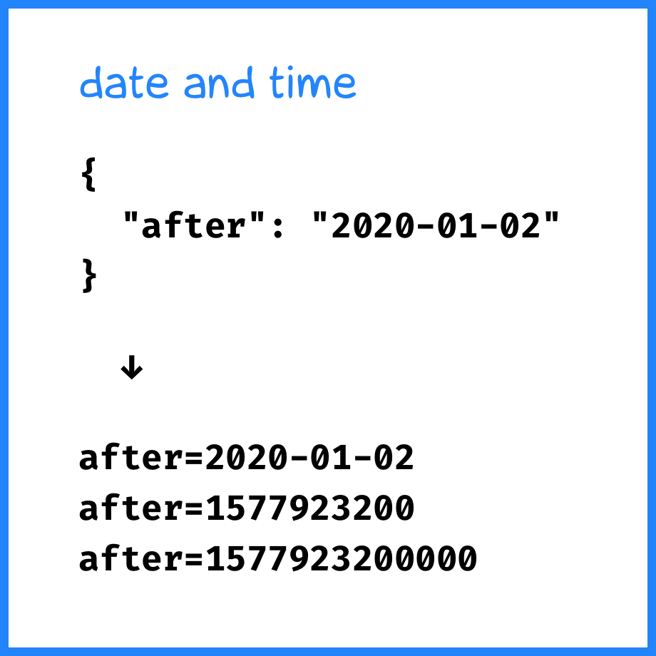

+++
date = 2022-05-08T11:30:00Z
title = "Storing state in the URL"
description = "So that the app does not reset to zero after page refresh."
image = "/storing-state/cover.png"
slug = "storing-state"
tags = ["software"]
+++

If you are developing a web application, sooner or later you will face the problem of saving the local system state for the user.

Imagine you sell elite potatoes over the Internet. The buyer visits the website and enters the search criteria:

-   strictly from Bolivia or South Africa,
-   harvest of 2022,
-   tuber size from 3 to 7 cm,
-   preferably in the form of a sea seal.

The buyer then receives a list of 300 items (seal-shaped potatoes are quite popular in South Africa), split into 6 pages of 50 items each. They load the third page, open the potato card and freeze in silent admiration for a few seconds. And then accidentally refresh the page. What will your application do?

It depends on how the application stores the filter state. Let's look at the options, and then consider one of them in more detail.

## How to store state

JavaScript applications traditionally work with local state in the form of in-memory objects. This is convenient because it supports complex data structures without storage limits, and one does not have to deal with serialization. But will it suit our potato shop? Let's figure it out.

### Don't store state at all

Let's say you didn't bother to store the state and keep it in memory. Then after page reload the current context will be lost. The user will be redirected to the main page, where they will stare in disbelief at the giant "ELITE POTATOES" heading.

This is how Google calendar used to behave. No matter how you navigate around the calendar, no matter what filters you apply, the URL always stayed the same:

    https://www.google.com/calendar/render

Refresh the page — and the calendar happily resets to the current week. Ouch.

### Store state locally

Most services understand that it is not OK to lose context after page refresh. They store the state on the client side (using Web Storage, IndexedDB or other means). This solves the problem with page refreshes, but still won't help with bookmarking.

Plus, such approach creates a problem with conflicting state changes. I opened two browser tabs, went to your potato website, searched for "young potatoes" in the first tab and for "bushy leaves" in the second one. Which query will the app remember?

### Store a set of URL parameters

Ever since the days when the dynamic nature of websites was limited to the `<blink>` tag, some considered a best practice to store the state in the URL (_URL parameters_, also known as _GET parameters_ or _query string_). Such URL is great for emailing or bookmarking — there is no problem restoring the context:

    https://potato.shop/catalog/?search=wild+potatoes&country=bo,za&size=3-7&page=5

URL state makes each browser tab completely independent. No shared data in the local storage means no conflicts. It simplifies developer's life, and the user does not have to scratch their head over the mysterious system glitches.

### Store serialized state

URL parameters do an excellent job with scalar values (strings, numbers, booleans). But they are less suitable for collections and more complex structures. That's why programmers sometimes do this:

-   represent the state in the form of a dictionary;
-   serialize it to Base64;
-   pass it as the single URL parameter.

For example, for this state:

```json
{
    "search": "wild potatoes",
    "country": ["bo", "za"],
    "size": { "min": 3, "max": 7 },
    "page": 5
}
```

One will get this URL:

    https://potato.shop/catalog/?state=eyJzZWFyY2giOiJ3aWxkIHBvdGF0b2VzIiwiY291bnRyeSI6WyJibyIsInphIl0sInNpemUiOnsibWluIjozLCJtYXgiOjd9LCJwYWdlIjo1fQ==

### Hybrid approaches

One can store only the main parameters in the URL, and additional ones in the local storage:

    https://potato.shop/catalog/?search=wild+potatoes&page=10

One can pass the main parameters explicitly, and the additional ones as the serialized blob:

    https://potato.shop/catalog/?search=wild+potatoes&state=eyJjb3VudHJ5IjpbImJvIiwiemEiXSwic2l6ZSI6eyJtaW4iOjMsIm1heCI6N30sInBhZ2UiOjV9

There are also more creative options.

For example, one can store the state of the potato list locally. When a visitor requests a specific potato item, open it in a new tab — to not bother restoring the list state later.

Or one can implement an URL shortener of sorts. Store the full state on the server, generate a unique link like `https://potato.shop/catalog/xKda7` and serve it to the client.

We have sorted out the options, now let's look at one of them in more detail.

## How to store state in URL parameters

At first glance, storing the state as a set of URL parameters is all nice and easy.

State:

```json
{
    "search": "wild potatoes",
    "page": 5
}
```

URL params (this and further examples do not use url escaping):

    ?search=wild+potatoes&page=5

Indeed, it is easy to pass strings and numbers in the parameters. It gets more interesting with other data types.

### Boolean value

Booleans are typically passed as `true` / `false` or `1` / `0`.

State:

```json
{
    "search": "potatoes",
    "popular": true
}
```

URL params:

    ?search=potatoes&popular=true
    ?search=potatoes&popular=1

### Date and time

Date/time typically uses [RFC 3339](https://datatracker.ietf.org/doc/html/rfc3339) (`2020-01-02T10:11:12Z`) or [Unix Time](https://en.wikipedia.org/wiki/Unix_time) (seconds after midnight 01/01/1970).

State (since the example is in JSON, I pass the date in RFC3339; your language has a native representation):

```json
{
    "search": "potatoes",
    "after": "2020-01-02T10:11:12Z"
}
```

URL params:

    ?search=potatoes&after=2020-01-02T10:11:12Z
    ?search=potatoes&after=1577959872

Unix time in milliseconds is less common:

    ?search=potatoes&after=1577959872000

### Empty value

If some property is not set, it is usually passed empty, or not passed at all.

State:

```json
{
    "search": "potatoes",
    "country": null
}
```

URL params:

    ?search=potatoes&country=
    ?search=potatoes

Sometimes devs use a special empty value (e.g. `null`):

    ?search=potatoes&country=null

### List (array)

So far we have been dealing with scalar values. It becomes more fun with lists.

```json
{
    "search": "potatoes",
    "country": ["bo", "za"]
}
```

The classic option is to repeat the property name for each value, as dictated by [RFC 6570](https://datatracker.ietf.org/doc/html/rfc6570#section-2.4.2):

    ?search=potatoes&country=bo&country=za

Sometimes a `[]` is added to stress the list nature:

    ?search=potatoes&country[]=bo&country[]=za

Sometimes even with an index:

    ?search=potatoes&country[0]=bo&country[1]=za

Brevity fans pass the property name once, and separate the values with a comma:

    ?search=potatoes&country=bo,za

### Dictionary (map)

A list includes a set of values. A dictionary contains nested properties:

```json
{
    "search": "potatoes",
    "size": { "min": 3, "max": 7 }
}
```

Internet standards do not mention passing composite objects in the URL. So the developers have invented their own options.

Most often people repeat the top-level property name and pass nested property names in `[]`:

    ?search=potatoes&size[min]=3&size[max]=7

Dot notation is more rare:

    ?search=potatoes&size.min=3&size.max=7

Deeper nesting is not typically used. It would be very nontrivial to deserialize such URL parameters back into the object.

## Summary

The main ways of storing the local state are:

-   no storage;
-   local storage;
-   URL parameters;
-   serialized blob.

Memory and local storage are great for "private" state — settings, caches, history. URL parameters are good for the "public" state, so that one could bookmark or forward the stateful link. URLs with parameters are self-evident and allow one to pass rather complex data structures.

<div class="row">
<div class="col-xs-12 col-sm-4">
<figure></figure>
</div>
<div class="col-xs-12 col-sm-4">
<figure></figure>
</div>
<div class="col-xs-12 col-sm-4">
<figure></figure>
</div>
</div>

<div class="row">
<div class="col-xs-12 col-sm-4">
<figure></figure>
</div>
<div class="col-xs-12 col-sm-4">
<figure></figure>
</div>
<div class="col-xs-12 col-sm-4">
<figure></figure>
</div>
</div>

Most importantly, whichever approach you choose — make sure to save and restore the context transparently for the user.

_Follow **[@ohmypy](https://twitter.com/ohmypy)** on Twitter to keep up with new posts 🚀_
