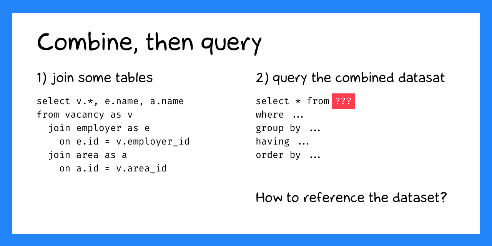
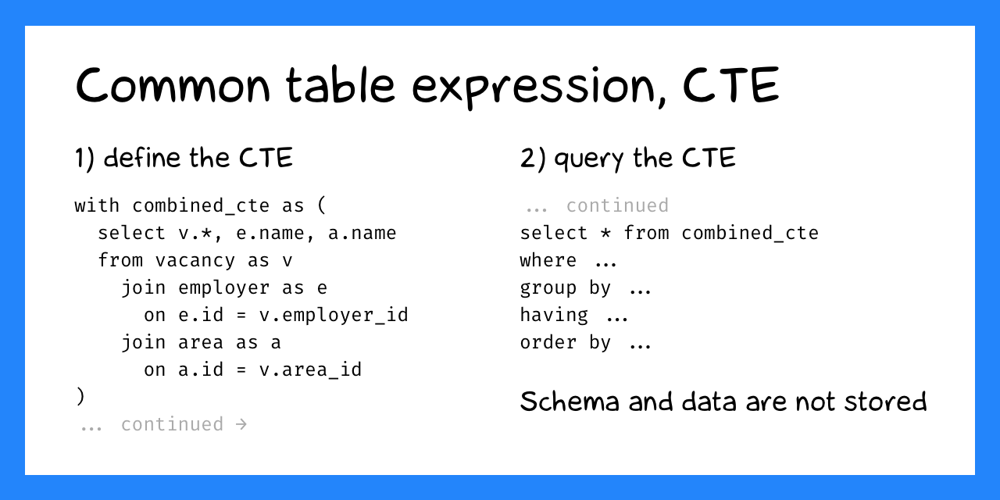
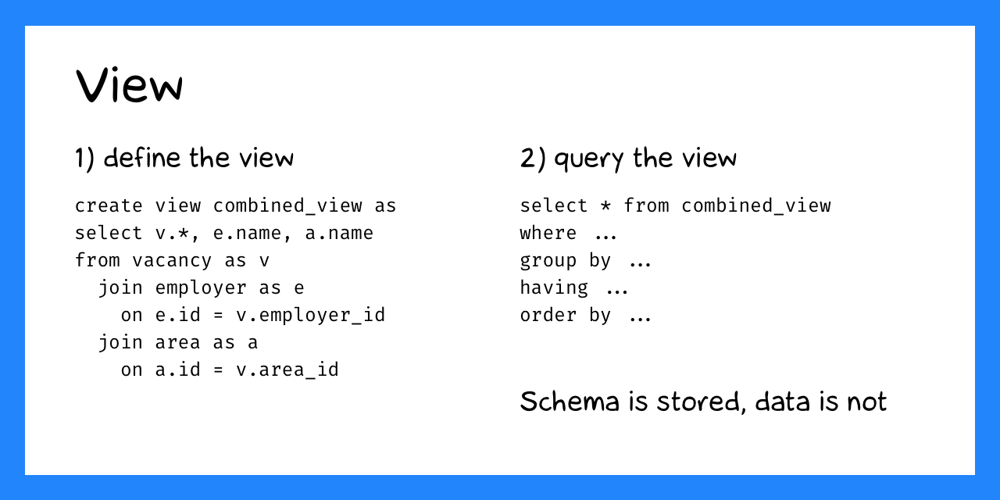
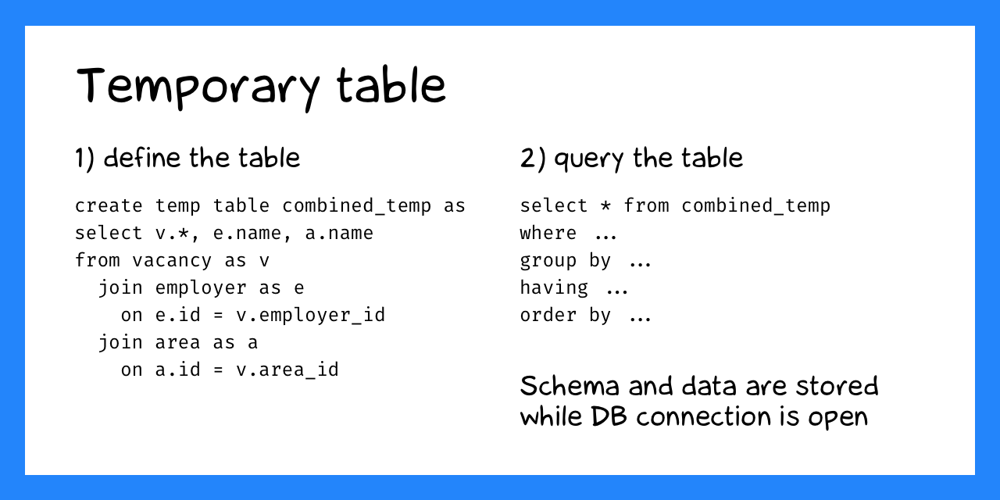

+++
date = 2022-05-18T20:30:00Z
title = "Temporary tables in SQLite"
description = "For faster exploratory data analysis."
image = "/temp-tables/cover.png"
slug = "temp-tables"
tags = ["sqlite"]
+++

Sometimes you want to combine data from multiple tables into one and query the results. For example, join vacancies together with employers and regions:



```sql
select v.*, e.name, a.name
from vacancy as v
  join employer as e on e.id = v.employer_id
  join area as a on a.id = v.area_id
```

The question is how to reference the combined dataset in further queries. There are three ways of doing that:

1. Common Table Expressions (CTEs)
2. Views
3. Temporary tables



A **Common Table Expression** is basically a named subquery:

```sql
with combined_cte as (
  select v.*, e.name, a.name
  from vacancy as v
    join employer as e on e.id = v.employer_id
    join area as a on a.id = v.area_id
)
select ...
from combined_cte
where ...
group by ...
order by ...
```

The CTE is repeated in each query and computed on the fly. So if the subquery for the combined dataset is slow, the entire query will be even slower.



A **view** works like a CTE, but you can reference it by name and not repeat the subquery every time. Views are computed on the fly, similar to CTEs.

```sql
-- 1) create once
create view combined_view as
select v.*, e.name, a.name
from vacancy as v
  join employer as e on e.id = v.employer_id
  join area as a on a.id = v.area_id;

-- 2) use everywhere
select ...
from combined_view
where ...
group by ...
order by ...
```

PostgreSQL and others have materialized views, which store data on disk. But not SQLite.



A **temporary table** is like a real table: it stores data on disk, and you can build indexes. But it exists only while the database connection is open.

```sql
-- 1) create once
create temp table combined_temp as
select v.*, e.name, a.name
from vacancy as v
  join employer as e on e.id = v.employer_id
  join area as a on a.id = v.area_id;

-- 2) use everywhere
select ...
from combined_temp
where ...
group by ...
order by ...
```

Technically, SQLite stores temporary tables in a separate `temp` database. It keeps that database in a separate file on disk, visible only to the current database connection. The temporary database is deleted automatically as soon as the connection is closed.

<div class="boxed">
<p><strong>Temporary database location</strong></p>

On unix-like systems, the directory for storing the temp database can be one of the following:

1. The directory set by `PRAGMA temp_store_directory` (deprecated)
2. The `SQLITE_TMPDIR` environment variable
3. The `TMPDIR` environment variable
4. `/var/tmp`
5. `/usr/tmp`
6. `/tmp`
7. The current working directory (`.`)

SQLite picks the first one with both write and execute permissions.

[documentation](https://sqlite.org/tempfiles.html)

</div>

Temporary tables are great for experimenting when you're just getting to know the data. Do whatever you want — everything will be forgotten after disconnecting from the database ツ
