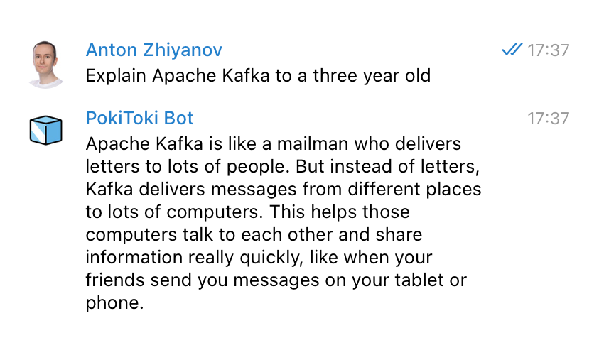
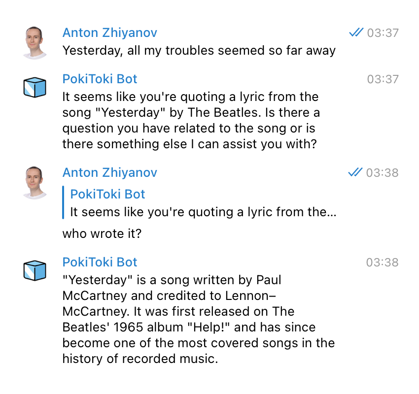
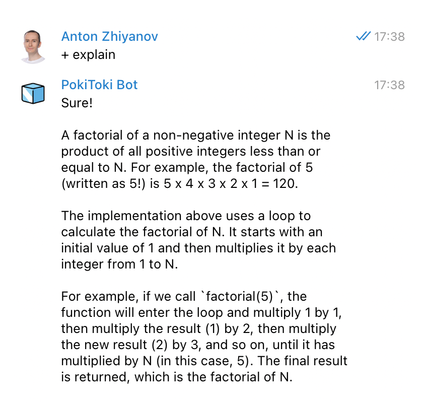
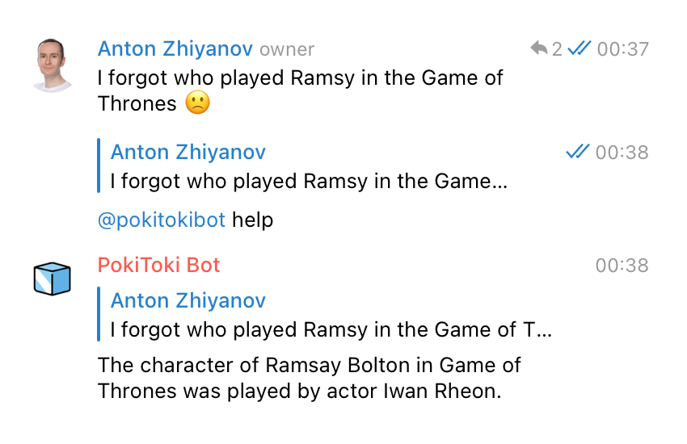
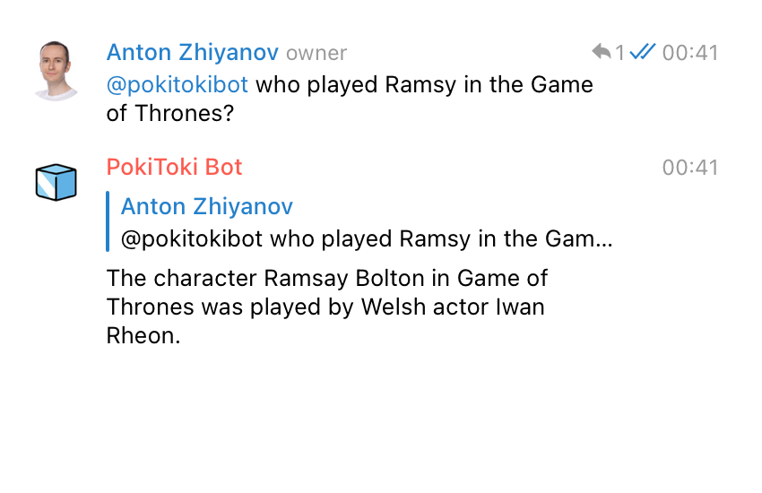

+++
date = 2023-03-11T12:30:00Z
title = "ChatGPT Bot in Python"
description = "A Telegram chatbot that works via the official OpenAI API."
image = "/pokitoki/cover.png"
slug = "pokitoki"
tags = ["python"]
+++

In the last few months, people have been releasing a record number of AI-powered software. Of course I could not stay out of it.

And so the [**pokitoki**](https://github.com/nalgeon/pokitoki) project was born. It's a a Telegram chat bot built using the ChatGPT (aka GPT-3.5) language model from OpenAI.

Notable features:

-   Both one-on-one and group chats.
-   Direct questions or mentions.
-   Ask again by retrying or editing the last message.
-   Follow-up questions.

## Personal chats

The bot acts as your personal assistant:

<div class="row">
<div class="col-xs-12 col-sm-6">
<figure>
    
</figure>
</div>
</div>

To allow other users to use the bot, list them in the `telegram_usernames` config property.

The bot has a terrible memory, so don't expect it to remember any chat context by default. But you can ask follow-up questions using a plus sign:

<div class="row">
<div class="col-xs-12 col-sm-6">
<figure>
    
    <figcaption>follow up by replying<figcaption>
</figure>
</div>
<div class="col-xs-12 col-sm-6">
<figure>
    
    <figcaption>or by writing a `+` sign<figcaption>
</figure>
</div>
</div>

Available commands:

-   `/retry` - retry answering the last question
-   `/help` - show help

To rephrase or add to the last question, simply edit it. The bot will then answer the updated question.

## Groups

To get an answer from the bot in a group, mention it in a reply to a question, or ask a question directly:

<div class="row">
<div class="col-xs-12 col-sm-6">
<figure>
    
    <figcaption>reply with mention<figcaption>
</figure>
</div>
<div class="col-xs-12 col-sm-6">
<figure>
    
    <figcaption>direct question<figcaption>
</figure>
</div>
</div>

To make the bot reply to group members, list the group id in the `telegram_chat_ids` config property. Otherwise, the bot will ignore questions from group members unless they are listed in the `telegram_usernames` config property.

If you don't know the group id, run the `/version` bot command in a group to find it:

```
Chat information:
- id: -1001405001234
- title: My Favorite Group
- type: supergroup

Bot information:
- id: 5930739038
- name: @pokitokibot
- version: 56
- usernames: 6 users
- chat IDs: []
- access to messages: True
```

## Setup

1. Get your [OpenAI API](https://openai.com/api/) key
2. Get your Telegram bot token from [@BotFather](https://t.me/BotFather)
3. Copy `config.example.yml` to `config.yml` and specify your tokens there.
4. Start the bot:

```bash
docker compose up --build
```

I've intentionally kept the bot as simple as possible so you can quickly understand the code.

[Source code on GitHub](https://github.com/nalgeon/pokitoki)
