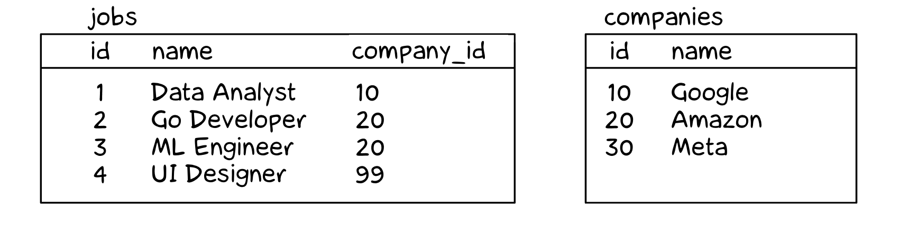
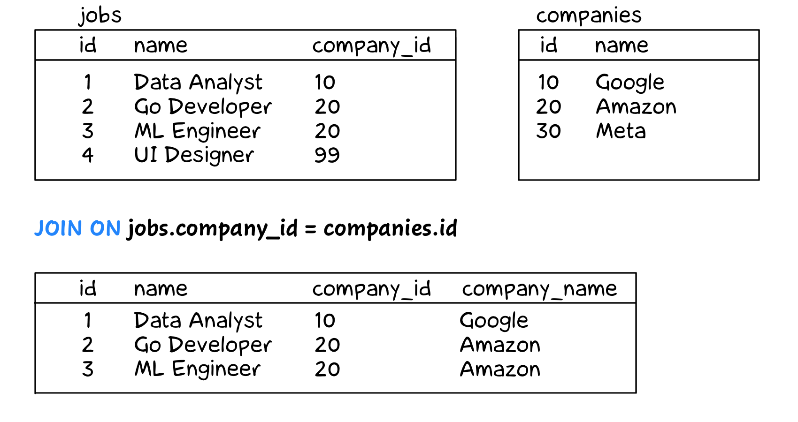
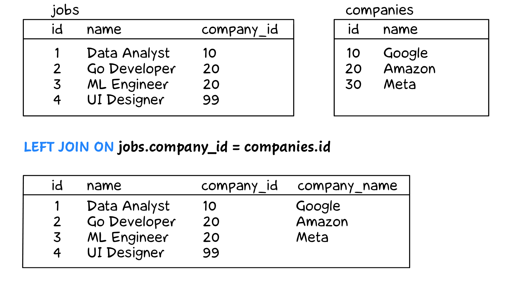

+++
date = 2023-05-14T13:00:00Z
title = "SQL Cheat Sheet"
description = "For those who knew SQL, but kinda forgot it."
image = "/sql-cheatsheet/cover.png"
slug = "sql-cheatsheet"
tags = ["data"]
+++

This is a short cheat sheet for those who were once familiar with SQL selects, but haven't given it much practice since. The examples are interactive, so you can both read and practice.

We will use the toy `employees` table:

```
┌────┬───────┬────────┬────────────┬────────┐
│ id │ name  │  city  │ department │ salary │
├────┼───────┼────────┼────────────┼────────┤
│ 11 │ Diane │ London │ hr         │ 70     │
│ 12 │ Bob   │ London │ hr         │ 78     │
│ 21 │ Emma  │ London │ it         │ 84     │
│ 22 │ Grace │ Berlin │ it         │ 90     │
│ 23 │ Henry │ London │ it         │ 104    │
│ 24 │ Irene │ Berlin │ it         │ 104    │
│ 25 │ Frank │ Berlin │ it         │ 120    │
│ 31 │ Cindy │ Berlin │ sales      │ 96     │
│ 32 │ Dave  │ London │ sales      │ 96     │
│ 33 │ Alice │ Berlin │ sales      │ 100    │
└────┴───────┴────────┴────────────┴────────┘
```

## Basics

The basic building blocks of an SQL query.

### select ... from ...

Selects rows from the specified table, keeping only the listed columns in each row.

```sql
select id, name, salary
from employees;
```

### where

Select only rows that meet the conditions.

```sql
select id, name, salary
from employees
where city = 'Berlin';
```

There are different types of conditions:

-   strict equality: `city = 'Berling'`
-   inequality: `salary > 100`
-   range inclusion: `id between 20 and 29`
-   set inclusion: `department in ('hr', 'it')`
-   pattern matching: `name like 'A%'`
-   null value checking: `city is null`

Conditions can be combined with `or` (to select rows that match _any_ of the conditions):

```sql
select id, name, salary
from employees
where department = 'hr' or department = 'it';
```

Or with `and` (to select rows that match _all_ of the conditions):

```sql
select id, name, salary
from employees
where city = 'London' and department = 'it';
```

### distinct

Selects only unique values (i.e., no repetitions) listed in the `select` columns.

```sql
select distinct department
from employees;
```

### order by

Sorts the results according to the specified columns.

```sql
select id, name, salary
from employees
order by salary, id;
```

Sorts from smallest to largest by default, but does the opposite if you add `desc`.

```sql
select id, name, salary
from employees
order by salary desc, id;
```

### limit

Returns only the first N rows of the result set. Typically used with `order by`.

```sql
select id, name, salary
from employees
order by salary
limit 5;
```

## Grouping

Grouping data and calculating aggregates.

### group by

Combines rows with the same value in specified columns. It is used in conjunction with one of several aggregate functions:

`count(*)` counts the number of rows with the same `group by` column value.

```sql
-- number of employees in each city
select city, count(*)
from employees
group by city;
```

`sum(column)` calculates the sum of the `column` values among the rows with the same `group by` column value.

```sql
-- total salary fund in each city
select city, sum(salary)
from employees
group by city;
```

`avg(column)` calculates the average of the `column` values among the rows with the same `group by` column value.

```sql
-- average salary in each city
select city, avg(salary)
from employees
group by city;
```

`max(column)` calculates the maximum of the `column` values among the rows with the same `group by` column value.

```sql
-- maximum salary in each city
select city, max(salary)
from employees
group by city;
```

`min(column)` calculates the minimum of the `column` values among the rows with the same `group by` column value.

```sql
-- minimum salary in each city
select city, min(salary)
from employees
group by city;
```

We can group by multiple columns:

```sql
-- average salary in each department for each city
select
  city, department,
  round(avg(salary)) as avg_salary
from employees
group by city, department;
```

### having

Filters rows from the result _after_ the `group by` is executed — unlike `where`, which filters out rows _before_ the `group by` is executed.

```sql
-- departments with more than 3 employees
select department, count(*)
from employees
group by department
having count(*) > 3;
```

## Table join

Merging multiple tables in the query result.

Suppose there are two tables — `jobs` and `companies`.

<div class="row">
<div class="col-xs-12 col-sm-8">
<figure>
  
</figure>
</div>
</div>

In the `jobs` table there is a company identifier called `company_id`. However, the name of the company is in the other table — `companies`.

### Inner JOIN

We want to select records from the `jobs` table, but we also want to add the company name to them. We can do this by using a table `join` operation:

<div class="row">
<div class="col-xs-12 col-sm-8">
<figure>
  
</figure>
</div>
</div>

```sql
select
  jobs.id,
  jobs.name,
  jobs.company_id,
  companies.name as company_name
from jobs
  join companies on jobs.company_id = companies.id;
```

For each row in the `jobs` table, the database engine looks in the `companies` table, finds the value where `id = jobs.company_id`, extracts the `name`, and adds it to the result. If no matching value is found (as in the case of "UI Designer" with a company ID of `99`), the row is not included in the result.

### Outer JOIN (LEFT JOIN)

The outer join is very similar to an inner join.

<div class="row">
<div class="col-xs-12 col-sm-8">
<figure>
  
</figure>
</div>
</div>

```sql
select
  jobs.id,
  jobs.name,
  jobs.company_id,
  companies.name as company_name
from jobs
  left join companies on jobs.company_id = companies.id;
```

The difference is that even if the row with `id = jobs.company_id` ("UI Designer" in our example) is not found in the `companies` table, the row from `jobs` will still appear in the result. The company name will be `null` in this case.

An inner JOIN can be thought of as saying:

> Given these two tables, I want to see records that match based on the specified criteria.

An outer (left) JOIN, on the other hand, says:

> Given these two tables, I want to see records that match based on the specified criteria. I also want to see all records from the left table that do not match the right table.

## Summary

We covered the basics of SQL for selecting data:

-   Query parts: columns, tables, filtering, sorting.
-   Data grouping and aggregation functions.
-   Table joins.

Of course, SQL has many more capabilities, but that's another story.

<sqlime-db name="sample" path="./sample.sql"></sqlime-db>
<sqlime-examples db="sample" selector="div.highlight" editable></sqlime-examples>

<script src="/assets/sqlime/sqlite3.js"></script>
<script src="/assets/sqlime/sqlime-db.js"></script>
<script src="/assets/sqlime/sqlime-examples.js"></script>
