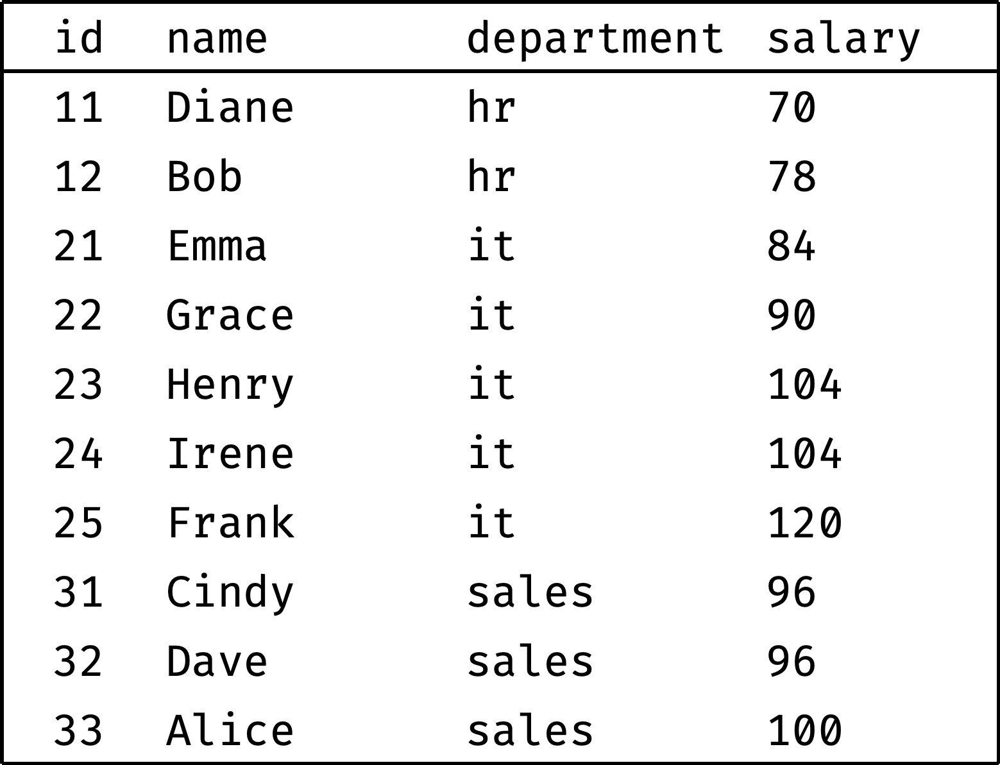
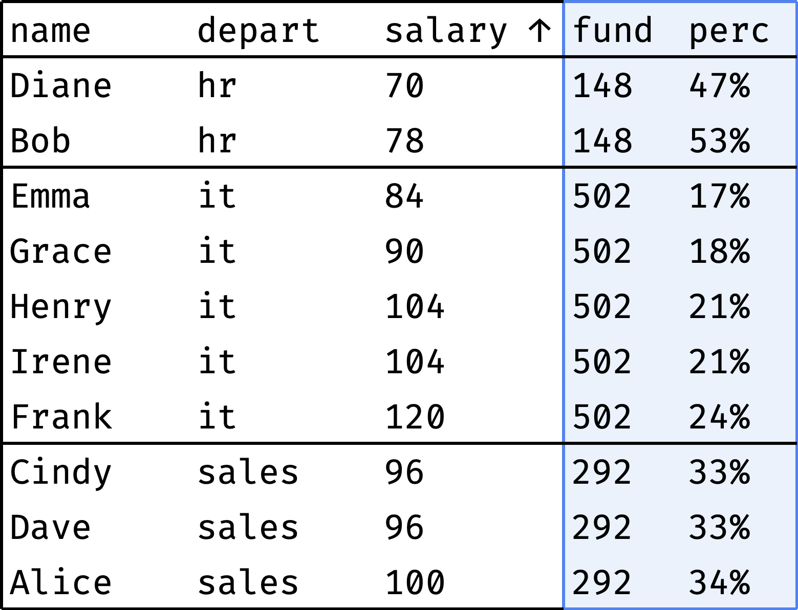
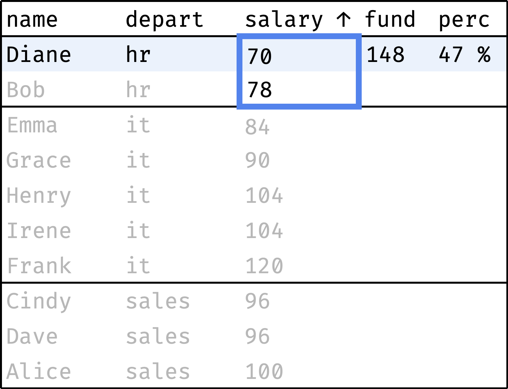
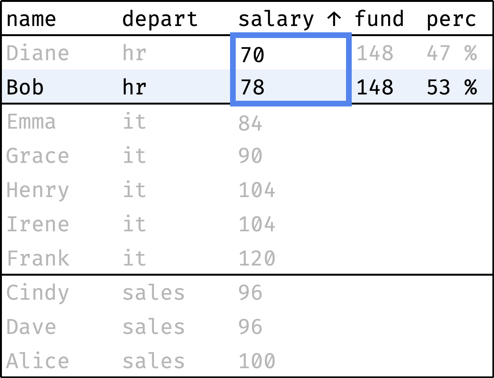
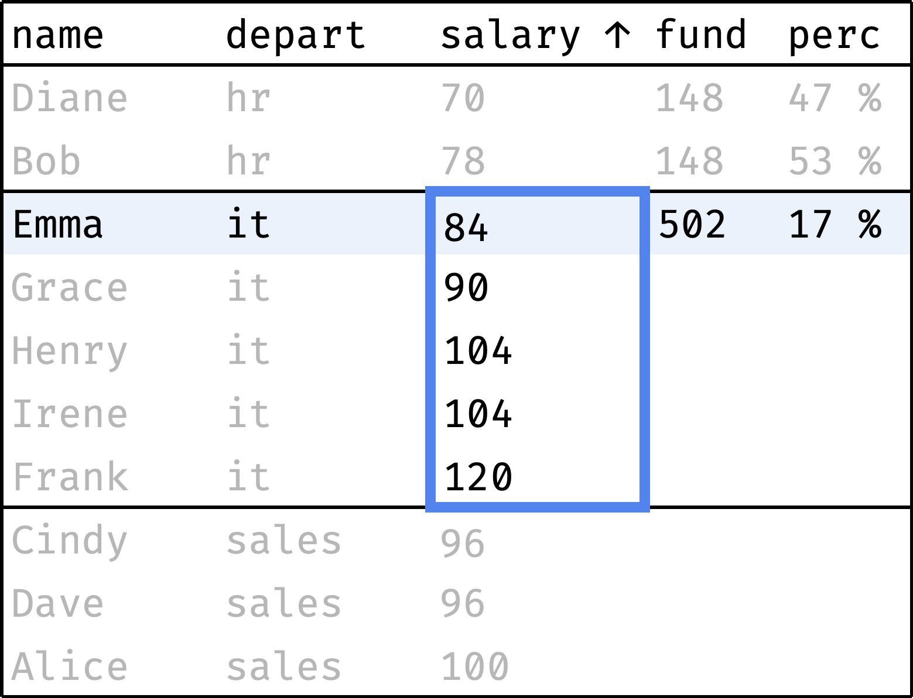
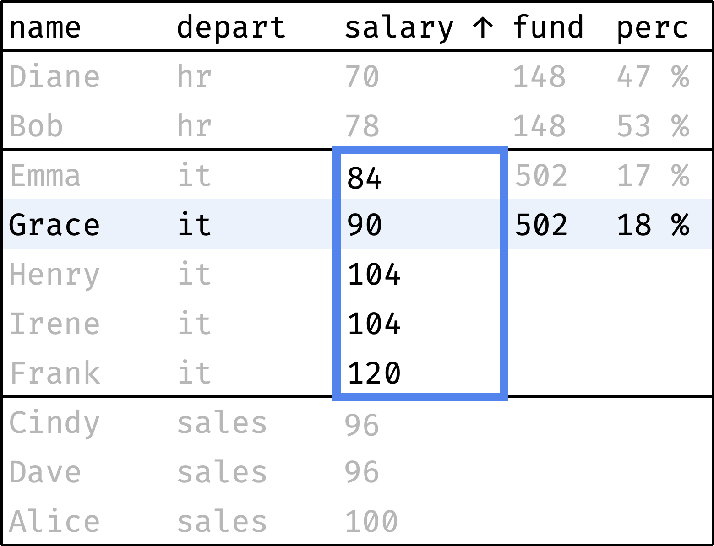
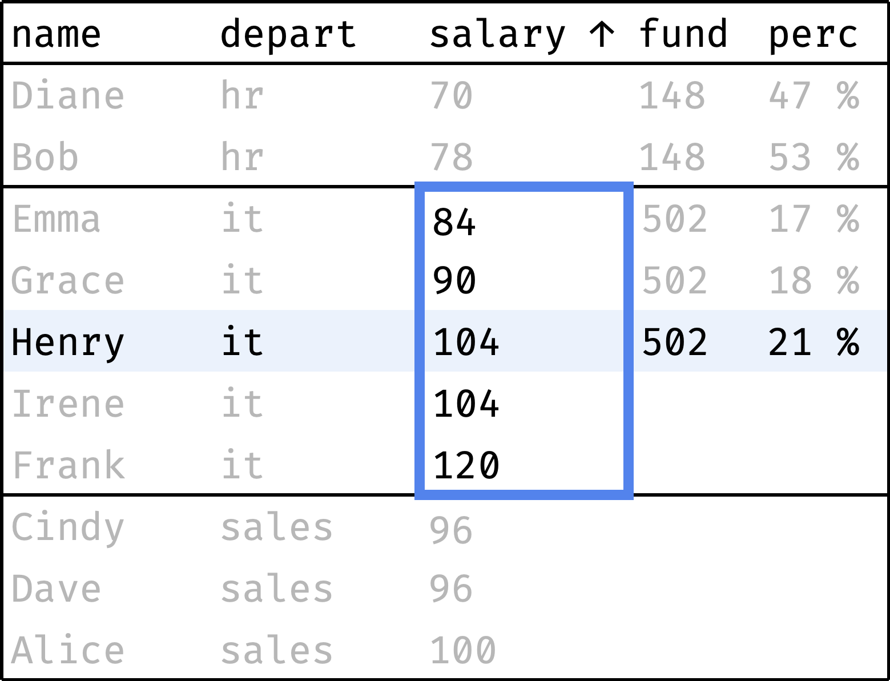
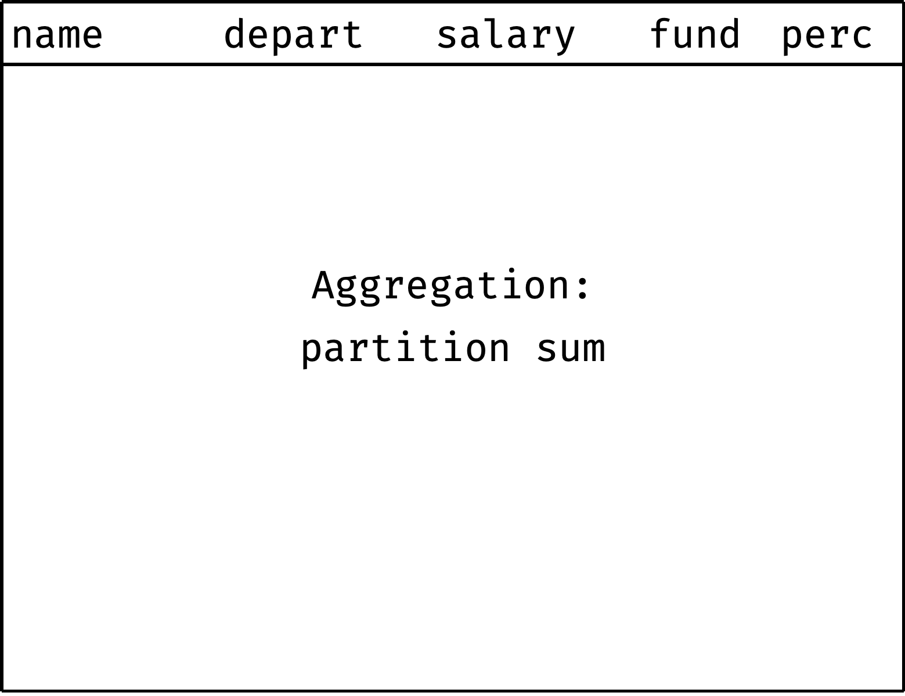

+++
date = 2023-04-30T18:30:00Z
title = "Aggregating Data with SQL Window Functions"
description = "Comparing individual values with totals and averages."
image = "/sql-window-functions-aggregation/cover.png"
slug = "sql-window-functions-aggregation"
tags = ["data"]
featured = true
+++

_This is an excerpt from my book [SQL Window Functions Explained](/sql-window-functions-book). The book is a clear and visual introduction to the topic with lots of practical exercises._

Aggregation means counting totals or averages (or other _aggregates_). For example, the average salary per city. Or the total number of gold medals for each country in the Olympic Games standings.

We will aggregate records from the `employees` table:

```
┌────┬───────┬────────┬────────────┬────────┐
│ id │ name  │  city  │ department │ salary │
├────┼───────┼────────┼────────────┼────────┤
│ 11 │ Diane │ London │ hr         │ 70     │
│ 12 │ Bob   │ London │ hr         │ 78     │
│ 21 │ Emma  │ London │ it         │ 84     │
│ 22 │ Grace │ Berlin │ it         │ 90     │
│ 23 │ Henry │ London │ it         │ 104    │
│ 24 │ Irene │ Berlin │ it         │ 104    │
│ 25 │ Frank │ Berlin │ it         │ 120    │
│ 31 │ Cindy │ Berlin │ sales      │ 96     │
│ 32 │ Dave  │ London │ sales      │ 96     │
│ 33 │ Alice │ Berlin │ sales      │ 100    │
└────┴───────┴────────┴────────────┴────────┘
```

[playground](https://sqlime.org/#employees.db) • [download](/sql-window-functions-book/employees.sql)

Table of contents:

-   [Comparing with the salary fund](#comparing-with-the-salary-fund)
-   [Filtering and execution order](#filtering-and-execution-order)
-   [Window definition](#window-definition)
-   [Aggregation functions](#aggregation-functions)
-   [Keep it up](#keep-it-up)

## Comparing with the salary fund

Each department has a salary fund — money spent monthly on paying employees' salaries. Let's see what percentage of this fund represents each employee's salary:

<div class="row">
<div class="col-xs-12 col-sm-5">
    before<br/>
    <figure></figure>
</div>
<div class="col-xs-12 col-sm-5">
    after<br/>
    <figure></figure>
</div>
</div>

The `fund` column shows the department's salary fund, and the `perc` column shows the employee's salary share of that fund. As you can see, everything is more or less even in HR and Sales, but IT has a noticeable spread of salaries.

How do we go from "before" to "after"?

First, let's sort the table by department:

```sql
select
  name, department, salary,
  null as fund, null as perc
from employees
order by department, salary, id;
```

Now let's traverse from the first record to the last, computing the following values along the way:

-   `fund` — total departmental salary;
-   `perc` — employee's salary as a percentage of the `fund`.

<div class="row">
<div class="col-xs-12 col-sm-5">
    ➀<br/>
    <figure></figure>
</div>
<div class="col-xs-12 col-sm-5">
    ➁<br/>
    <figure></figure>
</div>
</div>

<div class="row">
<div class="col-xs-12 col-sm-5">
    ➂<br/>
    <figure></figure>
</div>
<div class="col-xs-12 col-sm-5">
    ➃<br/>
    <figure></figure>
</div>
</div>

<div class="row">
<div class="col-xs-12 col-sm-5">
    ➄<br/>
    <figure></figure>
</div>
<div class="col-xs-12 col-sm-5">
    <p>and so on...</p>
</div>
</div>

In a single gif:

<div class="row">
<div class="col-xs-12 col-sm-5">
<figure>
  
</figure>
</div>
</div>

The window consists of several partitions, one partition per department. The order of records in a partition is not essential: we are counting the total `salary`, which does not depend on the order.

```
window w as (
  partition by department
)
```

We can use a regular `sum()` over the window to calculate the `fund`. And the `perc` will be calculated as `salary / fund`:

```sql
select
  name, department, salary,
  sum(salary) over w as fund,
  round(salary * 100.0 / sum(salary) over w) as perc
from employees
window w as (partition by department)
order by department, salary, id;
```

The `sum()` function works without surprises — it counts the sum of values for the entire partition to which the current row belongs.

<div class="boxed">
<h3>✎ Exercise: City salary fund (+1 more)</h3>
<p>Practice is crucial in turning abstract knowledge into skills, making theory alone insufficient. The book, unlike this article, contains a lot of exercises — that's why I recommend <a href="https://antonz.gumroad.com/l/sql-windows">getting it</a>.</p>
<p>If you are okay with just theory for now, let's continue.</p>
</div>

## Filtering and execution order

Let's get back to the query that calculated the salary fund by department:

```sql
select
  name, department, salary,
  sum(salary) over w as fund
from employees
window w as (partition by department)
order by department, salary, id;
```

Let's say we want to leave only London employees in the report. We'll add a filter:

```sql
select
  name, salary,
  sum(salary) over w as fund
from employees
where city = 'London'
window w as (partition by department)
order by department, salary, id;
```

The filter works. However, the `fund` values differ from the expected:

<div class="row">
<div class="col-xs-12 col-sm-5">
    expectation<br/>
    <pre><code>┌───────┬────────┬──────┐
│ name  │ salary │ fund │
├───────┼────────┼──────┤
│ Diane │ 70     │ 148  │
│ Bob   │ 78     │ 148  │
│ Emma  │ 84     │ 502  │
│ Henry │ 104    │ 502  │
│ Dave  │ 96     │ 292  │
└───────┴────────┴──────┘</code></pre>
</div>
<div class="col-xs-12 col-sm-5">
    reality<br/>
    <pre><code>┌───────┬────────┬──────┐
│ name  │ salary │ fund │
├───────┼────────┼──────┤
│ Diane │ 70     │ 148  │
│ Bob   │ 78     │ 148  │
│ Emma  │ 84     │ 188  │
│ Henry │ 104    │ 188  │
│ Dave  │ 96     │ 96   │
└───────┴────────┴──────┘</code></pre>
</div>
</div>

It's all about the order of operations. Here is the order in which the DB engine executes the query:

1. Take the tables (`from`) and join them if necessary (`join`).
2. Filter the rows (`where`).
3. Group the rows (`group by`).
4. Filter the aggregated results (`having`).
5. Take specific columns from the result (`select`).
6. Calculate the values of window functions (`function() over window`).
7. Sort the results (`order by`).

Windows are processed at the next-to-last step, after filtering and grouping the results. Therefore, in our query, the `fund` represents not the sum of all department salaries but the sum only for London employees.

The solution is to use a subquery with a window and filter it in the main query:

```sql
with emp as (
  select
    name, city, salary,
    sum(salary) over w as fund
  from employees
  window w as (partition by department)
  order by department, salary, id
)
select name, salary, fund
from emp where city = 'London';
```

## Window definition

So far, we have described the window in the `window` clause and referred to it in the `over` clause:

```sql
select
  name, department, salary,
  count(*) over w as emp_count,
  sum(salary) over w as fund
from employees
window w as (partition by department)
order by department, salary, id;
```

There is another way. SQL allows to omit the `window` clause and define the window directly inside `over`:

```sql
select
  name, department, salary,
  count(*) over (partition by department) as emp_count,
  sum(salary) over (partition by department) as fund
from employees
order by department, salary, id;
```

I prefer the `window` clause — it is easier to read, and you can explicitly reuse the window. But the `over` option is common in the documentation and examples, so do not be surprised when you see it.

By the way, the window definition can be empty:

```sql
select
  name, department, salary,
  count(*) over () as emp_count,
  sum(salary) over () as fund
from employees
order by department, salary, id;
```

An empty window includes all rows, so:

-   `emp_count` amounts to the total number of employees,
-   `fund` amounts to the total salary for all employees.

<div class="boxed">
<h3>✎ Exercise: Execution order (+1 more)</h3>
<p>Practice is crucial in turning abstract knowledge into skills, making theory alone insufficient. The book, unlike this article, contains a lot of exercises — that's why I recommend <a href="https://antonz.gumroad.com/l/sql-windows">getting it</a>.</p>
<p>If you are okay with just theory for now, let's continue.</p>
</div>

## Aggregation functions

Here are the aggregation window functions:

| Function                         | Description                                                                   |
| -------------------------------- | ----------------------------------------------------------------------------- |
| `min(value)`                     | returns the minimum `value` across all window rows                            |
| `max(value)`                     | returns the maximum `value`                                                   |
| `count(value)`                   | returns the count of non-null `value`s                                        |
| `avg(value)`                     | returns the average `value`                                                   |
| `sum(value)`                     | returns the total `value`                                                     |
| `group_concat(value, separator)` | returns a string combining `value`s using `separator` (SQLite and MySQL only) |
| `string_agg(value, separator)`   | similar to `group_concat()` in PostgreSQL and MS SQL                          |

## Keep it up

You have learned how to calculate regular window aggregates. In the <span class="color-gray">next chapter</span> (coming soon) we will try rolling aggregates!

<p>
    <a class="button" href="https://antonz.gumroad.com/l/sql-windows">
        Get the book
    </a>
</p>

<sqlime-db name="employees" path="/sql-window-functions-book/employees.sql"></sqlime-db>
<sqlime-examples db="employees" selector="div.highlight" editable></sqlime-examples>

<script src="/assets/sqlime/sqlite3.js"></script>
<script src="/assets/sqlime/sqlime-db.js"></script>
<script src="/assets/sqlime/sqlime-examples.js"></script>
