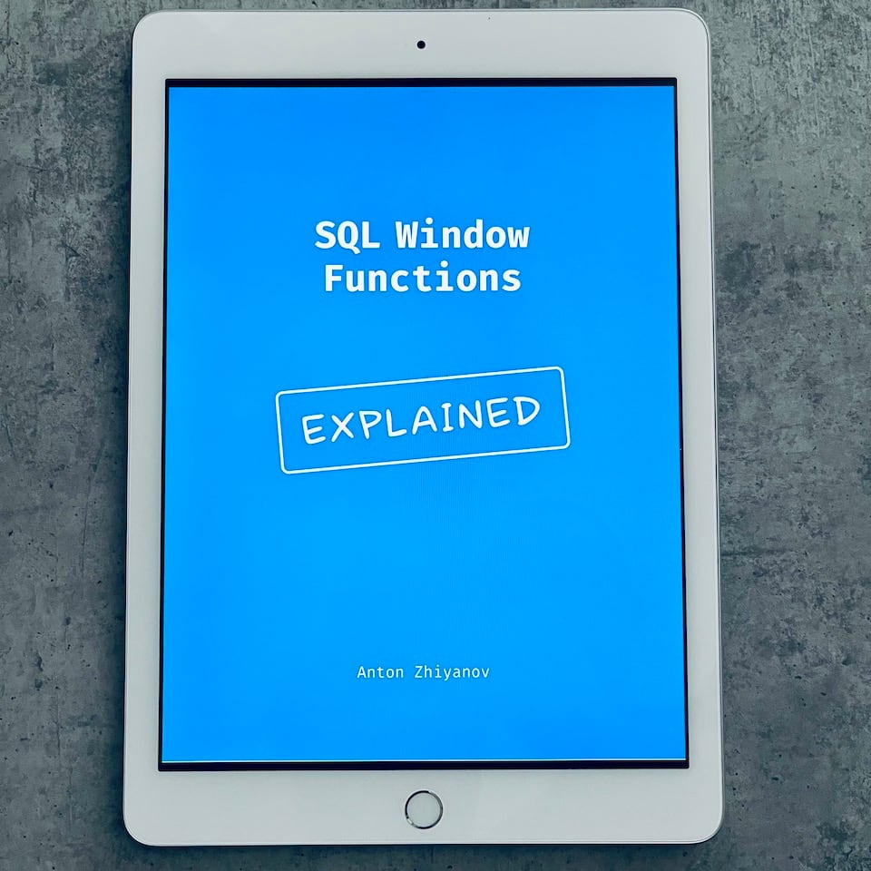
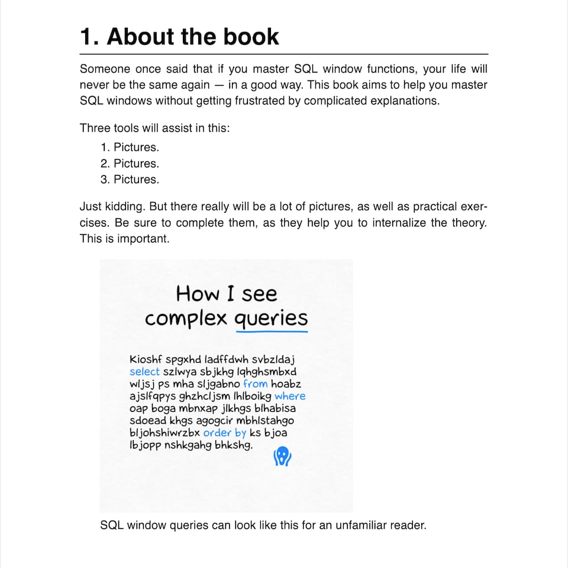
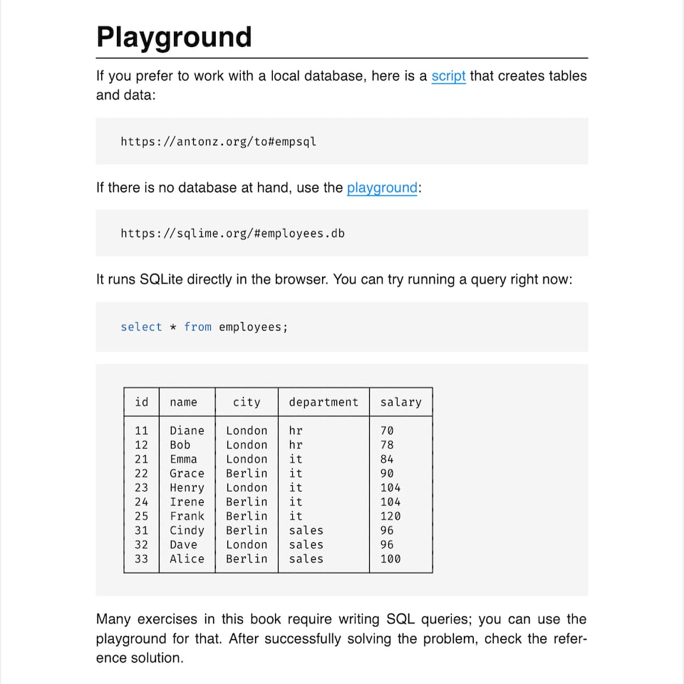
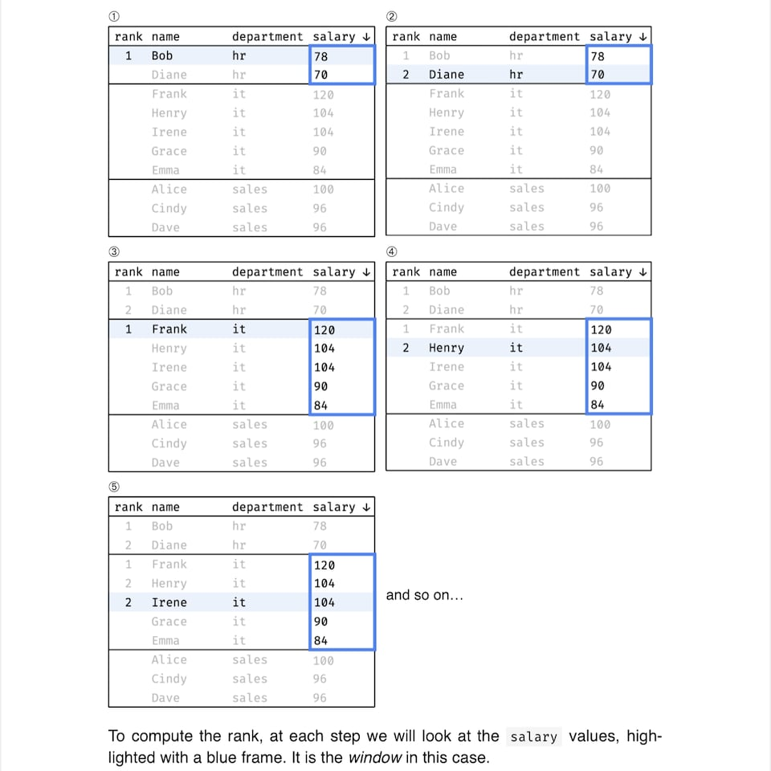
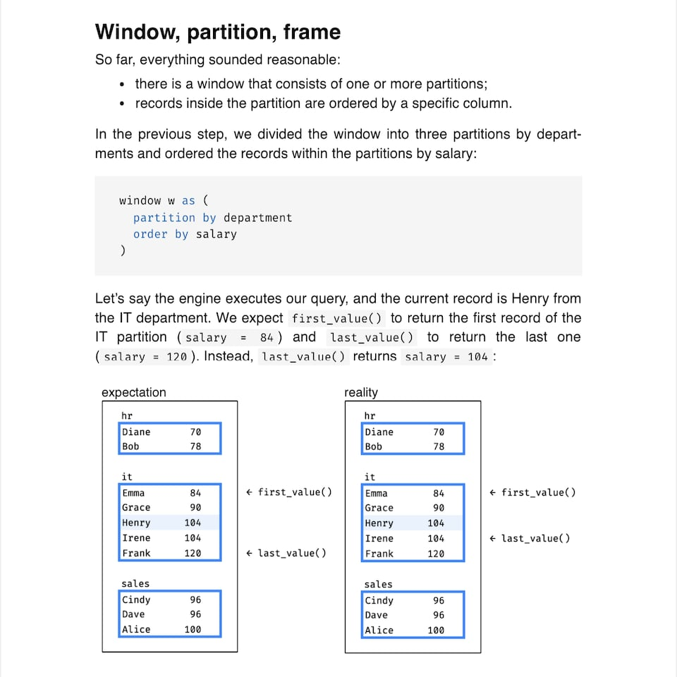
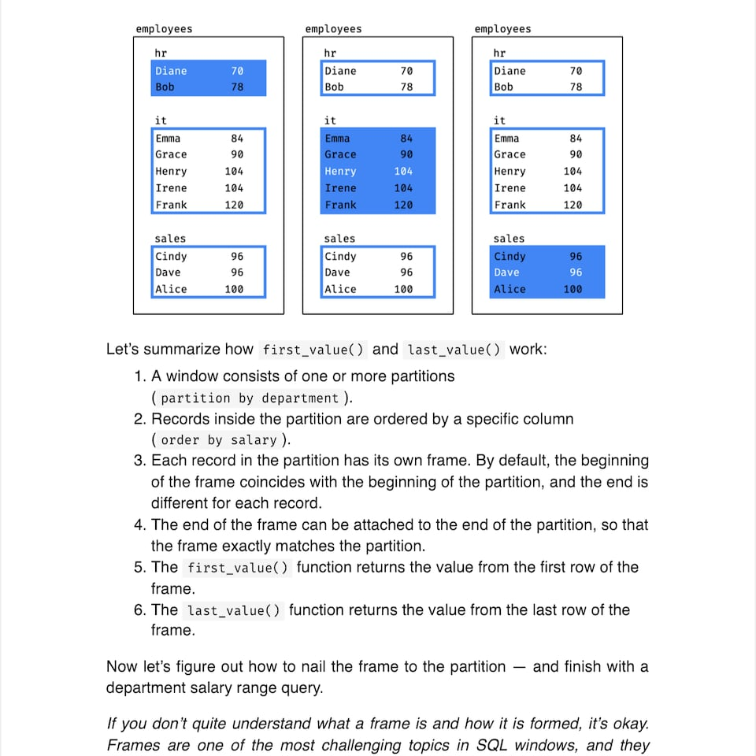
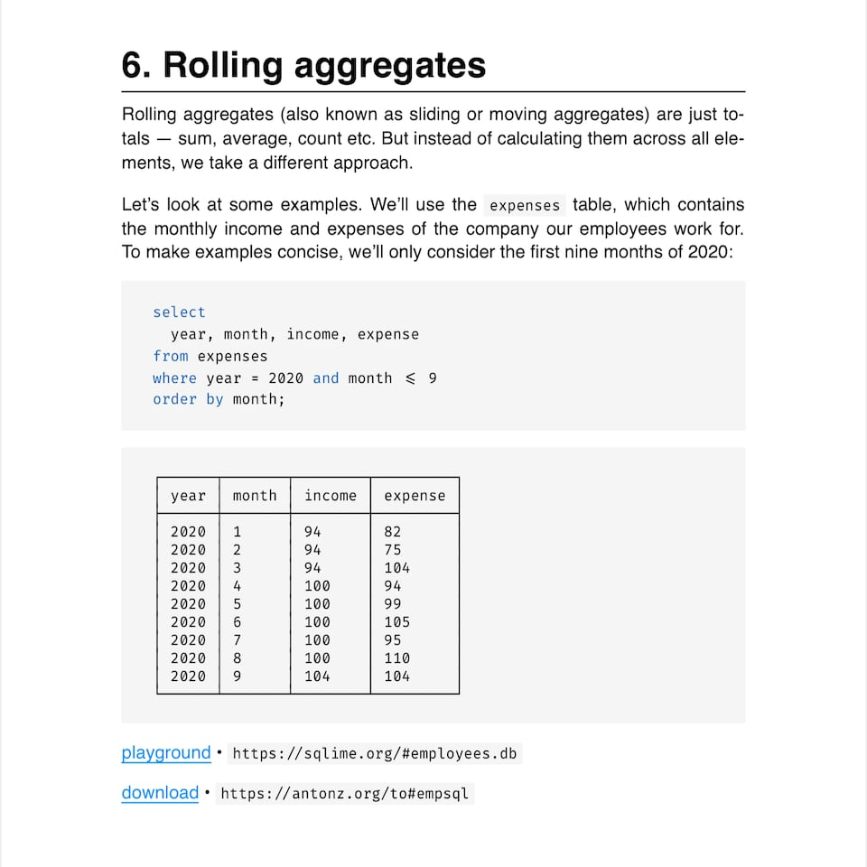
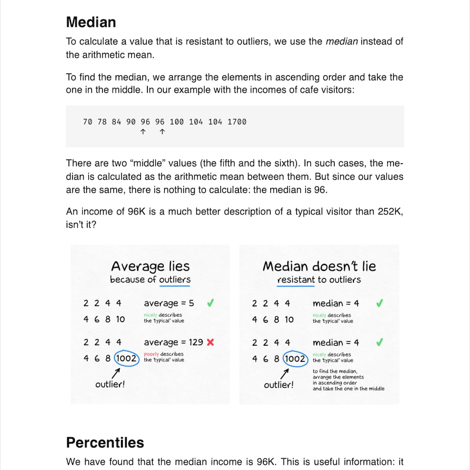

+++
date = 2023-01-22T18:00:00Z
title = "SQL Window Functions Explained"
description = "A clear and visual introduction to window functions in SQL."
image = "/sql-window-functions-book/cover.png"
slug = "sql-window-functions-book"
tags = ["data"]
featured = true
+++

Window functions are probably the most confusing section of SQL. You might think, "So what? They just came up with some additional functions". Not really. "Window functions" is a separate language built into regular SQL. And it's more complicated than everything you know about SELECTs.

In short, window functions assist in making great analytical reports without Excel. Maybe you want to calculate monthly sales percentages over the year? Window functions. Split marketing channels into effective and ineffective ones? Window functions. Choose the top 10 clients for each segment? Same.

    
I've read several dozen articles explaining SQL window functions. They all suffered from one of two problems:

    <ol>
        <li>Easy read without much practical value, describing 10% of features.</li>
        <li>Difficult to comprehend. If I did not know the subject — I would not understand a thing.</li>
    </ol>

    <figure>
        
        <figcaption>
            <small>SQL window queries can look like this for an unfamiliar reader.</small>
        </figcaption>
    </figure>

I want people to understand SQL windows better. So I wrote a book — _SQL Window Functions Explained_.

## About the book

It is a clear and visual introduction to window functions. Clear — because I can describe complex topics in a readable way. Visual — because I have prepared a hundred pictures and GIFs to help you understand SQL windows.

Window functions are a complex topic. So the book only teaches a little at a time. It gives just enough theory and a lot of practice, because it's the only way to turn abstract knowledge into skills.

    

        
    

    

        
    

    

        
    

    

        
    

    

        
    

    

        
    

    

        
    

    

        
    

A step-by-step narrative combined with numerous visuals helps readers understand the material. Fifty-six interactive exercises with solutions ensure that you master window functions in practice.

    <a class="button" href="https://antonz.gumroad.com/l/sql-windows">
        Get the book
    </a>

## What you will learn

<a href="/why-use-sql-window-functions">Why use window functions</a>

Part 1. Windows and functions

    <ul>
        <li><a href="/sql-window-functions-ranking">Ranking</a></li>
        <li><a href="/sql-window-functions-offset">Offset</a></li>
        <li><a href="/sql-window-functions-aggregation">Aggregation</a></li>
        <li><a href="/sql-window-functions-rolling-aggregates">Rolling aggregates</a></li>
        <li>Statistics</li>
    </ul>

Part 2. Frames

    <ul>
        <li>ROWS and GROUPS</li>
        <li>RANGE</li>
        <li>EXCLUDE</li>
        <li>FILTER</li>
    </ul>

Part 3. Practice

    <ul>
        <li>Finance</li>
        <li>Clustering</li>
        <li>Data cleaning</li>
    </ul>

    <figure>
        
        <figcaption>Every chapter covers a single topic in depth</figcaption>
    </figure>

    
Detailed table of contents

    

        
<strong>Introduction</strong>

        
About the book

        
Why use window functions

        
Playground

        
<strong>Part 1. Windows and functions</strong>

        
Ranking

        <ul>
            <li>Window function</li>
            <li>Window ordering vs. result ordering</li>
            <li>Sorting uniqueness</li>
            <li>Multiple windows</li>
            <li>Partitions</li>
            <li>Groups</li>
            <li>Ranking functions</li>
        </ul>
        
Offset

        <ul>
            <li>Comparing with neighbors</li>
            <li>Comparing to boundaries</li>
            <li>Window, partition, frame</li>
            <li>Comparing to boundaries revisited</li>
            <li>Offset functions</li>
        </ul>
        
Aggregation

        <ul>
            <li>Partitioned aggregates</li>
            <li>Filtering and execution order</li>
            <li>Window definition</li>
            <li>Aggregation functions</li>
        </ul>
        
Rolling aggregates

        <ul>
            <li>Moving average</li>
            <li>Frame</li>
            <li>Cumulative total</li>
            <li>Default frame</li>
            <li>Rolling aggregates functions</li>
        </ul>
        
Statistics

        <ul>
            <li>Cumulative distribution</li>
            <li>Relative rank</li>
            <li>Summary statistics</li>
            <li>Percentile</li>
            <li>Percentile as a window function</li>
            <li>Statistics functions</li>
        </ul>
        
Summary

        
<strong>Part 2. Frames</strong>

        
ROWS and GROUPS

        <ul>
            <li>Frame revisited</li>
            <li>Groups frame</li>
        </ul>
        
RANGE

        <ul>
            <li>Range frame</li>
            <li>Range specifics</li>
            <li>Frame boundaries</li>
            <li>Default frame</li>
            <li>Frames FAQ</li>
        </ul>
        
EXCLUDE

        <ul>
            <li>Excluding rows</li>
            <li>Exclude options</li>
        </ul>
        
FILTER

        <ul>
            <li>Filtering rows</li>
            <li>CASE as an alternative to FILTER</li>
        </ul>
        
Summary

        
<strong>Part 3. Practice</strong>

        
Finance

        <ul>
            <li>Aggregate first, windows later</li>
            <li>Windows first, filter later</li>
            <li>Aggregation and null</li>
            <li>Gold plan sales</li>
            <li>Sales by plan for Q1</li>
            <li>Platinum plan moving average</li>
            <li>Comparison with December</li>
            <li>Plans contribution</li>
            <li>High/medium/low revenue</li>
            <li>2020 vs 2019</li>
            <li>Months ranked by revenue</li>
        </ul>
        
Clustering

        <ul>
            <li>Identifying islands</li>
            <li>Islands with duplicates</li>
            <li>Date islands</li>
            <li>Value clusters</li>
            <li>Date clusters</li>
        </ul>
        
Data cleaning

        <ul>
            <li>Duplicates</li>
            <li>Missing values</li>
            <li>Previous non-empty value</li>
            <li>Outliers</li>
        </ul>
        
Final thoughts

    

The book starts with SQL windows basics (Part 1) and goes through frame nuances (Part 2) to some pretty advanced stuff (Part 3).

To preview the first few chapters, visit the links in the table of contents above.

## About the author

I'm Anton Zhiyanov, a Python/Golang developer and SQLite enthusiast. I work on [open source](https://github.com/nalgeon), teach courses and blog about programming.

In 2021 I launched a course on SQL window functions. It now has 1000+ graduates and an average rating of 5 stars based on 300+ student reviews.

In 2023 I decided to write a book based on the original course. Here it is.

## Book details

-   296 pages
-   100+ pictures and GIFs
-   56 interactive exercises (with solutions)
-   PDF 17.8 × 23.3 cm (7 × 9.2 inches)

    <a class="button" href="https://antonz.gumroad.com/l/sql-windows">
        Get the book for $20
    </a>

