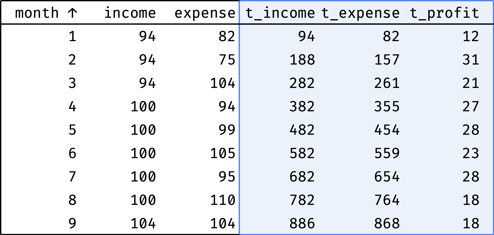

+++
date = 2023-01-22T18:00:00Z
title = "SQL Window Functions Explained"
description = "A clear and visual introduction to window functions in SQL."
image = "/sql-window-functions-book/cover.png"
slug = "sql-window-functions-book"
tags = ["data"]
featured = true
+++

Window functions are probably the most confusing section of SQL. You might think, "So what? They just came up with some additional functions". Not really. "Window functions" is a separate language built into regular SQL. And it's more complicated than everything you know about SELECTs.

In short, window functions assist in making great analytical reports without Excel. Maybe you want to calculate monthly sales percentages over the year? Window functions. Split marketing channels into effective and ineffective ones? Window functions. Choose the top 10 clients for each segment? Same.

<div class="row">
<div class="col-xs-12 col-sm-8">
    <p>I've read several dozen articles explaining SQL window functions. They all suffered from one of two problems:</p>
    <ol>
        <li>Easy read without much practical value, describing 10% of features.</li>
        <li>Difficult to comprehend. If I did not know the subject — I would not understand a thing.</li>
    </ol>
</div>
<div class="col-xs-12 col-sm-4">
    <figure>
        
        <figcaption>
            <small>SQL window queries can look like this for an unfamiliar reader.</small>
        </figcaption>
    </figure>
</div>
</div>

I want people to understand SQL windows better. So I decided to write a book — _SQL Window Functions Explained_.

## About the book

It is a clear and visual introduction to window functions. Clear — because I can describe complex topics in a readable way. Visual — because I have prepared a hundred pictures and GIFs to help you understand SQL windows.

Window functions are a complex topic. So the book only teaches a little at a time. It gives just enough theory and a lot of practice — because it's the only way to turn abstract knowledge into skills.

Here is what you will learn:

<div class="row">
<div class="col-xs-12 col-sm-6">
<ol>
    <li>Why use window functions</li>
    <li>Windows and functions
        <ul>
            <li>Ranking</li>
            <li>Offset</li>
            <li>Aggregation</li>
            <li>Rolling aggregates</li>
        </ul>
    </li>
    <li>Frames
        <ul>
            <li>ROWS and GROUPS</li>
            <li>RANGE</li>
            <li>EXCLUDE</li>
            <li>FILTER</li>
        </ul>
    </li>
    <li>Practice
        <ul>
            <li>Product analytics</li>
            <li>Handling duplicates</li>
            <li>Finding the gaps</li>
        </ul>
    </li>
</ol>
</div>
<div class="col-xs-12 col-sm-6">
    <figure>
        
        <figcaption>Every chapter covers a single topic in depth</figcaption>
    </figure>
</div>
</div>

10 of the 13 chapters are ready, and I'll publish the rest by May 2023. You can buy an early access release for $10:

<p class="big"><a href="https://antonz.gumroad.com/l/sql-windows">SQL Window Functions Explained</a></p>

Here is an excerpt from the book:

<p class="align-center">⌘&nbsp;⌘&nbsp;⌘</p>

## Why use window functions

​In short, window functions assist in building great analytical reports without Excel.

The easiest way to explain it is through concrete examples. We will work with a toy employee table:

```ascii
┌────┬──────────┬────────┬────────────┬────────┐
│ id │   name   │  city  │ department │ salary │
├────┼──────────┼────────┼────────────┼────────┤
│ 11 │ Diane    │ London │ hr         │ 70     │
│ 12 │ Bob      │ London │ hr         │ 78     │
│ 21 │ Emma     │ London │ it         │ 84     │
│ 22 │ Grace    │ Berlin │ it         │ 90     │
│ 23 │ Henry    │ London │ it         │ 104    │
│ 24 │ Irene    │ Berlin │ it         │ 104    │
│ 25 │ Frank    │ Berlin │ it         │ 120    │
│ 31 │ Cindy    │ Berlin │ sales      │ 96     │
│ 32 │ Dave     │ London │ sales      │ 96     │
│ 33 │ Alice    │ Berlin │ sales      │ 100    │
└────┴──────────┴────────┴────────────┴────────┘
```

Let's look at some tasks that are convenient to solve with the help of SQL window functions. We'll save the technical details for the following chapters. For now, let's review the use cases.

## Ranking

Ranking means coming up with all kinds of ratings, starting from the winners of the World Swimming Championships and ending with the Forbes 500.

We will rank employees.

### Overall salary rating

Let's make a rating of employees by salary:

<div class="row">
<div class="col-xs-12 col-sm-6">
    <figure>
        
    </figure>
</div>
</div>

The `rank` column shows each employee's position in the overall rating.

Some colleagues have the same salary (Henry and Irene, Cindy and Dave) — so they receive the same rank.

### Salary rating by department

Similar rating, but created for each department separately instead of the whole company:

<div class="row">
<div class="col-xs-12 col-sm-6">
    <figure>
        
    </figure>
</div>
</div>

The `rank` column shows each employee's position in the department's rating.

### Salary groups

Let's split the employees into three groups according to their salary:

-   highly-paid,
-   medium-paid,
-   low-paid.

<div class="row">
<div class="col-xs-12 col-sm-6">
    <figure>
        
    </figure>
</div>
</div>

The `tile` column shows which group each employee belongs to.

### The most "precious" colleagues

Let's find the highest-paid people in each department:

<div class="row">
<div class="col-xs-12 col-sm-6">
    <figure>
        
    </figure>
</div>
</div>

No more salary raise for them, I guess.

## Comparison with offset

Comparing by offset means looking at the difference between neighboring values. For example, comparing the countries that occupy the 5th and 6th places in the world GDP rating — how different are they? What about 1st and 6th place?

Sometimes we want to compare one of the group values with the group boundaries. For example, there are 100 top tennis players worldwide, and Maria Sakkari is ranked 10th. How do her stats compare to Iga Swiatek, who is ranked 1st? How does she compare to Lin Zhou, who is ranked 50th?

We will compare employees.

### Salary difference with the neighbor

Let's arrange employees by salary and check whether the gap between neighbors is large:

<div class="row">
<div class="col-xs-12 col-sm-6">
    <figure>
        
    </figure>
</div>
</div>

The `diff` column shows how much an employee's salary differs from the previous colleague's. As you can see, there are no significant gaps. The largest ones are Diane and Bob (11%) and Irene and Frank (15%).

### Salary range in the department

Let's see how an employee's salary compares to the minimum and maximum wages in his department:

<div class="row">
<div class="col-xs-12 col-sm-6">
    <figure>
        
    </figure>
</div>
</div>

For each employee, the `low` column shows the minimum salary in the department, and the `high` column shows the maximum. As you can see, the HR and Sales salary ranges are narrow, but the IT range is much broader.

## Aggregation

Aggregation means counting totals or averages. For example, the average salary per city. Or the total number of gold medals for each country in the Olympic Games standings.

We will aggregate employee salaries.

### Comparing with the salary fund

Each department has a salary fund — money spent monthly on paying employees' salaries. Let's see what percentage of this fund amounts to the salary of each employee:

<div class="row">
<div class="col-xs-12 col-sm-6">
    <figure>
        
    </figure>
</div>
</div>

The `fund` column shows the department's salary fund, and the `perc` column shows the employee's salary share of this fund. As you can see, everything is more or less even in HR and Sales, but IT has a noticeable spread of salaries.

### Comparing to the average salary

I wonder how large is the spread of salaries inside departments. Let's calculate the deviation of each employee's salary from the average department salary:

<div class="row">
<div class="col-xs-12 col-sm-6">
    <figure>
        
    </figure>
</div>
</div>

The result confirms the previous observation: IT salaries range from -16% to +20% of the average, while other departments are within 5%.

## Rolling aggregates

​Rolling aggregates (aka sliding or moving aggregates) are just totals — sum or average. But instead of calculating them across all elements, we use a different approach.

Consider the company our employees work for. Here is a table with its income and expenses for nine months of the year:

```
┌──────┬───────┬────────┬─────────┐
│ year │ month │ income │ expense │
├──────┼───────┼────────┼─────────┤
│ 2020 │ 1     │ 94     │ 82      │
│ 2020 │ 2     │ 94     │ 75      │
│ 2020 │ 3     │ 94     │ 104     │
│ 2020 │ 4     │ 100    │ 94      │
│ 2020 │ 5     │ 100    │ 99      │
│ 2020 │ 6     │ 100    │ 105     │
│ 2020 │ 7     │ 100    │ 95      │
│ 2020 │ 8     │ 100    │ 110     │
│ 2020 │ 9     │ 104    │ 104     │
└──────┴───────┴────────┴─────────┘
```

### Expenses moving average

Judging by the data, the income is growing: 94 in January → 104 in September. But are the expenses growing as well? It's hard to say right away: expenses differ month by month. To smooth out these spikes, we'll use the "3-month average" — the average between the previous, current, and next month's expenses for each month:

-   moving average for February = (January + February + March) / 3;
-   for March = (February + March + April) / 3;
-   for April = (March + April + May) / 3;
-   etc.

Let's calculate the moving average for all months:

<div class="row">
<div class="col-xs-12 col-sm-6">
    <figure>
        
    </figure>
</div>
</div>

Now it is clear that expenses are steadily growing.

### Cumulative income

Thanks to the moving average, we know that income and expenses are growing. But how do they relate to each other? We want to understand whether the company is "in the black" or "in the red", considering all the money earned and spent.

It is essential to see the values for each month, not only for the end of the year. If at the end of the year everything is OK, but in June the company went into negative — this is a potential problem (companies call this situation a "cash gap").

Let's calculate income and expenses by month as a cumulative total:

-   cumulative income for January = January;
-   for February = January + February;
-   for March = January + February + March;
-   for April = January + February + March + April;
-   etc.

<div class="row">
<div class="col-xs-12 col-sm-8">
    <figure>
        
    </figure>
</div>
</div>

Now it is clear the company is doing well. In some months, expenses exceed income, but thanks to the accumulated cash reserve, there is no gap.

## Summary

SQL window functions help to solve the following tasks:

-   Ranking (all kinds of ratings).
-   Comparison with offset (neighboring elements and boundaries).
-   Aggregation (sum and average).
-   Rolling aggregates (sum and average in dynamics).

Of course, this is not an exhaustive list. But I hope now it is clear why window functions are beneficial for data analysis. In the next chapter, we will examine what windows are and how to use them.

<p class="align-center">⌘&nbsp;⌘&nbsp;⌘</p>

Interested in the 'early bird' book edition? **[Buy it for $10](https://antonz.gumroad.com/l/sql-windows)**
