+++
date = 2023-02-16T14:00:00Z
title = "Comparing by Offset with SQL Window Functions"
description = "Comparing records with neighbors and boundaries."
image = "/sql-window-functions-offset/cover.png"
slug = "sql-window-functions-offset"
tags = ["data"]
featured = true
+++

_This is an excerpt from my book [SQL Window Functions Explained](/sql-window-functions-book). The book is a clear and visual introduction to the topic with lots of practical exercises._

Comparing by offset means looking at the difference between neighboring values. For example, if you compare the countries ranked 5th and 6th in the world in terms of GDP, how different are they? What about 1st and 6th?

Sometimes we compare with boundaries instead of neighbors. For example, there are 50 top tennis players in the world, and Maria Sakkari is ranked 10th. How do her stats compare to Iga Swiatek, who is ranked 1st? How does she compare to Lin Zhou, who is ranked 50th?

We will compare records from the `employees` table:

```
┌────┬───────┬────────┬────────────┬────────┐
│ id │ name  │  city  │ department │ salary │
├────┼───────┼────────┼────────────┼────────┤
│ 11 │ Diane │ London │ hr         │ 70     │
│ 12 │ Bob   │ London │ hr         │ 78     │
│ 21 │ Emma  │ London │ it         │ 84     │
│ 22 │ Grace │ Berlin │ it         │ 90     │
│ 23 │ Henry │ London │ it         │ 104    │
│ 24 │ Irene │ Berlin │ it         │ 104    │
│ 25 │ Frank │ Berlin │ it         │ 120    │
│ 31 │ Cindy │ Berlin │ sales      │ 96     │
│ 32 │ Dave  │ London │ sales      │ 96     │
│ 33 │ Alice │ Berlin │ sales      │ 100    │
└────┴───────┴────────┴────────────┴────────┘
```

[playground](https://sqlime.org/#employees.db) • [download](/sql-window-functions-book/employees.sql)

Table of contents:

-   [Salary difference with neighbor](#salary-difference-with-neighbor)
-   [Department salary range](#department-salary-range)
-   [Window, partition, frame](#window-partition-frame)
-   [Department salary range revisited](#department-salary-range-revisited)
-   [Offset functions](#offset-functions)
-   [Keep it up](#keep-it-up)

## Salary difference with neighbor

Let's arrange employees by salary and see if the gap between neighbors is large:

<div class="row">
<div class="col-xs-12 col-sm-5">
    before<br/>
    <figure>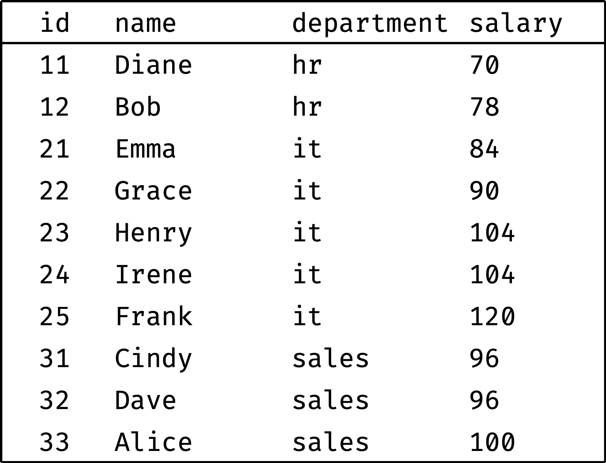</figure>
</div>
<div class="col-xs-12 col-sm-5">
    after<br/>
    <figure>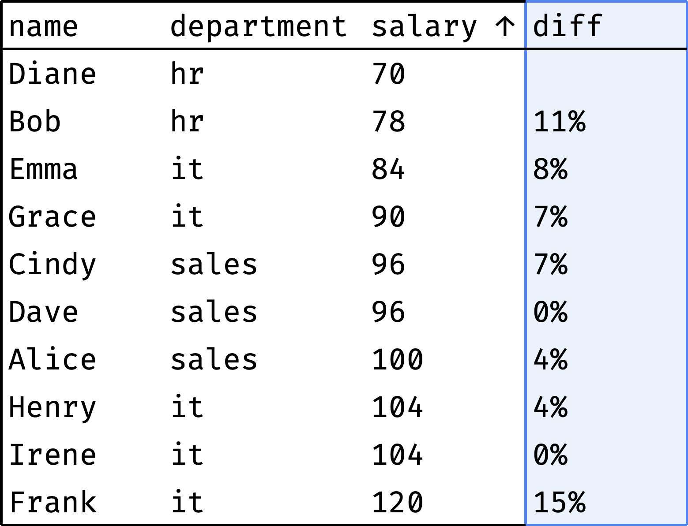</figure>
</div>
</div>

The `diff` column shows how much the employee's salary differs from the previous colleague's salary. As you can see, there are no significant gaps. The largest ones are Diane and Bob (11%) and Irene and Frank (15%).

How do we go from "before" to "after"?

First, let's sort the table in ascending order of salary:

```sql
select
  name, department, salary,
  null as prev
from employees
order by salary, id;
```

Now let's traverse from the first record to the last, peeking at the salary of the previous employee at each step:

<div class="row">
<div class="col-xs-12 col-sm-5">
    ➀<br/>
    <figure>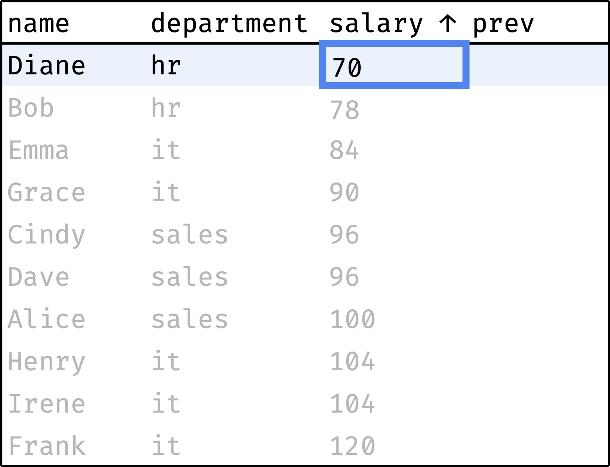</figure>
</div>
<div class="col-xs-12 col-sm-5">
    ➁<br/>
    <figure>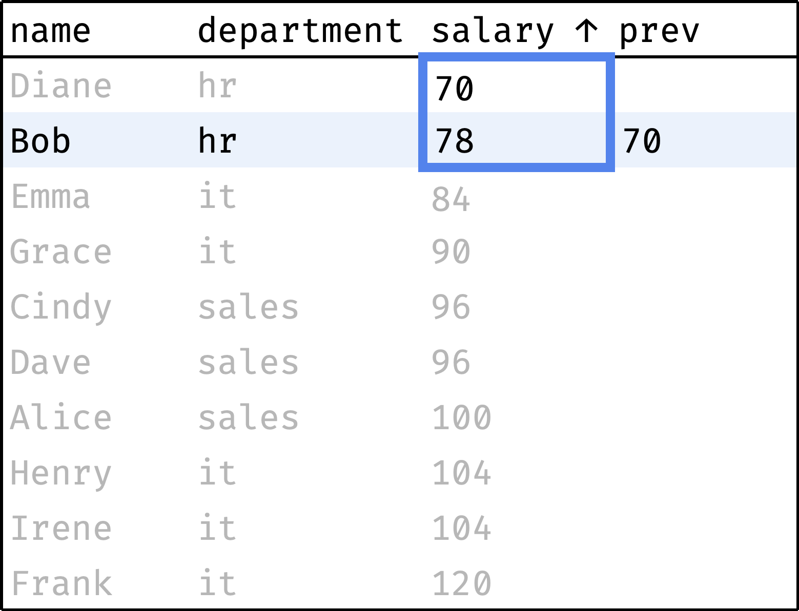</figure>
</div>
</div>

<div class="row">
<div class="col-xs-12 col-sm-5">
    ➂<br/>
    <figure>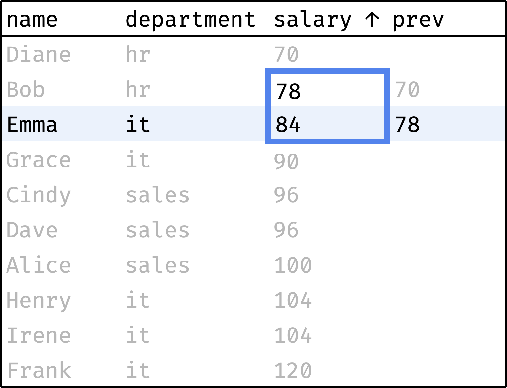</figure>
</div>
<div class="col-xs-12 col-sm-5">
    ➃<br/>
    <figure>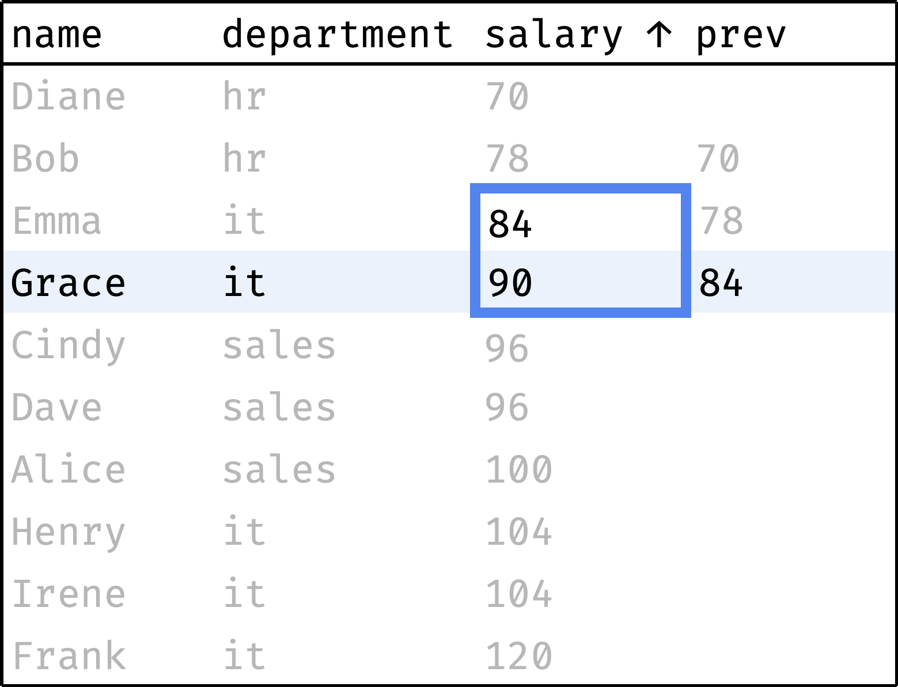</figure>
</div>
</div>

<div class="row">
<div class="col-xs-12 col-sm-5">
    ➄<br/>
    <figure>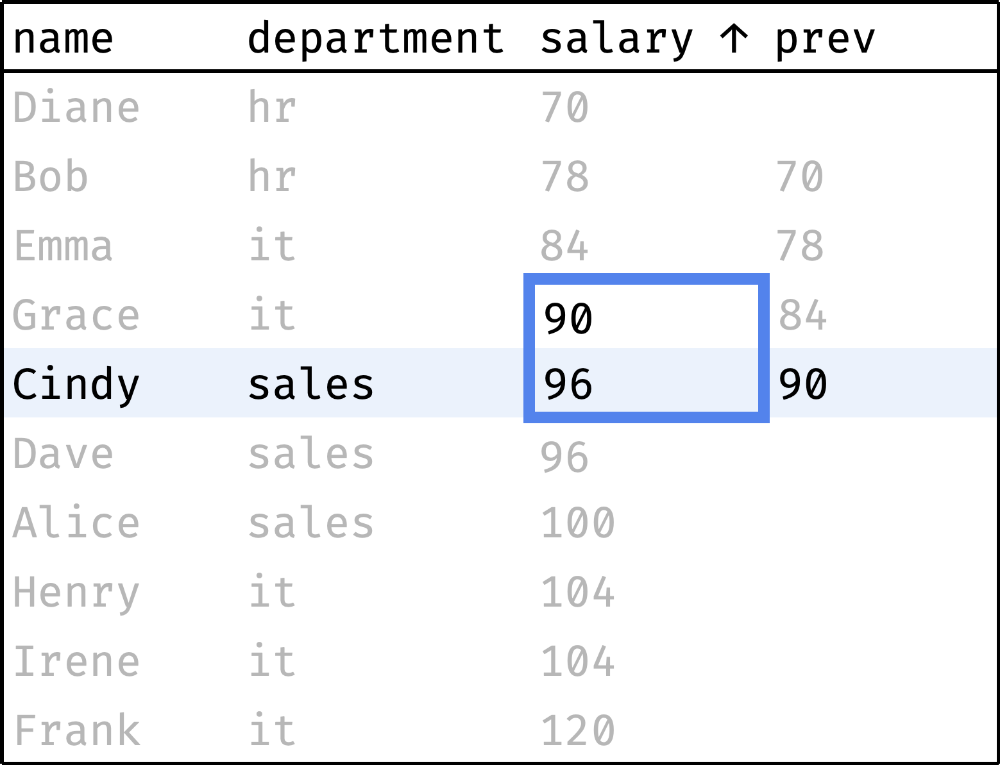</figure>
</div>
<div class="col-xs-12 col-sm-5">
    <p>and so on...</p>
</div>
</div>

In a single gif:

<div class="row">
<div class="col-xs-12 col-sm-5">
<figure>
  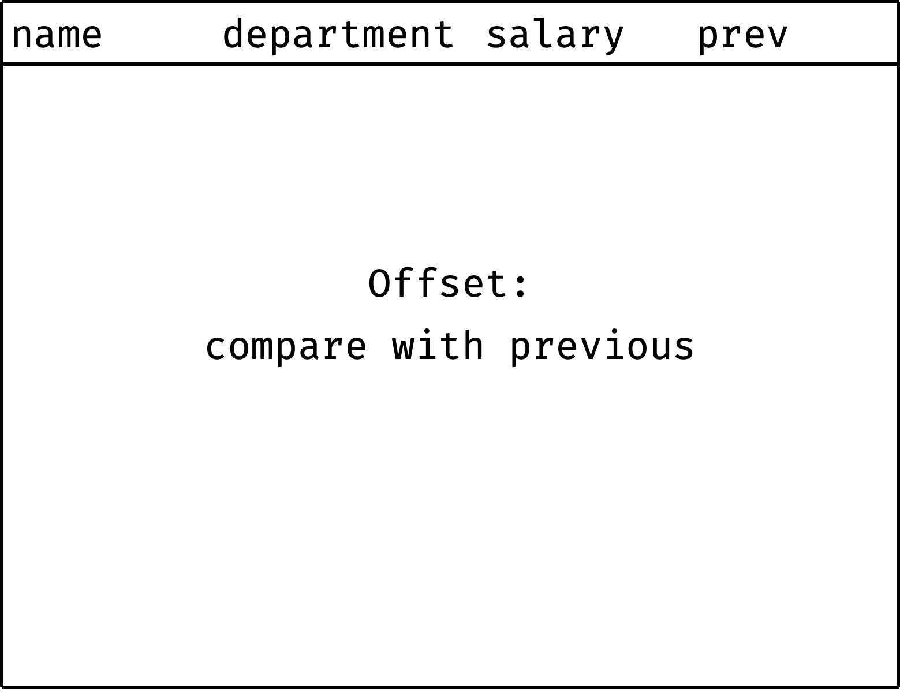
</figure>
</div>
</div>

As you can see, the window here covers the current and previous records. It shifts down at every step (slides). It's a reasonable interpretation; you can set a sliding window in SQL. But such windows have more complex syntax, so we will postpone them until a later chapter.

Instead, let's take a simpler and more familiar window — all records ordered in ascending order of `salary`:

<div class="row">
<div class="col-xs-12 col-sm-5">
<figure>
  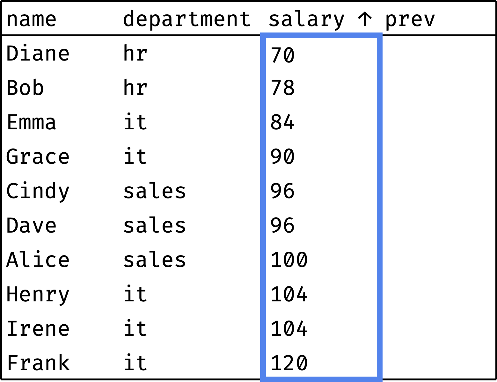
</figure>
</div>
</div>

To peek at the previous employee's salary at each step, we will use the `lag()` window function:

```
lag(salary, 1) over w
```

The `lag()` function returns a value several rows back from the current one. In our case — the `salary` from the previous record.

Let's add a window and a window function to the original query:

```sql
select
  id, name, department, salary,
  lag(salary, 1) over w as prev
from employees
window w as (order by salary, id)
order by salary, id;
```

The `prev` column shows the salary of the previous employee. Now all that remains is to calculate the difference between `prev` and `salary` as a percentage:

```sql
with emp as (
  select
    id, name, department, salary,
    lag(salary, 1) over w as prev
  from employees
  window w as (order by salary, id)
)
select
  name, department, salary,
  round((salary - prev)*100.0 / prev) as diff
from emp
order by salary, id;
```

We can get rid of the intermediate `emp` table expression by substituting a window function call instead of `prev`:

```sql
select
  name, department, salary,
  round(
    (salary - lag(salary, 1) over w)*100.0 / lag(salary, 1) over w
  ) as diff
from employees
window w as (order by salary, id)
order by salary, id;
```

Here we replaced `prev` → `lag(salary, 1) over w`. The database engine replaces the `function_name(...) over window_name` statement with the specific value that the function returned. So the window function can be called right inside the calculations, and you will often find such queries in the documentation and examples.

<div class="boxed">
<h3>✎ Exercise: Sibling employee salary</h3>
<p>Practice is crucial in turning abstract knowledge into skills, making theory alone insufficient. The book, unlike this article, contains a lot of exercises; that's why I recommend <a href="https://antonz.gumroad.com/l/sql-windows">getting it</a>.</p>
<p>If you are okay with just theory for now, though — let's continue.</p>
</div>

## Department salary range

Let's see how an employee's salary compares to the minimum and maximum wages in their department:

<div class="row">
<div class="col-xs-12 col-sm-5">
    before<br/>
    <figure></figure>
</div>
<div class="col-xs-12 col-sm-5">
    after<br/>
    <figure>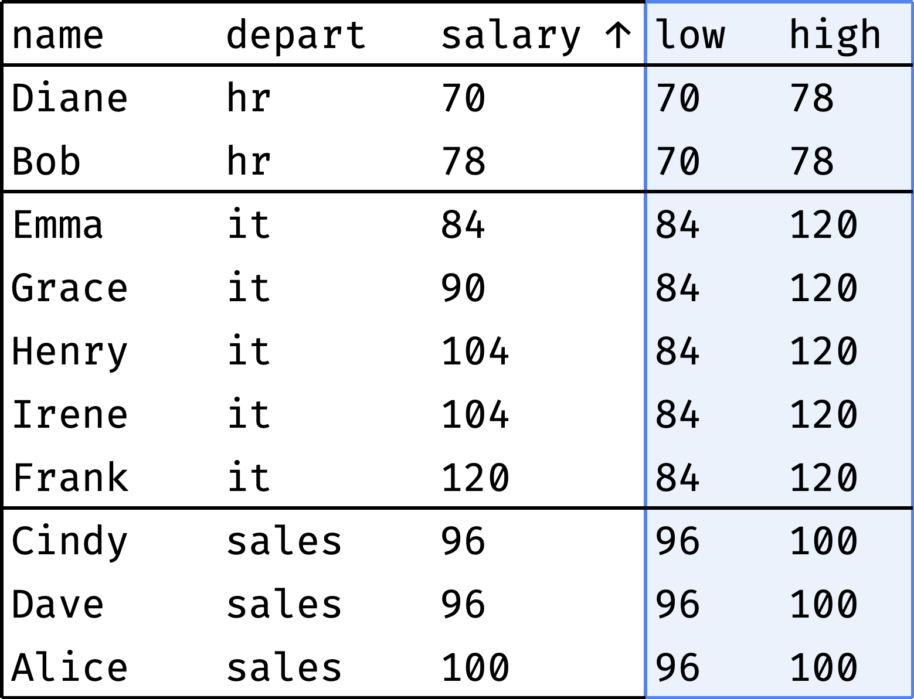</figure>
</div>
</div>

For each employee, the `low` column shows the minimum salary of their department, and the `high` column shows the maximum.

How do we go from "before" to "after"?

First, let's sort the table by department, and each department — in ascending order of salary:

```sql
select
  name, department, salary,
  null as low,
  null as high
from employees
order by department, salary, id;
```

Now let's traverse from the first record to the last, peeking at the smallest and largest salaries in the department at each step:

<div class="row">
<div class="col-xs-12 col-sm-5">
    ➀<br/>
    <figure>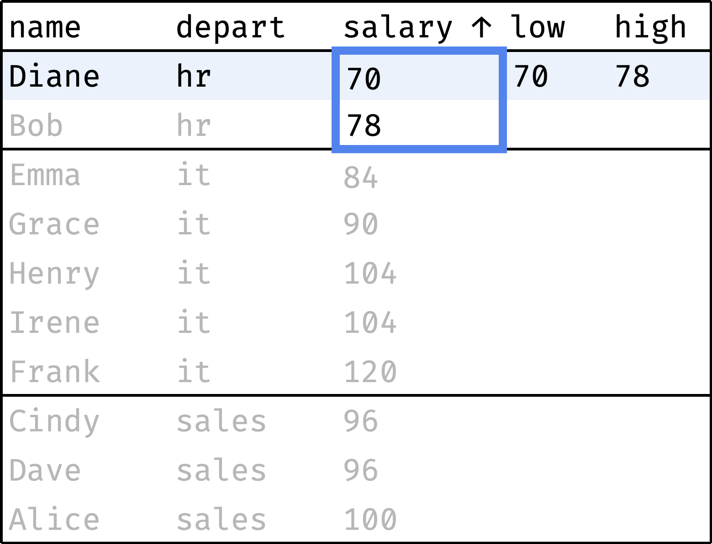</figure>
</div>
<div class="col-xs-12 col-sm-5">
    ➁<br/>
    <figure>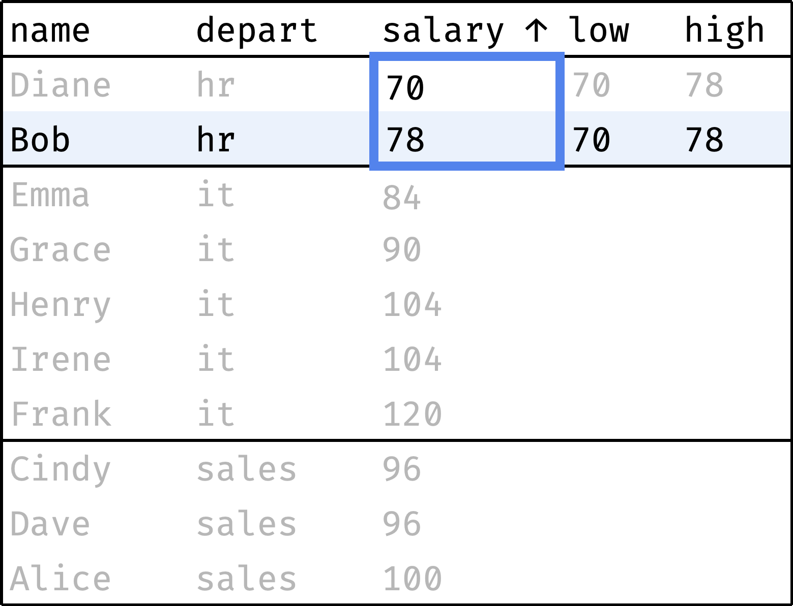</figure>
</div>
</div>

<div class="row">
<div class="col-xs-12 col-sm-5">
    ➂<br/>
    <figure>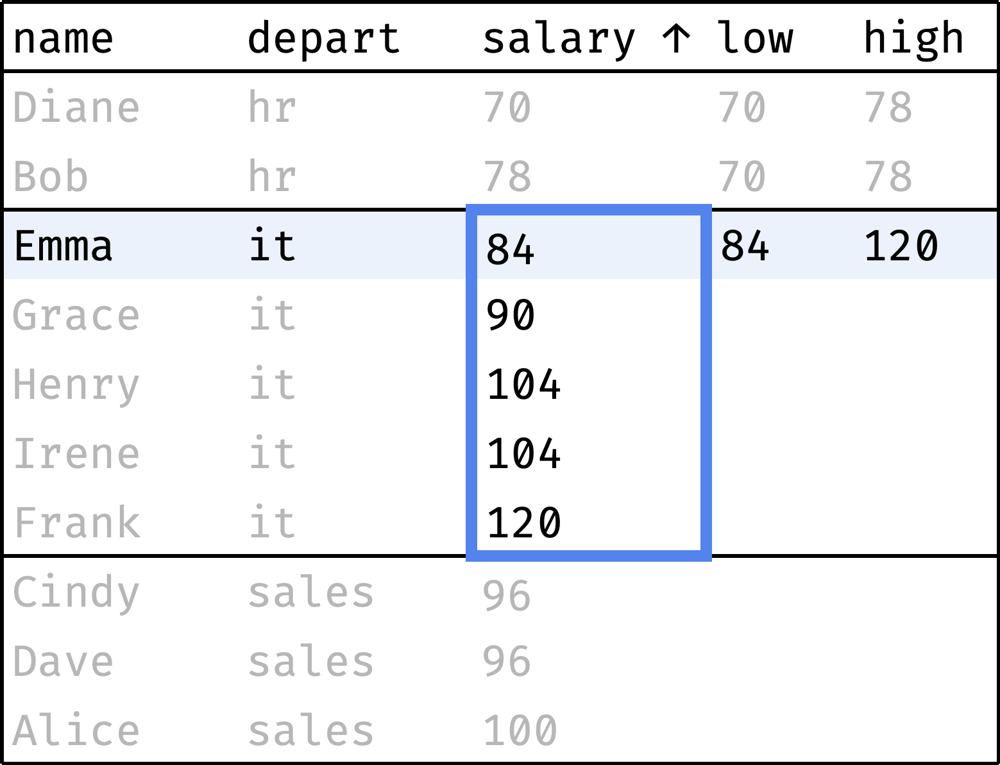</figure>
</div>
<div class="col-xs-12 col-sm-5">
    ➃<br/>
    <figure>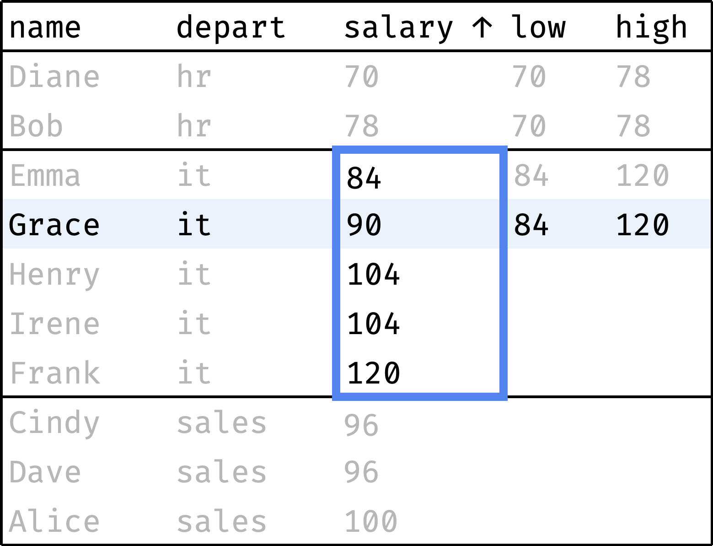</figure>
</div>
</div>

<div class="row">
<div class="col-xs-12 col-sm-5">
    ➄<br/>
    <figure>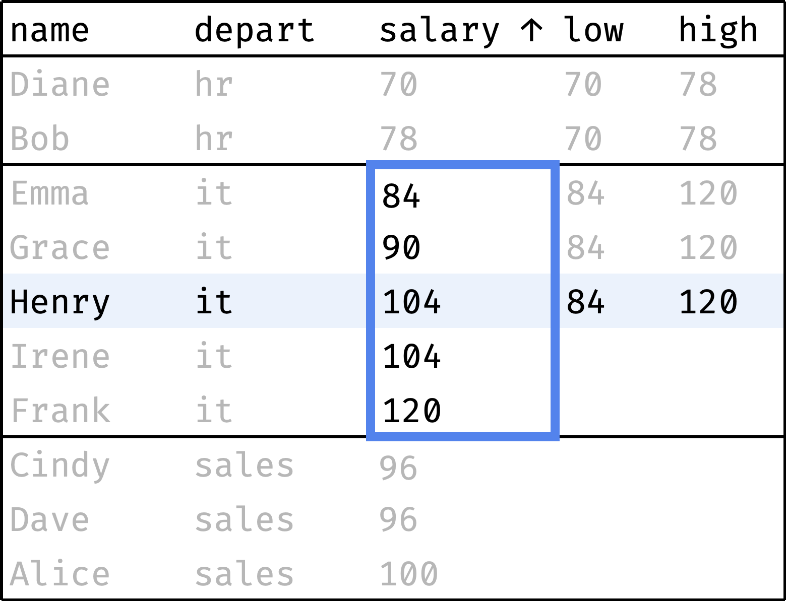</figure>
</div>
<div class="col-xs-12 col-sm-5">
    <p>and so on...</p>
</div>
</div>

In a single gif:

<div class="row">
<div class="col-xs-12 col-sm-5">
<figure>
    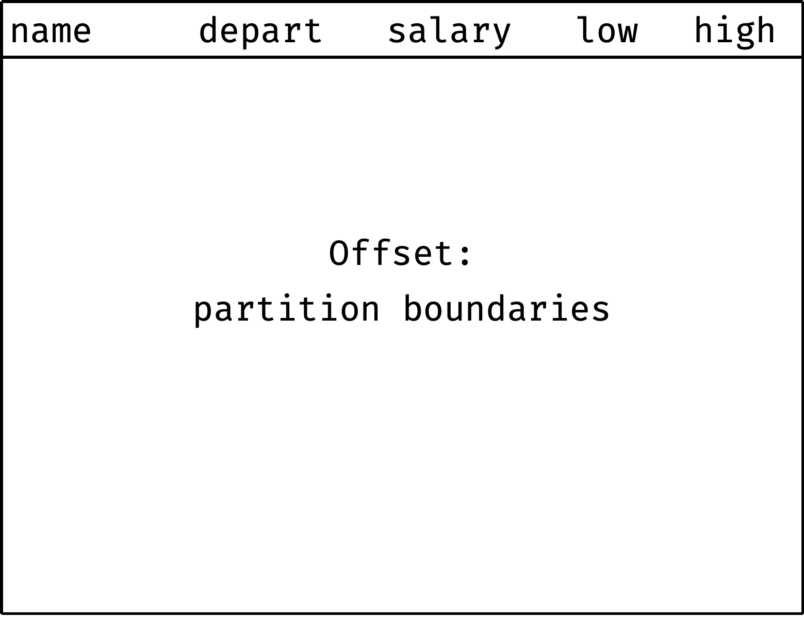
</figure>
</div>
</div>

The window consists of three partitions. At each step, the partition covers the entire department of the employee. The records within the partition are ordered by salary. So the minimum and maximum salaries are always on the boundaries of the partition:

```
window w as (
  partition by department
  order by salary
)
```

It would be convenient to use the `lag()` and `lead()` functions to get the salary range in the department. But they look at a fixed number of rows backward or forward. We need something else:

-   `low` — salary of the first employee in the window partition;
-   `high` — salary of the last employee in the partition.

Fortunately, there are window functions precisely for this:

```
first_value(salary) over w as low,
last_value(salary) over w as high
```

Let's add a window and a window function to the original query:

```sql
select
  name, department, salary,
  first_value(salary) over w as low,
  last_value(salary) over w as high
from employees
window w as (
  partition by department
  order by salary
)
order by department, salary, id;
```

`low` is calculated correctly, while `high` is obviously wrong. Instead of being equal to the department's maximum salary, it varies from employee to employee. We'll deal with it in a moment.

## Window, partition, frame

So far, everything sounded reasonable:

-   there is a window that consists of one or more partitions;
-   records inside the partition are ordered by a specific column.

In the previous step, we divided the window into three partitions by departments and ordered the records within the partitions by salary:

```
window w as (
  partition by department
  order by salary
)
```

Let's say the engine executes our query, and the current record is Henry from the IT department. We expect `first_value()` to return the first record of the IT partition (`salary = 84`) and `last_value()` to return the last one (`salary = 120`). Instead, `last_value()` returns `salary = 104`:

<div class="row">
<div class="col-xs-12 col-sm-5">
    expectation<br/>
    <figure>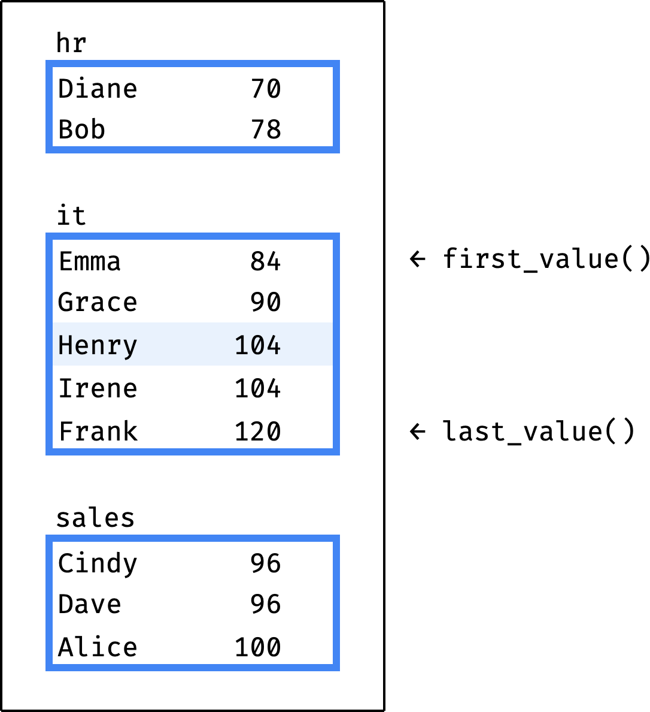</figure>
</div>
<div class="col-xs-12 col-sm-5">
    reality<br/>
    <figure>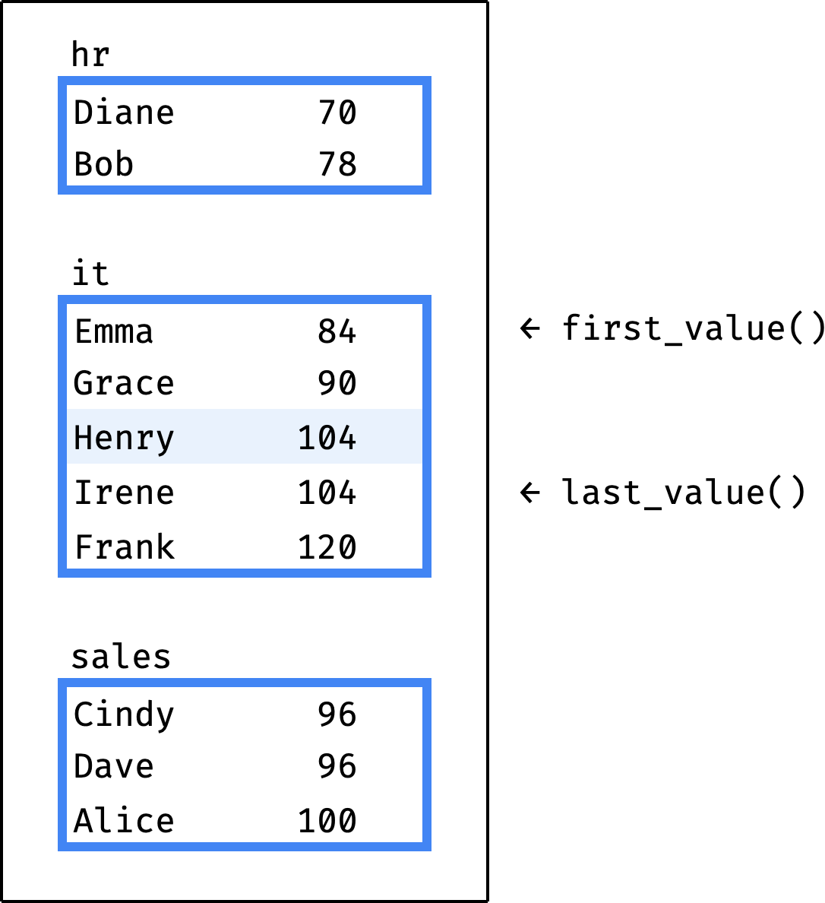</figure>
</div>
</div>

The reason is that the `first_value()` and `last_value()` functions do not work directly with a window partition. They work with a _frame_ inside the partition:

<div class="row">
<div class="col-xs-12 col-sm-5">
    <figure>
        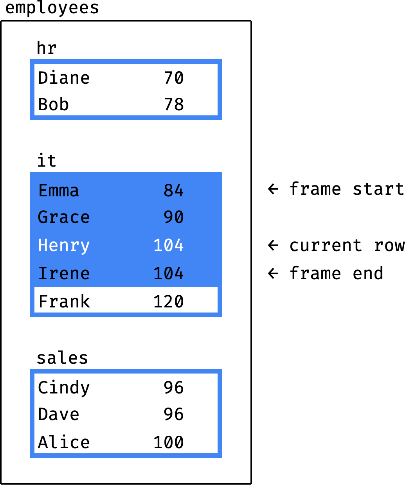
    </figure>
</div>
</div>

The frame is in the same partition as the current record (Henry):

-   beginning of the frame = beginning of the partition (Emma);
-   end of the frame = last record with a `salary` value equal to the current record (Irene).

<div class="boxed">
<h3>Where the frame ends</h3>
<p>People often have questions about the frame end. Let's consider some examples to make it clearer. The current record in each example is Henry.</p>
<pre><code>Emma    84  ← frame start
Grace   90
Henry  104  ← current row
Irene  104  ← frame end
Frank  120</code></pre>
<p>The end of the frame is the last record with a salary value equal to the current record. The current record is Henry, with a salary of 104. The last record with a salary of 104 is Irene. Therefore, the end of the frame is Irene.</p>
<pre><code>Emma    84  ← frame start
Grace   90
Henry  104  ← current row and frame end
Irene  110
Frank  120</code></pre>
<p>Let's say Irene's salary increased to 110. The current record is Henry, with a salary of 104. The last record with a salary of 104 is also Henry. Therefore, the end of the frame is Henry.</p>
<pre><code>Emma    84  ← frame start
Grace   90
Henry  104  ← current row
Irene  104
Frank  104  ← frame end</code></pre>
<p>Let's say Franks's salary decreased to 104. The current record is Henry, with a salary of 104. The last record with a salary of 104 is Frank. Therefore, the end of the frame is Frank.</p>
</div>

The partition is fixed, but the frame depends on the current record and is constantly changing:

<div class="row">
<div class="col-xs-12 col-sm-5">
    <strong>Partition</strong><br/>
    <figure>
        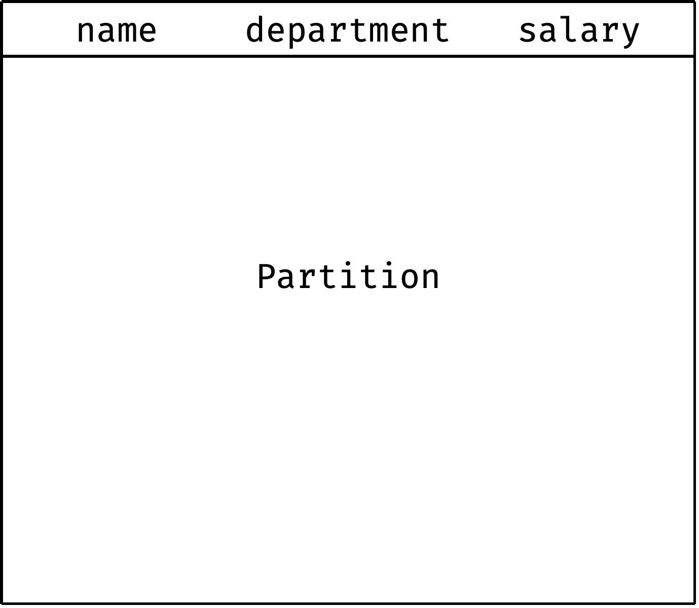
    </figure>
</div>
<div class="col-xs-12 col-sm-5">
    <strong>Frame</strong><br/>
    <figure>
        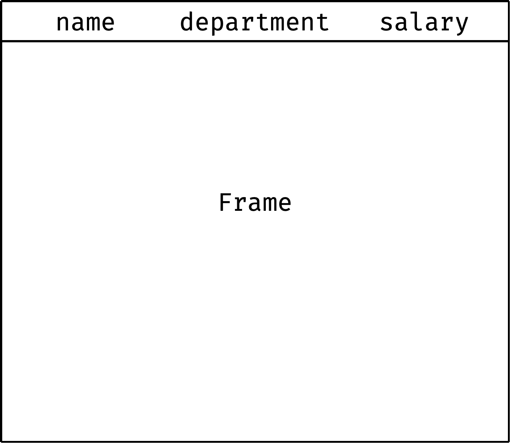
    </figure>
</div>
</div>

`first_value()` returns the first row of the frame, not the partition. But since the beginning of the frame coincides with the beginning of the partition, the function performed as we expected.

`last_value()` returns the last row of the frame, not the partition. That is why our query returned each employee's salary instead of the maximum salary for each department.

For `last_value()` to work as we expect, we will have to "nail" the frame boundaries to the partition boundaries. Then, for each partition, the frame will exactly match it:

<div class="row">
<div class="col-xs-12 col-sm-10">
<figure>
    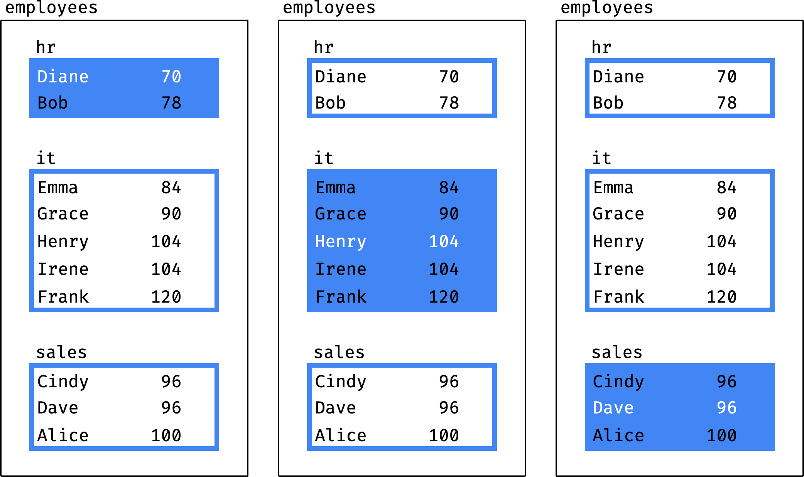
</figure>
</div>
</div>

Let's summarize how `first_value()` and `last_value()` work:

1.  A window consists of one or more partitions (`partition by department`).
2.  Records inside the partition are ordered by a specific column (`order by salary`).
3.  Each record in the partition has its own frame. By default, the beginning of the frame coincides with the beginning of the partition, and the end is different for each record.
4.  The end of the frame can be attached to the end of the partition, so that the frame exactly matches the partition.
5.  The `first_value()` function returns the value from the first row of the frame.
6.  The `last_value()` function returns the value from the last row of the frame.

Now let's figure out how to nail the frame to the partition — and finish with a department salary range query.

> **Note**. If you don't quite understand what a frame is and how it is formed, it's okay. Frames are one of the most challenging topics in SQL windows, and they cannot be fully explained in one go. We will study frames throughout the book and gradually sort everything out.

## Department salary range revisited

Let's take our window:

```
window w as (
  partition by department
  order by salary
)
```

And configure it so that the frame exactly matches the partition (department):

```
window w as (
  partition by department
  order by salary
  rows between unbounded preceding and unbounded following
)
```

Let's not explore the `rows between` statement now — its time will come in a later chapter. Thanks to it, the frame matches the partition, which means `last_value()` will return the maximum salary for the department:

```sql
select
  name, department, salary,
  first_value(salary) over w as low,
  last_value(salary) over w as high
from employees
window w as (
  partition by department
  order by salary
  rows between unbounded preceding and unbounded following
)
order by department, salary, id;
```

Now the engine calculates `low` and `high` as we did it manually:

<div class="row">
<div class="col-xs-12 col-sm-5">
<figure>
    
</figure>
</div>
</div>

<div class="boxed">
<h3>✎ Exercise: City salary ratio</h3>
<p>Practice is crucial in turning abstract knowledge into skills, making theory alone insufficient. The book, unlike this article, contains a lot of exercises; that's why I recommend <a href="https://antonz.gumroad.com/l/sql-windows">getting it</a>.</p>
<p>If you are okay with just theory for now, though — let's continue.</p>
</div>

## Offset functions

Here are the offset window functions:

| Function              | Description                                                                        |
| --------------------- | ---------------------------------------------------------------------------------- |
| `lag(value, offset)`  | returns the `value` from the record that is `offset` rows behind the current one   |
| `lead(value, offset)` | returns the `value` from the record that is `offset` rows ahead of the current one |
| `first_value(value)`  | returns the `value` from the first row of the frame                                |
| `last_value(value)`   | returns the `value` from the last row of the frame                                 |
| `nth_value(value, n)` | returns the `value` from the `n`-th row of the frame                               |

`lag()` and `lead()` act relative to the current row, looking forward or backward a certain number of rows.

<div class="row">
<div class="col-xs-12 col-sm-5">
<figure>
    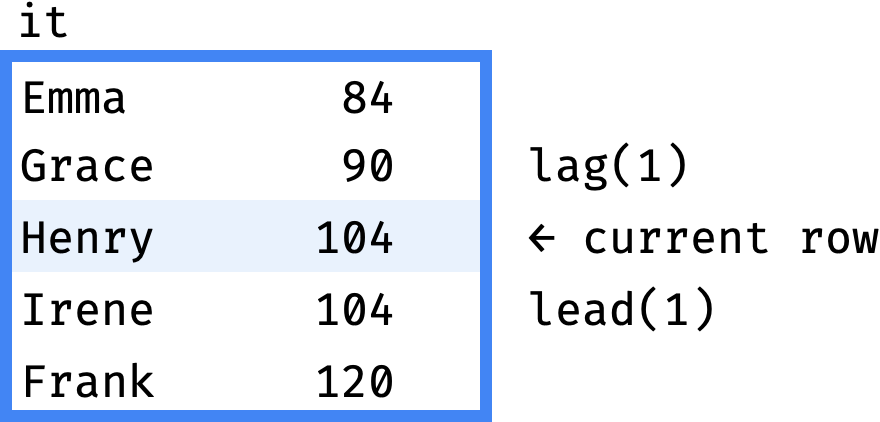
</figure>
</div>
</div>

`first_value()`, `last_value()`, and `nth_value()` act relative to the frame boundaries, selecting the specified row within the frame.

<div class="row">
<div class="col-xs-12 col-sm-5">
    <figure>
        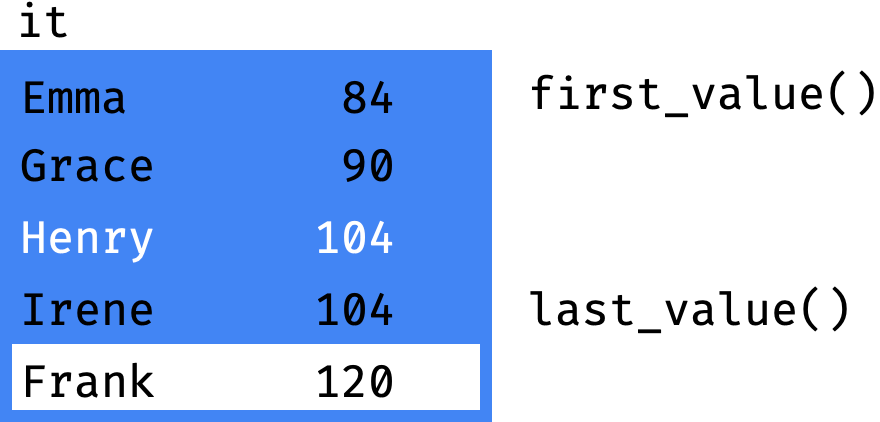
    </figure>
</div>
<div class="col-xs-12 col-sm-5">
    <figure>
        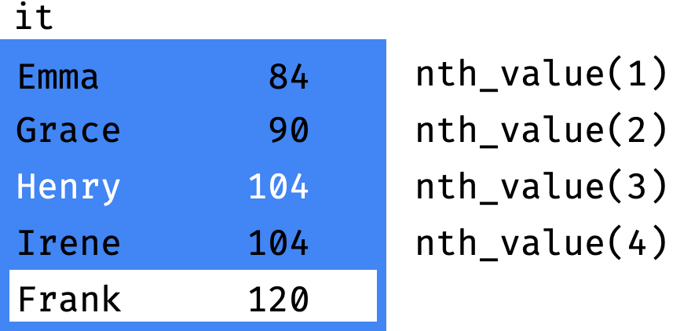
    </figure>
</div>
</div>

For the frame boundaries to match the partition boundaries (or the window boundaries if there is only one partition), use the following statement in the window definition:

```
rows between unbounded preceding and unbounded following
```

## Keep it up

You have learned how to compare rows with neighbors and window boundaries. In the <span class="color-gray">next chapter</span> (coming soon) we will aggregate data!

<p>
    <a class="button" href="https://antonz.gumroad.com/l/sql-windows">
        Get the book
    </a>
</p>

<sqlime-db name="employees" path="/sql-window-functions-book/employees.sql"></sqlime-db>
<sqlime-examples db="employees" selector="div.highlight" editable></sqlime-examples>

<script src="/assets/sqlime/sqlite3.js"></script>
<script src="/assets/sqlime/sqlime-db.js"></script>
<script src="/assets/sqlime/sqlime-examples.js"></script>
