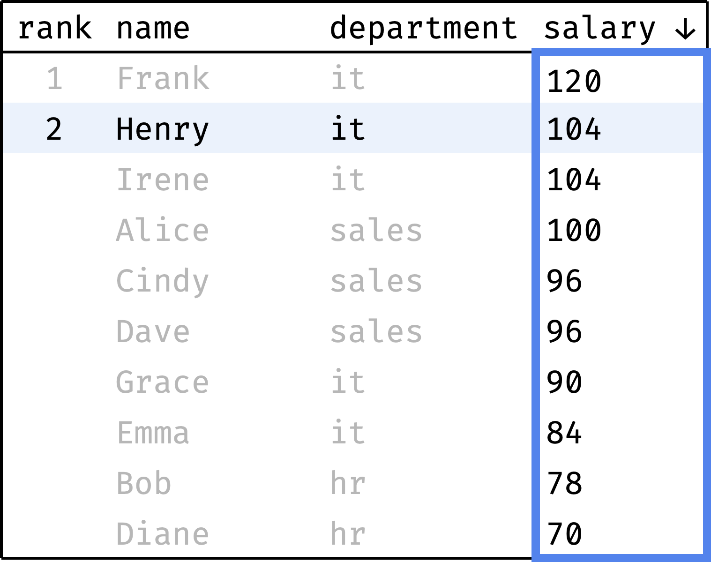

+++
date = 2023-02-08T13:30:00Z
title = "Ranking Data with SQL Window Functions"
description = "Making ratings and dividing data into partitions."
image = "/sql-window-functions-ranking/cover.png"
slug = "sql-window-functions-ranking"
tags = ["data"]
featured = true
+++

_This is an excerpt from my book [SQL Window Functions Explained](/sql-window-functions-book). The book is a clear and visual introduction to the topic with lots of practical exercises._

Ranking means coming up with all kinds of ratings, starting from the winners of the World Swimming Championships and ending with the Forbes 500.

We will rank records from the toy `employees` table:

```
┌────┬───────┬────────┬────────────┬────────┐
│ id │ name  │  city  │ department │ salary │
├────┼───────┼────────┼────────────┼────────┤
│ 11 │ Diane │ London │ hr         │ 70     │
│ 12 │ Bob   │ London │ hr         │ 78     │
│ 21 │ Emma  │ London │ it         │ 84     │
│ 22 │ Grace │ Berlin │ it         │ 90     │
│ 23 │ Henry │ London │ it         │ 104    │
│ 24 │ Irene │ Berlin │ it         │ 104    │
│ 25 │ Frank │ Berlin │ it         │ 120    │
│ 31 │ Cindy │ Berlin │ sales      │ 96     │
│ 32 │ Dave  │ London │ sales      │ 96     │
│ 33 │ Alice │ Berlin │ sales      │ 100    │
└────┴───────┴────────┴────────────┴────────┘
```

[playground](https://sqlime.org/#employees.db) • [download](/sql-window-functions-book/employees.sql)

Table of contents:

- [Salary rating](#salary-rating)
- [Window ordering vs. result ordering](#window-ordering-vs-result-ordering)
- [Sorting uniqueness](#sorting-uniqueness)
- [​​Salary rating by department](#salary-rating-by-department)
- [Salary groups](#salary-groups)
- [Ranking functions](#ranking-functions)
- [Keep it up](#keep-it-up)

<div class="boxed">
<h3>Databases</h3>
<p>All modern relational databases support window functions to some extent. I tested this article on three of them:</p>
<ul>
  <li>MySQL 8.0.2+ (MariaDB 10.2+)</li>
  <li>PostgreSQL 11+</li>
  <li>SQLite 3.28+</li>
</ul>
<p>Windows are fully implemented in PostgreSQL, and almost fully in SQLite. MySQL has all the core features but lacks some of the advanced ones.</p>
<p>Oracle 11g+, MS SQL 2012+, and Google BigQuery are also fine. They lack certain advanced capabilities, just like MySQL. If you use one of them — the article will also be helpful.</p>
<p>You can use any of the mentioned DBMS if you have one available. Or an <a href="https://sqlime.org/#employees.db">online playground</a>.</p>
</div>

## Salary rating

Let's make an employee rating by salary:

<div class="row">
<div class="col-xs-12 col-sm-5">
    before<br/>
    <figure></figure>
</div>
<div class="col-xs-12 col-sm-5">
    after<br/>
    <figure></figure>
</div>
</div>

Note that employees with the same salary received the same rank (Henry and Irene, Cindy and Dave).

How do we go from "before" to "after"?

First, let's sort the table in descending order of salary:

```sql
select
  null as "rank",
  name, department, salary
from employees
order by salary desc, id;
```

```
┌──────┬───────┬────────────┬────────┐
│ rank │ name  │ department │ salary │
├──────┼───────┼────────────┼────────┤
│      │ Frank │ it         │ 120    │
│      │ Henry │ it         │ 104    │
│      │ Irene │ it         │ 104    │
│      │ Alice │ sales      │ 100    │
│      │ Cindy │ sales      │ 96     │
│      │ Dave  │ sales      │ 96     │
│      │ Grace │ it         │ 90     │
│      │ Emma  │ it         │ 84     │
│      │ Bob   │ hr         │ 78     │
│      │ Diane │ hr         │ 70     │
└──────┴───────┴────────────┴────────┘
```

Now let's go from the first row to the last and calculate the rank of each record. We will start with one and increase the rank every time the salary value is less than the previous one:

<div class="row">
<div class="col-xs-12 col-sm-5">
    ➀<br/>
    <figure></figure>
</div>
<div class="col-xs-12 col-sm-5">
    ➁<br/>
    <figure></figure>
</div>
</div>

<div class="row">
<div class="col-xs-12 col-sm-5">
    ➂<br/>
    <figure></figure>
</div>
<div class="col-xs-12 col-sm-5">
    ➃<br/>
    <figure></figure>
</div>
</div>

<div class="row">
<div class="col-xs-12 col-sm-5">
    ➄<br/>
    <figure></figure>
</div>
<div class="col-xs-12 col-sm-5">
    <p>and so on...</p>
</div>
</div>

To compute the rank, at each step we will look at the `salary` values, highlighted with a blue frame. Let's call these values a _window_.

Let's describe the window contents in plain English:

1. These are the values of the salary column.
2. They are ordered from larger to smaller values.

Let's express it in SQL:

```
window w as (order by salary desc)
```

-   `window` — a keyword announcing that the window definition will follow;
-   `w` — the name of the window (could be anything);
-   `(order by salary desc)` — the window definition ("values of the salary column in descending order").

Our goal is to calculate the rank over the window `w`. In SQL, this is written as `dense_rank() over w`.

`dense_rank()` is a _window function_ that counts the rank over the specified _window_. The logic of `dense_rank()` is the same as when we counted manually — start with one and increase the rank every time the next window value differs from the previous one.

Let's add the window definition and the window function to the original query:

```sql
select
  dense_rank() over w as "rank",
  name, department, salary
from employees
window w as (order by salary desc)
order by "rank", id;
```

```
┌──────┬───────┬────────────┬────────┐
│ rank │ name  │ department │ salary │
├──────┼───────┼────────────┼────────┤
│ 1    │ Frank │ it         │ 120    │
│ 2    │ Henry │ it         │ 104    │
│ 2    │ Irene │ it         │ 104    │
│ 3    │ Alice │ sales      │ 100    │
│ 4    │ Cindy │ sales      │ 96     │
│ 4    │ Dave  │ sales      │ 96     │
│ 5    │ Grace │ it         │ 90     │
│ 6    │ Emma  │ it         │ 84     │
│ 7    │ Bob   │ hr         │ 78     │
│ 8    │ Diane │ hr         │ 70     │
└──────┴───────┴────────────┴────────┘
```

Here's how the engine executes this query:

1. Take the table specified in `from`.
2. Select all records from it.
3. Calculate the value of `dense_rank()` for each record using the window `w`.
4. Sort the result as specified in `order by`.

Here's an animation of how the engine executes step 3, where the rank is assigned:

<div class="row">
<div class="col-xs-12 col-sm-5">
<figure>
  
</figure>
</div>
</div>

The `window` clause itself does not affect query results. It only defines the window that we can use in the query. If we remove the `dense_rank()` call, the query will work as if there is no window:

```sql
select
  null as "rank",
  name, department, salary
from employees
window w as (order by salary desc)
order by salary desc, id;
```

```
┌──────┬───────┬────────────┬────────┐
│ rank │ name  │ department │ salary │
├──────┼───────┼────────────┼────────┤
│      │ Frank │ it         │ 120    │
│      │ Henry │ it         │ 104    │
│      │ Irene │ it         │ 104    │
│      │ Alice │ sales      │ 100    │
│      │ Cindy │ sales      │ 96     │
│      │ Dave  │ sales      │ 96     │
│      │ Grace │ it         │ 90     │
│      │ Emma  │ it         │ 84     │
│      │ Bob   │ hr         │ 78     │
│      │ Diane │ hr         │ 70     │
└──────┴───────┴────────────┴────────┘
```

The window starts working only when a window function in `select` uses it.

---

**Window queries in Oracle and MS SQL Server databases**

Neither Oracle nor SQL Server support the `window` clause. To make a window query work in these databases, move the window definition inside the `over` clause.

Instead of this:

```sql
select
  dense_rank() over w as "rank",
  name, department, salary
from employees
window w as (order by salary desc)
order by "rank", id;
```

Do this:

```sql
select
  dense_rank() over (
    order by salary desc
  ) as "rank",
  name, department, salary
from employees
order by "rank", id;
```

---

## Window ordering vs. result ordering

People often have questions about window sorting. Let's break them down.

Here is a query that calculates a salary rating:

```sql
select
  dense_rank() over w as "rank",
  name, department, salary
from employees
window w as (order by salary desc)
order by "rank", id;
```

```
┌──────┬───────┬────────────┬────────┐
│ rank │ name  │ department │ salary │
├──────┼───────┼────────────┼────────┤
│ 1    │ Frank │ it         │ 120    │
│ 2    │ Henry │ it         │ 104    │
│ 2    │ Irene │ it         │ 104    │
│ 3    │ Alice │ sales      │ 100    │
│ 4    │ Cindy │ sales      │ 96     │
│ 4    │ Dave  │ sales      │ 96     │
│ 5    │ Grace │ it         │ 90     │
│ 6    │ Emma  │ it         │ 84     │
│ 7    │ Bob   │ hr         │ 78     │
│ 8    │ Diane │ hr         │ 70     │
└──────┴───────┴────────────┴────────┘
```

Let's leave the `order by` in the window but remove it from the main query:

```sql
select
  dense_rank() over w as "rank",
  name, department, salary
from employees
window w as (order by salary desc);
```

Nothing has changed:

```
┌──────┬───────┬────────────┬────────┐
│ rank │ name  │ department │ salary │
├──────┼───────┼────────────┼────────┤
│ 1    │ Frank │ it         │ 120    │
│ 2    │ Henry │ it         │ 104    │
│ 2    │ Irene │ it         │ 104    │
│ 3    │ Alice │ sales      │ 100    │
│ 4    │ Cindy │ sales      │ 96     │
│ 4    │ Dave  │ sales      │ 96     │
│ 5    │ Grace │ it         │ 90     │
│ 6    │ Emma  │ it         │ 84     │
│ 7    │ Bob   │ hr         │ 78     │
│ 8    │ Diane │ hr         │ 70     │
└──────┴───────┴────────────┴────────┘
```

So why use `order by` in the main query?

The window's `order by` defines the window sorting, while the main query's `order by` defines the final result sorting after the rest of the query is complete.

Let's say we want to assign a rank in descending order of salary but sort in the opposite, ascending order:

```sql
select
  dense_rank() over w as "rank",
  name, department, salary
from employees
window w as (order by salary desc)
order by salary asc;
```

```
┌──────┬───────┬────────────┬────────┐
│ rank │ name  │ department │ salary │
├──────┼───────┼────────────┼────────┤
│ 8    │ Diane │ hr         │ 70     │
│ 7    │ Bob   │ hr         │ 78     │
│ 6    │ Emma  │ it         │ 84     │
│ 5    │ Grace │ it         │ 90     │
│ 4    │ Cindy │ sales      │ 96     │
│ 4    │ Dave  │ sales      │ 96     │
│ 3    │ Alice │ sales      │ 100    │
│ 2    │ Henry │ it         │ 104    │
│ 2    │ Irene │ it         │ 104    │
│ 1    │ Frank │ it         │ 120    │
└──────┴───────┴────────────┴────────┘
```

As you can see, the rank is assigned according to the window sorting (`salary desc`), and the results are ordered according to the main query sorting (`salary asc`).

If the query's `order by` clause is not specified, the result order is undefined. Sometimes it might work out (as in the example with the ascending salary ranking), and sometimes it might not. It's not worth relying on luck, so always specify the order of results explicitly.

## Sorting uniqueness

Another popular question is why to include the `id` column in the result ordering:

```sql
select
  dense_rank() over w as "rank",
  name, department, salary
from employees
window w as (order by salary desc)
order by "rank", id;
```

```
┌──────┬───────┬────────────┬────────┐
│ rank │ name  │ department │ salary │
├──────┼───────┼────────────┼────────┤
│ 1    │ Frank │ it         │ 120    │
│ 2    │ Henry │ it         │ 104    │
│ 2    │ Irene │ it         │ 104    │
│ 3    │ Alice │ sales      │ 100    │
│ 4    │ Cindy │ sales      │ 96     │
│ 4    │ Dave  │ sales      │ 96     │
│ 5    │ Grace │ it         │ 90     │
│ 6    │ Emma  │ it         │ 84     │
│ 7    │ Bob   │ hr         │ 78     │
│ 8    │ Diane │ hr         │ 70     │
└──────┴───────┴────────────┴────────┘
```

Why use `order by rank, id` instead of `order by rank`? To know how to sort employees with the same rank. Without the `id`, the order of records "Henry-Irene" and "Cindy-Dave" is undefined, and the DB engine can arrange them in any order. But with the `id`, everything is clear: "Henry, then Irene" and "Cindy, then Dave".

<div class="boxed">
<h3>✎ Exercise: Ranking by name</h3>
<p>Practice is crucial in turning abstract knowledge into skills, making theory alone insufficient. The book, unlike this article, contains a lot of exercises; that's why I recommend <a href="https://antonz.gumroad.com/l/sql-windows">getting it</a>.</p>
<p>If you are okay with just theory for now, though — let's continue.</p>
</div>

## ​​Salary rating by department

Let's make an employee salary rating independently for each department:

<div class="row">
<div class="col-xs-12 col-sm-5">
    before<br/>
    <figure></figure>
</div>
<div class="col-xs-12 col-sm-5">
    after<br/>
    <figure></figure>
</div>
</div>

How do we go from "before" to "after"?

First, let's sort the table by department. Within the same department, let's sort in descending order of salary:

```sql
select
  null as "rank",
  name, department, salary
from employees
order by department, salary desc, id;
```

```
┌──────┬───────┬────────────┬────────┐
│ rank │ name  │ department │ salary │
├──────┼───────┼────────────┼────────┤
│      │ Bob   │ hr         │ 78     │
│      │ Diane │ hr         │ 70     │
│      │ Frank │ it         │ 120    │
│      │ Henry │ it         │ 104    │
│      │ Irene │ it         │ 104    │
│      │ Grace │ it         │ 90     │
│      │ Emma  │ it         │ 84     │
│      │ Alice │ sales      │ 100    │
│      │ Cindy │ sales      │ 96     │
│      │ Dave  │ sales      │ 96     │
└──────┴───────┴────────────┴────────┘
```

Now let's go from the first row to the last and calculate the rank of each record. We will start with one and increase the rank every time the `salary` value is less than the previous one. When switching between departments, we will reset the rank back to 1:

<div class="row">
<div class="col-xs-12 col-sm-5">
    ➀<br/>
    <figure></figure>
</div>
<div class="col-xs-12 col-sm-5">
    ➁<br/>
    <figure></figure>
</div>
</div>

<div class="row">
<div class="col-xs-12 col-sm-5">
    ➂<br/>
    <figure></figure>
</div>
<div class="col-xs-12 col-sm-5">
    ➃<br/>
    <figure></figure>
</div>
</div>

<div class="row">
<div class="col-xs-12 col-sm-5">
    ➄<br/>
    <figure></figure>
</div>
<div class="col-xs-12 col-sm-5">
    <p>and so on...</p>
</div>
</div>

To compute the rank, at each step we will look at the `salary` values, highlighted with a blue frame. It is the _window_ in this case.

The window changes depending on which department the current record belongs to. Let's describe it in plain English:

1. The window is split into several independent partitions — one for each department.
2. Inside each partition, records are ordered by decreasing salary.

Let's express it in SQL:

```sql
window w as (
  partition by department
  order by salary desc
)
```

-   `partition by department` specifies how to split the window into partitions;
-   `order by salary desc` sets the sorting within the partition.

The rank calculation function remains the same — `dense_rank()`.

Let's add the window definition and the window function to the original query:

```sql
select
  dense_rank() over w as "rank",
  name, department, salary
from employees
window w as (
  partition by department
  order by salary desc
)
order by department, "rank", id;
```

```
┌──────┬───────┬────────────┬────────┐
│ rank │ name  │ department │ salary │
├──────┼───────┼────────────┼────────┤
│ 1    │ Bob   │ hr         │ 78     │
│ 2    │ Diane │ hr         │ 70     │
├──────┼───────┼────────────┼────────┤
│ 1    │ Frank │ it         │ 120    │
│ 2    │ Henry │ it         │ 104    │
│ 2    │ Irene │ it         │ 104    │
│ 3    │ Grace │ it         │ 90     │
│ 4    │ Emma  │ it         │ 84     │
├──────┼───────┼────────────┼────────┤
│ 1    │ Alice │ sales      │ 100    │
│ 2    │ Cindy │ sales      │ 96     │
│ 2    │ Dave  │ sales      │ 96     │
└──────┴───────┴────────────┴────────┘
```

_I've manually added the separators between departments for clarity_

Here's an animation showing how the engine calculates the rank for each record:

<div class="row">
<div class="col-xs-12 col-sm-5">
<figure>
    
</figure>
</div>
</div>

<div class="boxed">
<h3>✎ Exercise: Salary rating by city</h3>
<p>Practice is crucial in turning abstract knowledge into skills, making theory alone insufficient. The book, unlike this article, contains a lot of exercises; that's why I recommend <a href="https://antonz.gumroad.com/l/sql-windows">getting it</a>.</p>
<p>If you are okay with just theory for now, though — let's continue.</p>
</div>

## Salary groups

Let's divide the employees into three groups depending on the size of the salary:

-   high-paid,
-   medium-paid,
-   low-paid.

<div class="row">
<div class="col-xs-12 col-sm-5">
    before<br/>
    <figure></figure>
</div>
<div class="col-xs-12 col-sm-5">
    after<br/>
    <figure></figure>
</div>
</div>

How do we go from "before" to "after"?

First, let's sort the table in descending order of salary:

```sql
select
  null as tile,
  name, department, salary
from employees
order by salary desc, id;
```

```
┌──────┬───────┬────────────┬────────┐
│ tile │ name  │ department │ salary │
├──────┼───────┼────────────┼────────┤
│      │ Frank │ it         │ 120    │
│      │ Henry │ it         │ 104    │
│      │ Irene │ it         │ 104    │
│      │ Alice │ sales      │ 100    │
│      │ Cindy │ sales      │ 96     │
│      │ Dave  │ sales      │ 96     │
│      │ Grace │ it         │ 90     │
│      │ Emma  │ it         │ 84     │
│      │ Bob   │ hr         │ 78     │
│      │ Diane │ hr         │ 70     │
└──────┴───────┴────────────┴────────┘
```

There are 10 records and 3 groups — which means two groups of 3 records and one of 4 records. For example:

```
┌──────┬───────┬────────────┬────────┐
│ tile │ name  │ department │ salary │
├──────┼───────┼────────────┼────────┤
│      │ Frank │ it         │ 120    │
│      │ Henry │ it         │ 104    │
│      │ Irene │ it         │ 104    │
│      │ Alice │ sales      │ 100    │
├──────┼───────┼────────────┼────────┤
│      │ Cindy │ sales      │ 96     │
│      │ Dave  │ sales      │ 96     │
│      │ Grace │ it         │ 90     │
├──────┼───────┼────────────┼────────┤
│      │ Emma  │ it         │ 84     │
│      │ Bob   │ hr         │ 78     │
│      │ Diane │ hr         │ 70     │
└──────┴───────┴────────────┴────────┘
```

To draw the boundaries between the groups, we must analyze all the salaries, sorted in descending order. Therefore, the window is the same as we used for salary rating:

```
window w as (order by salary desc)
```

But the function is different — `ntile(n)`, where `n` is the number of groups. In our case `n = 3`:

```sql
select
  ntile(3) over w as tile,
  name, department, salary
from employees
window w as (order by salary desc)
order by salary desc, id;
```

```
┌──────┬───────┬────────────┬────────┐
│ tile │ name  │ department │ salary │
├──────┼───────┼────────────┼────────┤
│ 1    │ Frank │ it         │ 120    │
│ 1    │ Henry │ it         │ 104    │
│ 1    │ Irene │ it         │ 104    │
│ 1    │ Alice │ sales      │ 100    │
├──────┼───────┼────────────┼────────┤
│ 2    │ Cindy │ sales      │ 96     │
│ 2    │ Dave  │ sales      │ 96     │
│ 2    │ Grace │ it         │ 90     │
├──────┼───────┼────────────┼────────┤
│ 3    │ Emma  │ it         │ 84     │
│ 3    │ Bob   │ hr         │ 78     │
│ 3    │ Diane │ hr         │ 70     │
└──────┴───────┴────────────┴────────┘
```

_I've manually added the separators between groups for clarity_

`ntile(n)` splits all records into `n` groups and returns the group number for each record. If the total number of records (10 in our case) is not divisible by the group size (3), then the former groups will be larger than the latter.

`ntile()` always tries to split the data so that the groups are of the same size. So records with the same salary value may end up in different (adjacent) groups:

```sql
select
  ntile(2) over w as tile,
  name, department, salary
from employees
window w as (order by salary desc, id)
order by salary desc, tile;
```

```
┌──────┬───────┬────────────┬────────┐
│ tile │ name  │ department │ salary │
├──────┼───────┼────────────┼────────┤
│ 1    │ Frank │ it         │ 120    │
│ ...  │ ...   │ ...        │ ...    │
│ 1    │ Cindy │ sales      │ 96     │ <-- (!)
├──────┼───────┼────────────┼────────┤
│ 2    │ Dave  │ sales      │ 96     │ <-- (!)
│ ...  │ ...   │ ...        │ ...    │
│ 2    │ Diane │ hr         │ 70     │
└──────┴───────┴────────────┴────────┘
```

<div class="boxed">
<h3>✎ Exercises: Salary groups in each of the cities (+1 more)</h3>
<p>Practice is crucial in turning abstract knowledge into skills, making theory alone insufficient. The book, unlike this article, contains a lot of exercises; that's why I recommend <a href="https://antonz.gumroad.com/l/sql-windows">getting it</a>.</p>
<p>If you are okay with just theory for now, though — let's continue.</p>
</div>

## Ranking functions

Here are the ranking window functions:

| Function       | Description                                                                                |
| -------------- | ------------------------------------------------------------------------------------------ |
| `row_number()` | returns the row ordinal number                                                             |
| `dense_rank()` | returns row rank                                                                           |
| `rank()`       | returns row rank with possible gaps (see below)                                            |
| `ntile(n)`     | splits all rows into `n` groups and returns the index of the group that the row belongs to |

We have already seen `dense_rank()` and `ntile()`.

`row_number()` numbers the rows in the order specified in `order by`. No surprises here.

`rank()` is similar to `dense_rank()`, and the difference is easier to explain with an example.

```sql
select
  ••• over w as "rank",
  name, salary
from employees
window w as (order by salary desc)
order by "rank", id;
```

Let's try substituting `•••` with `dense_rank()` and `rank()`:

<div class="row">
<div class="col-xs-12 col-sm-6">
dense_rank()<br/>
<pre><code>┌──────┬───────┬────────┐
│ rank │ name  │ salary │
├──────┼───────┼────────┤
│ 1    │ Frank │ 120    │
│ 2    │ Henry │ 104    │
│ 2    │ Irene │ 104    │
│ 3    │ Alice │ 100    │ (!)
│ 4    │ Cindy │ 96     │
│ 4    │ Dave  │ 96     │
│ 5    │ Grace │ 90     │ (!)
│ 6    │ Emma  │ 84     │
│ 7    │ Bob   │ 78     │
│ 8    │ Diane │ 70     │
└──────┴───────┴────────┘</code></pre>
</div>
<div class="col-xs-12 col-sm-6">
rank()<br/>
<pre><code>┌──────┬───────┬────────┐
│ rank │ name  │ salary │
├──────┼───────┼────────┤
│ 1    │ Frank │ 120    │
│ 2    │ Henry │ 104    │
│ 2    │ Irene │ 104    │
│ 4    │ Alice │ 100    │ (!)
│ 5    │ Cindy │ 96     │
│ 5    │ Dave  │ 96     │
│ 7    │ Grace │ 90     │ (!)
│ 8    │ Emma  │ 84     │
│ 9    │ Bob   │ 78     │
│ 10   │ Diane │ 70     │
└──────┴───────┴────────┘</code></pre>
</div>
</div>

`dense_rank()` assigns Alice the third place, while `rank()` assigns the fourth because Henry and Irene already occupied the second and third. It is the same with Grace after Cindy and Dave. That's the whole difference.

## Keep it up

You have learned what "window" and "window functions" are and how to use them to rank data. In the [next chapter](/sql-window-functions-offset), we will deal with window offsets and comparisons!

<p>
    <a class="button" href="https://antonz.gumroad.com/l/sql-windows">
        Get the book
    </a>
</p>
