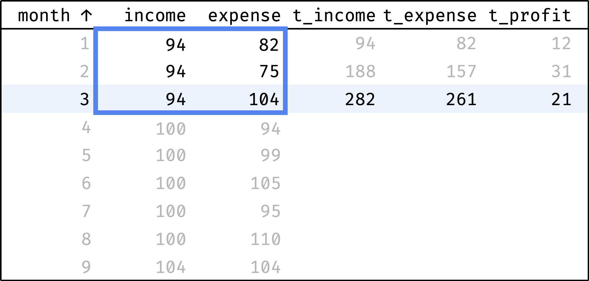

+++
date = 2023-05-01T12:00:00Z
title = "Rolling Aggregates with SQL Window Functions"
description = "Moving averages, cumulative totals and other sliding aggregates."
image = "/sql-window-functions-rolling-aggregates/cover.png"
slug = "sql-window-functions-rolling-aggregates"
tags = ["data"]
featured = true
+++

_This is an excerpt from my book [SQL Window Functions Explained](/sql-window-functions-book). The book is a clear and visual introduction to the topic with lots of practical exercises._

​Rolling aggregates (also known as sliding or moving aggregates) are just totals — sum, average, count etc. But instead of calculating them across all elements, we take a different approach.

Let's look at some examples. We'll use the `expenses` table, which contains the monthly income and expenses of the company our employees work for. To make examples concise, we'll only consider the first nine months of 2020:

```
select
  year, month, income, expense
from expenses
where year = 2020 and month <= 9
order by month;
```

```
┌──────┬───────┬────────┬─────────┐
│ year │ month │ income │ expense │
├──────┼───────┼────────┼─────────┤
│ 2020 │ 1     │ 94     │ 82      │
│ 2020 │ 2     │ 94     │ 75      │
│ 2020 │ 3     │ 94     │ 104     │
│ 2020 │ 4     │ 100    │ 94      │
│ 2020 │ 5     │ 100    │ 99      │
│ 2020 │ 6     │ 100    │ 105     │
│ 2020 │ 7     │ 100    │ 95      │
│ 2020 │ 8     │ 100    │ 110     │
│ 2020 │ 9     │ 104    │ 104     │
└──────┴───────┴────────┴─────────┘
```

[playground](https://sqlime.org/#employees.db) • [download](/sql-window-functions-book/employees.sql)

Table of contents:

-   [Expenses moving average](#expenses-moving-average)
-   [Frame](#frame)
-   [Cumulative profit](#cumulative-profit)
-   [Default frame](#default-frame)
-   [Rolling aggregates functions](#rolling-aggregates-functions)

## Expenses moving average

Judging by the data, the income is growing: 94 in January → 104 in September. But are the expenses growing as well? It's hard to tell right away: expenses vary from month to month. To smooth out these spikes, we'll use the "3-month average" — the average between the previous, current, and next month's expenses for each month:

-   moving average for January = (January + February) / 2;
-   for February = (January + February + March) / 3;
-   for March = (February + March + April) / 3;
-   for April = (March + April + May) / 3;
-   and so on.

Let's calculate the moving average for all months:

<div class="row">
<div class="col-xs-12 col-sm-5">
    before<br/>
    <figure></figure>
</div>
<div class="col-xs-12 col-sm-5">
    after<br/>
    <figure></figure>
</div>
</div>

The `roll_avg` column contains the expenses moving average for three months (previous, current, and following). Now it is clear that expenses are steadily growing.

How do we go from "before" to "after"?

Let's sort the table by month:

```sql
select
  year, month, expense,
  null as roll_avg
from expenses
where year = 2020 and month <= 9
order by year, month;
```

Now let's traverse from the first record to the last. At each step, we will calculate the average among the previous, current, and next values from the `expense` column:

<div class="row">
<div class="col-xs-12 col-sm-5">
    ➀<br/>
    <figure></figure>
</div>
<div class="col-xs-12 col-sm-5">
    ➁<br/>
    <figure></figure>
</div>
</div>

<div class="row">
<div class="col-xs-12 col-sm-5">
    ➂<br/>
    <figure></figure>
</div>
<div class="col-xs-12 col-sm-5">
    ➃<br/>
    <figure></figure>
</div>
</div>

<div class="row">
<div class="col-xs-12 col-sm-5">
    ➄<br/>
    <figure></figure>
</div>
<div class="col-xs-12 col-sm-5">
    <p>and so on...</p>
</div>
</div>

In a single gif:

<div class="row">
<div class="col-xs-12 col-sm-5">
<figure>
  
</figure>
</div>
</div>

The blue frame shifts down at each step — this is how we get the moving average. To describe this in SQL, we need to revisit the concept of _frames_ that we encountered in the [Comparing by Offset](/sql-window-functions-offset/) chapter:

1. The window consists of one or more partitions (in our case, there is only one partition with the company's expenses).
2. Within the partition, records are ordered by specific columns (`order by year, month`).
3. Each record has its own frame.

The frame at each step covers three records — previous, current and next:

<div class="row">
<div class="col-xs-12 col-sm-5">
    expenses<br/>
    <figure></figure>
</div>
<div class="col-xs-12 col-sm-5">
    expenses<br/>
    <figure></figure>
</div>
</div>

Here's how to write it in SQL:

```
window w as (
  order by year, month
  rows between 1 preceding and 1 following
)
```

The `rows` line is the frame definition. It literally says:

> Select rows from the previous one to the following one.

We will deal with frames in detail in the next step, but for now, let's finish with our query.

Calculate the average expenses with the `avg()` function:

```
avg(expense) over w
```

Add rounding and bring everything together:

```sql
select
  year, month, expense,
  round(avg(expense) over w) as roll_avg
from expenses
where year = 2020 and month <= 9
window w as (
  order by year, month
  rows between 1 preceding and 1 following
)
order by year, month;
```

The expenses moving average is ready!

## Frame

In general, the frame is defined like this:

```
rows between X preceding and Y following
```

Where `X` is the number of rows before the current one, and `Y` is the number of rows after the current one:

<div class="row">
<div class="col-xs-12 col-sm-5">
    <figure></figure>
</div>
<div class="col-xs-12 col-sm-5">
    <figure></figure>
</div>
</div>

If you specify the value `unbounded` instead of `X` or `Y` — this means "from/to the partition boundary":

<div class="row">
<div class="col-xs-12 col-sm-5">
    <figure></figure>
</div>
<div class="col-xs-12 col-sm-5">
    <figure></figure>
</div>
</div>

If you specify the value `current row` instead of `X preceding` or `Y following` — this means "the current record":

<div class="row">
<div class="col-xs-12 col-sm-5">
    <figure></figure>
</div>
<div class="col-xs-12 col-sm-5">
    <figure></figure>
</div>
</div>

The frame never goes beyond the partition boundaries. If the frame encounters a boundary, it is cut off:

<div class="row">
<div class="col-xs-12 col-sm-5">
    <figure></figure>
</div>
<div class="col-xs-12 col-sm-5">
    <figure></figure>
</div>
</div>

Frames have much more capabilities, but we will limit ourselves to these for now. We will discuss the rest in the next part of the book — it is fully devoted to frames.

<div class="boxed">
<h3>✎ Exercise: Frame definition (+2 more)</h3>
<p>Practice is crucial in turning abstract knowledge into skills, making theory alone insufficient. The book, unlike this article, contains a lot of exercises — that's why I recommend <a href="https://antonz.gumroad.com/l/sql-windows">getting it</a>.</p>
<p>If you are okay with just theory for now, let's continue.</p>
</div>

## Cumulative profit

Thanks to the moving average, we know that income and expenses are growing. But how do they relate to each other? We want to understand whether the company is "in the black" or "in the red", considering all the money earned and spent.

It is essential to see the values for each month, not only for the end of the year. If everything is OK at in September, but the company went negative in June — this is a potential problem (companies call this situation a "cash gap").

Let's calculate income and expenses by month as a cumulative total:

-   cumulative income for January = January;
-   for February = January + February;
-   for March = January + February + March;
-   for April = January + February + March + April;
-   and so on.

<div class="row">
<div class="col-xs-12 col-sm-7">
<figure>
  
</figure>
</div>
</div>

`t_` columns show cumulative values:

-   income (`t_income`),
-   expenses (`t_expense`),
-   profit (`t_profit`).

```
t_profit = t_income - t_expense
```

How do we calculate them?

Let's sort the table by month:

```sql
select
  year, month, income, expense,
  null as t_income,
  null as t_expense,
  null as t_profit
from expenses
where year = 2020 and month <= 9
order by year, month;
```

Now let's traverse from the first record to the last. At each step, we will calculate the totals from the first row to the current row:

<div class="row">
<div class="col-xs-12 col-sm-5">
    ➀<br/>
    <figure></figure>
</div>
<div class="col-xs-12 col-sm-5">
    ➁<br/>
    <figure></figure>
</div>
</div>

<div class="row">
<div class="col-xs-12 col-sm-5">
    ➂<br/>
    <figure></figure>
</div>
<div class="col-xs-12 col-sm-5">
    ➃<br/>
    <figure></figure>
</div>
</div>

<div class="row">
<div class="col-xs-12 col-sm-5">
    ➄<br/>
    <figure></figure>
</div>
<div class="col-xs-12 col-sm-5">
    <p>and so on...</p>
</div>
</div>

In a single gif:

<div class="row">
<div class="col-xs-12 col-sm-7">
<figure>
  
</figure>
</div>
</div>

At each step, the frame covers rows from the first one to the current one. We already know how to define this frame in SQL:

```
window w as (
  order by year, month
  rows between unbounded preceding and current row
)
```

Calculate total income and expenses with the `sum()` function:

```
sum(income) over w as t_income,
sum(expense) over w as t_expense,
```

Calculate profit as the difference between income and expenses:

```
(sum(income) over w) - (sum(expense) over w) as t_profit
```

All together:

```sql
select
  year, month, income, expense,
  sum(income) over w as t_income,
  sum(expense) over w as t_expense,
  (sum(income) over w) - (sum(expense) over w) as t_profit
from expenses
where year = 2020 and month <= 9
window w as (
  order by year, month
  rows between unbounded preceding and current row
)
order by year, month;
```

As you can see from `t_profit`, the company is doing well. In some months, expenses exceed income, but there is no gap due to the accumulated cash reserve.

<div class="boxed">
<h3>✎ Exercise: Cumulative salary fund</h3>
<p>Practice is crucial in turning abstract knowledge into skills, making theory alone insufficient. The book, unlike this article, contains a lot of exercises — that's why I recommend <a href="https://antonz.gumroad.com/l/sql-windows">getting it</a>.</p>
<p>If you are okay with just theory for now, let's continue.</p>
</div>

## Default frame

Let's take a query that calculates cumulative expenses:

```sql
select
  year, month, expense,
  sum(expense) over w as total
from expenses
where year = 2020 and month <= 9
window w as (
  order by year, month
  rows between unbounded preceding and current row
)
order by year, month;
```

And remove the frame definition:

```sql
select
  year, month, expense,
  sum(expense) over w as total
from expenses
where year = 2020 and month <= 9
window w as (
  order by year, month
)
order by year, month;
```

You'd expect the same `total` in all rows — total expenses for nine months. But instead, we've got this:

<div class="row">
<div class="col-xs-12 col-sm-5">
    expectation<br/>
                <pre><code>┌───────┬─────────┬───────┐
│ month │ expense │ total │
├───────┼─────────┼───────┤
│ 1     │ 82      │ 868   │
│ 2     │ 75      │ 868   │
│ 3     │ 104     │ 868   │
│ 4     │ 94      │ 868   │
│ 5     │ 99      │ 868   │
│ 6     │ 105     │ 868   │
│ 7     │ 95      │ 868   │
│ 8     │ 110     │ 868   │
│ 9     │ 104     │ 868   │
└───────┴─────────┴───────┘</code></pre>
</div>
<div class="col-xs-12 col-sm-5">
    reality<br/>
                <pre><code>┌───────┬─────────┬───────┐
│ month │ expense │ total │
├───────┼─────────┼───────┤
│ 1     │ 82      │ 82    │
│ 2     │ 75      │ 157   │
│ 3     │ 104     │ 261   │
│ 4     │ 94      │ 355   │
│ 5     │ 99      │ 454   │
│ 6     │ 105     │ 559   │
│ 7     │ 95      │ 654   │
│ 8     │ 110     │ 764   │
│ 9     │ 104     │ 868   │
└───────┴─────────┴───────┘</code></pre>
</div>
</div>

The query without a frame still calculated cumulative expenses — exactly as the query with a frame. How is this possible?

It's all about the presence of sorting in the window (`order by year, month`). The rule is as follows:

-   if there is an `order by` in the window definition,
-   and an aggregation function is used,
-   and there is no frame definition,
-   then the default frame is used.

The default frame in our query spreads from the first to the current record. Therefore, the results match the query with the explicit frame (`rows between unbounded preceding and current row`).

But it's not always the case. That's why I recommend specifying the frame explicitly until you understand the various frame types. Make your life easier — add a frame definition whenever you add an `order by` to the window.

If we remove the `order by` from the window, the aggregate turns from rolling into a regular one:

```sql
select
  year, month, expense,
  sum(expense) over () as total
from expenses
where year = 2020 and month <= 9
order by year, month;
```

No surprises here.

## Rolling aggregates functions

Rolling aggregates use the same functions as regular ones:

-   `min()` and `max()`,
-   `count()`, `avg()` and `sum()`,
-   `group_concat()`.

The only difference is the presence of a frame in rolling aggregates.

<p class="align-center">⌘&nbsp;⌘&nbsp;⌘</p>

We have seen four types of tasks commonly solved with window functions in SQL:

-   Ranking (various ratings).
-   Comparing by offset (neighbors and boundaries).
-   Aggregation (count, sum, and average).
-   Rolling aggregates (moving average and cumulative total).

To learn more about window functions or to get some practice — buy my book _SQL Window Functions Explained_.

<p>
    <a class="button" href="https://antonz.gumroad.com/l/sql-windows">
        Get the book
    </a>
</p>

<sqlime-db name="employees" path="/sql-window-functions-book/employees.sql"></sqlime-db>
<sqlime-examples db="employees" selector="div.highlight" editable></sqlime-examples>

<script src="/assets/sqlime/sqlite3.js"></script>
<script src="/assets/sqlime/sqlime-db.js"></script>
<script src="/assets/sqlime/sqlime-examples.js"></script>
