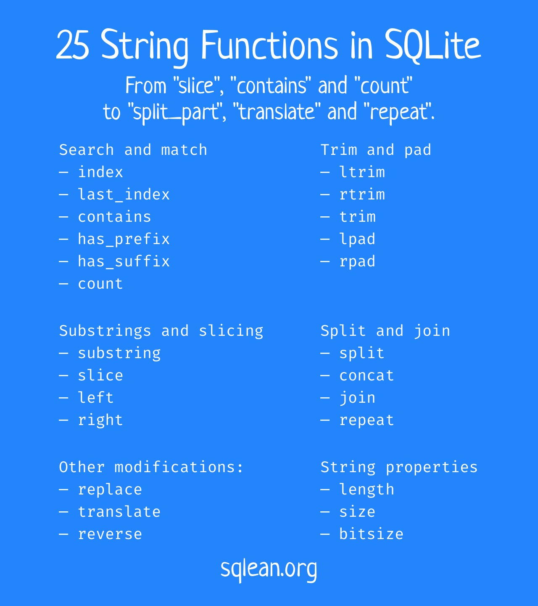

+++
date = 2023-06-07T14:00:00Z
title = "More String Functions in SQLite"
description = "A rich set of string functions, from `slice`, `contains` and `count` to `split_part`, `translate` and `repeat`."
image = "/sqlean-text/cover.png"
slug = "sqlean-text"
tags = ["sqlite"]
featured = true
+++

SQLite includes basic text functions like `instr`, `substr` and `replace` (and even `trim` in later versions), which can get you quite far. But I've always wanted a more complete set, like the one in PostgreSQL, Python or Go.

So I've created a `sqlean-text` extension that provides 25 string functions, from `slice`, `contains` and `count` to `split_part`, `translate` and `repeat`.

> **Note**. Unlike other DBMS, adding extensions to SQLite is a breeze. Download a file, run one database command — and you are good to go.

Many functions are postgres-compatible (i.e. they have the same alias and logic as in PostgreSQL). It can be useful when migrating from SQLite to PostgreSQL or vice versa.

<div class="row">
<div class="col-xs-12 col-sm-8">
<figure>
  
  <figcaption>SQLite already has some text functions, but working with a full set is much nicer.</figcaption>
</figure>
</div>
</div>

Note that some unicode-related functions like `upper` and `lower` are in the separate [unicode](https://github.com/nalgeon/sqlean/blob/main/docs/unicode.md) extension. Regular expression functions are in the separate [regexp](/sqlean-regexp/) extension.

## Substrings and slicing

```
text_substring(str, start [,length])
```

Extracts a substring of `length` characters starting at the `start` position.

```
text_slice(str, start [,end])
```

Extracts a substring from the `start` position inclusive to the `end` position non-inclusive.

```
text_left(str, length)
```

Extracts a substring of `length` characters from the beginning of the string.

```
text_right(str, length)
```

Extracts a substring of `length` characters from the end of the string.

## Search and match

```
text_index(str, other)
```

Returns the first index of the `other` substring in the original string.

```
text_last_index(str, other)
```

Returns the last index of the `other` substring in the original string.

```
text_contains(str, other)
```

Checks if the string contains the `other` substring.

```
text_has_prefix(str, other)
```

Checks if the string starts with the `other` substring.

```
text_has_suffix(str, other)
```

Checks if the string ends with the `other` substring.

```
text_count(str, other)
```

Counts how many times the `other` substring is contained in the original string.

## Split and join

```
text_split(str, sep, n)
```

Splits a string by a separator and returns the n-th part.

```
text_concat(str, ...)
```

Concatenates strings.

```
text_join(sep, str, ...)
```

Joins strings using the separator.

```
text_repeat(str, count)
```

Concatenates the string to itself a given number of times.

## Trim and pad

```
text_ltrim(str [,chars])
```

Trims certain characters from the beginning of the string.

```
text_rtrim(str [,chars])
```

Trims certain characters from the end of the string.

```
text_trim(str [,chars])
```

Trims certain characters from the beginning and end of the string.

```
text_lpad(str, length [,fill])
```

Pads the string to the specified length by prepending certain characters.

```
text_rpad(str, length [,fill])
```

Pads the string to the specified length by appending certain characters.

## Other modifications

```
text_replace(str, old, new [,count])
```

Replaces `old` substrings with `new` substrings in the original string, but not more than `count` times.

```
text_translate(str, from, to)
```

Replaces each string character that matches a character in the `from` set with the corresponding character in the `to` set.

```
text_reverse(str)
```

Reverses the order of the characters in the string.

## String properties

```
text_length(str)
```

Returns the number of characters in the string.

```
text_size(str)
```

Returns the number of bytes in the string.

```
text_bitsize(str)
```

Returns the number of bits in the string.

## Installation and Usage

1. Download the [latest release](https://github.com/nalgeon/sqlean/releases/latest)

2. Use with SQLite command-line interface:

```
sqlite> .load ./text
sqlite> select reverse('hello');
```

See [How to Install an Extension](https://github.com/nalgeon/sqlean/blob/main/docs/install.md) for usage with IDE, Python, etc.

See [Extension Documentation](https://github.com/nalgeon/sqlean/blob/main/docs/text.md) for reference.
