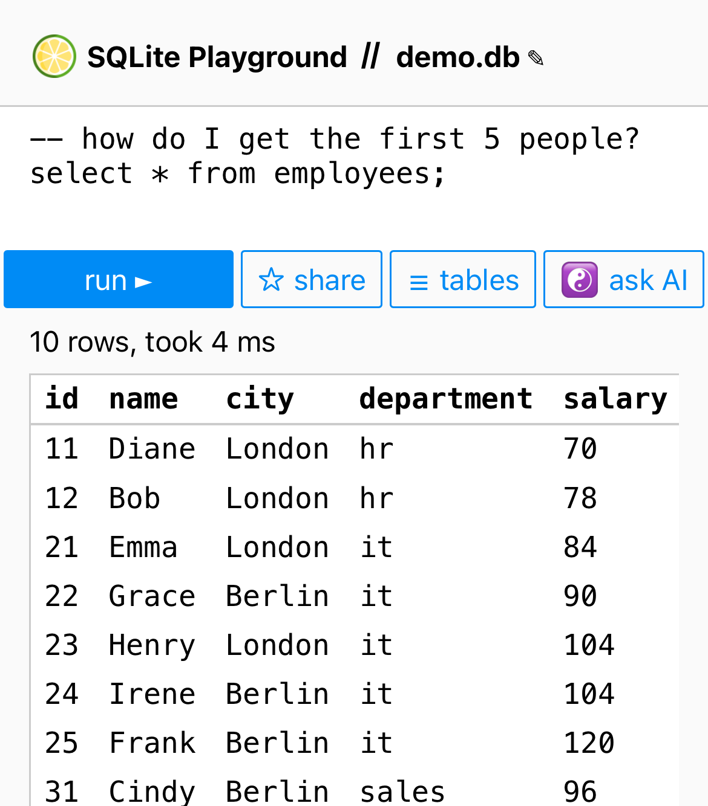
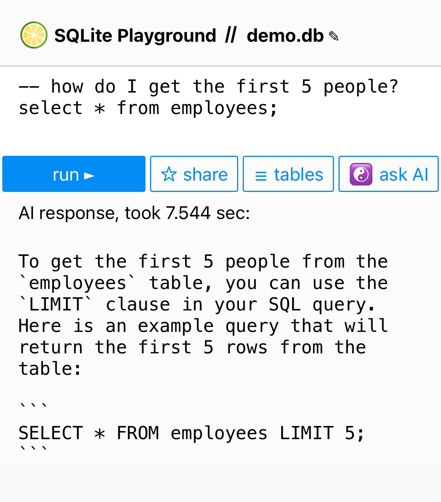

+++
date = 2023-03-16T12:00:00Z
title = "AI SQLite Assistant"
description = "Ask AI to explain or troubleshoot your SQL query in a playground."
image = "/sqlime-ai/cover.png"
slug = "sqlime-ai"
tags = ["sqlite"]
+++

While trying to trick AI into saying ethically questionable things may be fun for some of us, I prefer more practical and useful scenarios.

So, as of today, [Sqlime](https://sqlime.org/) — an online SQLite playground — includes the "Ask AI" feature.

AI can explain, teach, and troubleshoot your SQL without leaving the playground:

1. Write a question as a comment above the query.
2. Click "Ask AI".
3. Receive a not-so-fast, but often useful answer from AI.

<figure>
    
    <figcaption>ask a question<figcaption>
</figure>

<figure>
    
    <figcaption>and receive an answer from AI<figcaption>
</figure>

Try it out! All you need is an OpenAI API key.

<a href="https://sqlime.org/">Ask AI in Sqlime</a>

